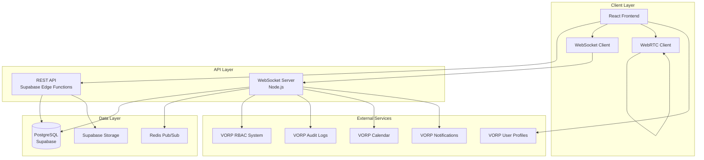
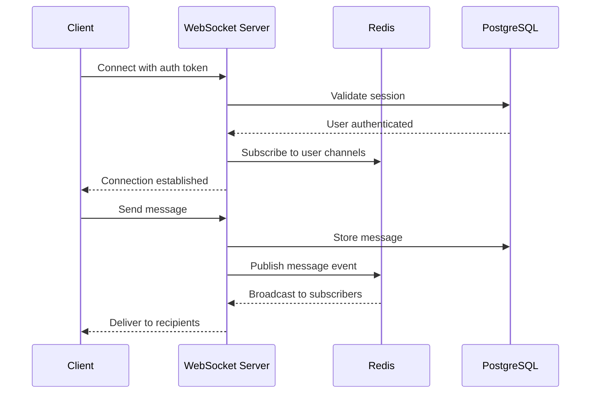
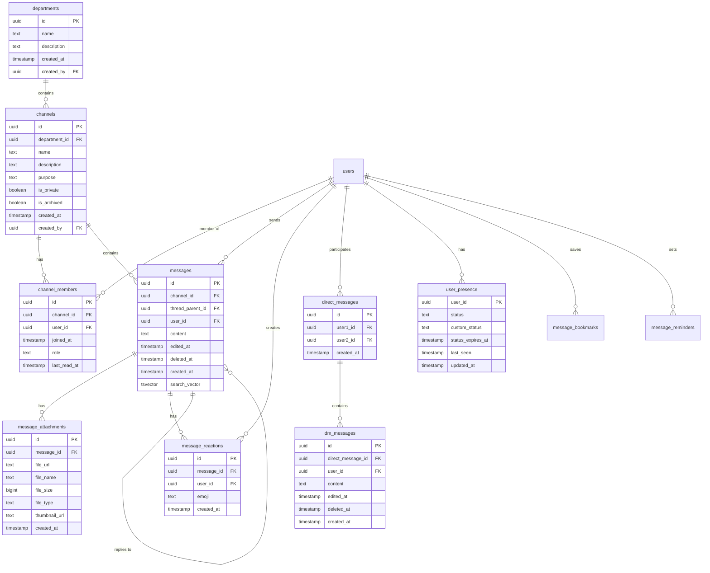
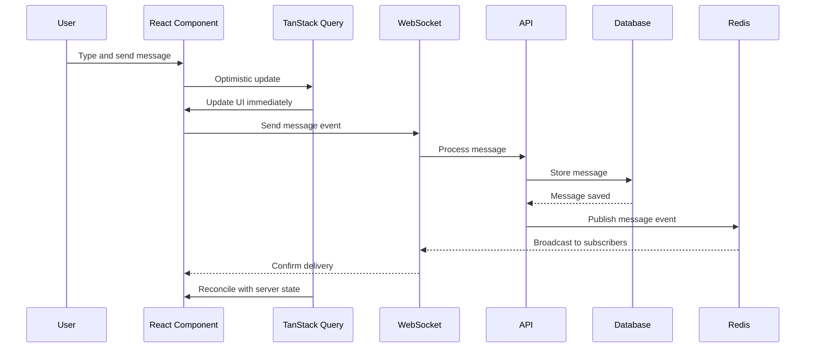
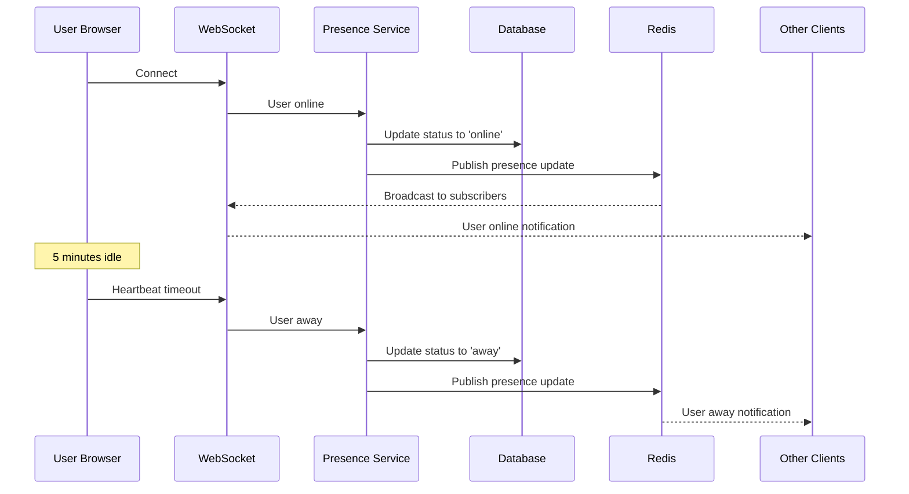

# Design Document: Communication Module

## Overview

The Communication Module is a Slack-like real-time communication system integrated into the Lazeez VORP Internal ERP platform. This module provides instant messaging, voice calling, video calling, and collaborative communication across organizational departments and channels.

### Purpose

Enable enterprise-grade real-time communication with:
- Instant text messaging with rich formatting
- Voice and video calling via WebRTC
- Threaded conversations and direct messages
- File sharing and emoji reactions
- Full-text search across message history
- Deep integration with VORP entities (vendors, POs, tasks, MOUs)
- Comprehensive audit logging and compliance features

### Key Design Goals

1. **Real-time Performance**: Sub-200ms message delivery via WebSocket infrastructure
2. **Scalability**: Support 1000+ concurrent connections per server instance
3. **Integration**: Seamless integration with existing VORP RBAC, audit logs, and user profiles
4. **Security**: Enterprise-grade security with input sanitization, rate limiting, and encryption
5. **Accessibility**: WCAG 2.1 AA compliance with full keyboard navigation
6. **Mobile-First**: Responsive design optimized for mobile browsers (no native app required)
7. **Offline Support**: Basic functionality with message queueing when offline

### Technology Stack

- **Frontend**: React 18.3.1 + TypeScript, Vite, TanStack Query
- **UI Framework**: shadcn/ui (Radix UI), Tailwind CSS, Framer Motion
- **Backend**: Supabase (PostgreSQL + Edge Functions)
- **Real-time**: WebSocket + Redis Pub/Sub
- **WebRTC**: Simple-peer for voice/video calling
- **Storage**: Supabase Storage for file attachments
- **Search**: PostgreSQL full-text search with GIN indexes

## System Architecture

### High-Level Architecture



### Component Architecture

#### Frontend Components

1. **CommunicationLayout**: Main layout wrapper with sidebar and message pane
2. **DepartmentSidebar**: Department and channel navigation
3. **ChannelView**: Message thread display with virtualized scrolling
4. **MessageComposer**: Rich text input with formatting toolbar
5. **ThreadPanel**: Side panel for threaded conversations
6. **DirectMessageList**: One-on-one conversation list
7. **CallInterface**: Voice/video call UI with participant grid
8. **SearchModal**: Full-text search interface
9. **UserPresenceIndicator**: Real-time status display
10. **NotificationBadge**: Unread message counters

#### Backend Services

1. **WebSocket Server**: Real-time message delivery and presence management
2. **Message Service**: CRUD operations for messages
3. **Channel Service**: Department and channel management
4. **Presence Service**: User online/offline status tracking
5. **Search Service**: Full-text search indexing and queries
6. **Call Signaling Service**: WebRTC signaling for voice/video
7. **Notification Service**: Push notifications and email digests
8. **Audit Service**: Integration with VORP audit logging

### WebSocket Infrastructure

#### Connection Management



**Connection Lifecycle**:
1. Client establishes WebSocket connection with JWT token
2. Server validates token against Supabase auth
3. Server subscribes to user's channels in Redis
4. Heartbeat ping every 30 seconds
5. Automatic reconnection with exponential backoff (1s, 2s, 4s, 8s, 16s max)
6. Connection pooling for database queries

**Scalability Strategy**:
- Redis Pub/Sub for horizontal scaling across multiple server instances
- Each server instance handles 1000+ concurrent connections
- Load balancer distributes connections across instances
- Sticky sessions ensure consistent routing

#### WebSocket Event Types

| Event | Direction | Payload | Description |
|-------|-----------|---------|-------------|
| `message.new` | Server→Client | `{id, channel_id, user_id, content, created_at}` | New message delivered |
| `message.edit` | Server→Client | `{id, content, edited_at}` | Message edited |
| `message.delete` | Server→Client | `{id, deleted_at}` | Message deleted |
| `user.typing` | Bidirectional | `{channel_id, user_id, is_typing}` | Typing indicator |
| `user.presence` | Server→Client | `{user_id, status, last_seen}` | Presence update |
| `reaction.add` | Server→Client | `{message_id, user_id, emoji}` | Reaction added |
| `call.signal` | Bidirectional | `{type, sdp, candidate}` | WebRTC signaling |

### WebRTC Architecture

#### Peer-to-Peer Call Flow

```mermaid
sequenceDiagram
    participant Caller
    participant Signaling Server
    participant Callee
    
    Caller->>Signaling Server: Initiate call
    Signaling Server->>Callee: Incoming call notification
    Callee->>Signaling Server: Accept call
    Signaling Server->>Caller: Call accepted
    
    Caller->>Signaling Server: Send offer (SDP)
    Signaling Server->>Callee: Forward offer
    Callee->>Signaling Server: Send answer (SDP)
    Signaling Server->>Caller: Forward answer
    
    Caller->>Callee: ICE candidates exchange
    Callee->>Caller: ICE candidates exchange
    
    Note over Caller,Callee: Direct P2P connection established
    Caller<-->Callee: Audio/Video streams
```

**Call Capabilities**:
- Voice calls: Up to 8 participants
- Video calls: Up to 4 active video streams
- Screen sharing support
- Automatic quality adjustment based on bandwidth
- Echo cancellation and noise suppression
- Device selection (microphone, camera, speakers)

**Fallback Strategy**:
- STUN servers for NAT traversal
- TURN servers for restrictive firewalls
- Automatic codec negotiation (Opus for audio, VP8/H.264 for video)

## Database Schema

### Entity Relationship Diagram



### Table Definitions

#### departments

```sql
CREATE TABLE departments (
    id UUID PRIMARY KEY DEFAULT gen_random_uuid(),
    name TEXT NOT NULL CHECK (length(name) <= 100),
    description TEXT,
    created_at TIMESTAMP WITH TIME ZONE DEFAULT now(),
    created_by UUID REFERENCES auth.users(id) ON DELETE SET NULL
);

CREATE INDEX idx_departments_created_by ON departments(created_by);
```

#### channels

```sql
CREATE TABLE channels (
    id UUID PRIMARY KEY DEFAULT gen_random_uuid(),
    department_id UUID NOT NULL REFERENCES departments(id) ON DELETE CASCADE,
    name TEXT NOT NULL CHECK (length(name) <= 100),
    description TEXT,
    purpose TEXT,
    is_private BOOLEAN DEFAULT false,
    is_archived BOOLEAN DEFAULT false,
    created_at TIMESTAMP WITH TIME ZONE DEFAULT now(),
    created_by UUID REFERENCES auth.users(id) ON DELETE SET NULL,
    UNIQUE(department_id, name)
);

CREATE INDEX idx_channels_department ON channels(department_id);
CREATE INDEX idx_channels_archived ON channels(is_archived);
CREATE INDEX idx_channels_private ON channels(is_private);
```

#### channel_members

```sql
CREATE TABLE channel_members (
    id UUID PRIMARY KEY DEFAULT gen_random_uuid(),
    channel_id UUID NOT NULL REFERENCES channels(id) ON DELETE CASCADE,
    user_id UUID NOT NULL REFERENCES auth.users(id) ON DELETE CASCADE,
    joined_at TIMESTAMP WITH TIME ZONE DEFAULT now(),
    role TEXT DEFAULT 'member' CHECK (role IN ('owner', 'admin', 'member')),
    last_read_at TIMESTAMP WITH TIME ZONE DEFAULT now(),
    UNIQUE(channel_id, user_id)
);

CREATE INDEX idx_channel_members_channel ON channel_members(channel_id);
CREATE INDEX idx_channel_members_user ON channel_members(user_id);
CREATE INDEX idx_channel_members_last_read ON channel_members(last_read_at);
```

#### messages

```sql
CREATE TABLE messages (
    id UUID PRIMARY KEY DEFAULT gen_random_uuid(),
    channel_id UUID NOT NULL REFERENCES channels(id) ON DELETE CASCADE,
    thread_parent_id UUID REFERENCES messages(id) ON DELETE CASCADE,
    user_id UUID NOT NULL REFERENCES auth.users(id) ON DELETE CASCADE,
    content TEXT NOT NULL CHECK (length(content) <= 4000),
    edited_at TIMESTAMP WITH TIME ZONE,
    deleted_at TIMESTAMP WITH TIME ZONE,
    created_at TIMESTAMP WITH TIME ZONE DEFAULT now(),
    search_vector tsvector GENERATED ALWAYS AS (to_tsvector('english', content)) STORED
);

CREATE INDEX idx_messages_channel ON messages(channel_id, created_at DESC);
CREATE INDEX idx_messages_thread ON messages(thread_parent_id);
CREATE INDEX idx_messages_user ON messages(user_id);
CREATE INDEX idx_messages_search ON messages USING GIN(search_vector);
CREATE INDEX idx_messages_created_at ON messages(created_at DESC);
```

#### message_attachments

```sql
CREATE TABLE message_attachments (
    id UUID PRIMARY KEY DEFAULT gen_random_uuid(),
    message_id UUID NOT NULL REFERENCES messages(id) ON DELETE CASCADE,
    file_url TEXT NOT NULL,
    file_name TEXT NOT NULL,
    file_size BIGINT NOT NULL CHECK (file_size <= 52428800), -- 50MB
    file_type TEXT NOT NULL,
    thumbnail_url TEXT,
    created_at TIMESTAMP WITH TIME ZONE DEFAULT now()
);

CREATE INDEX idx_attachments_message ON message_attachments(message_id);
```

#### message_reactions

```sql
CREATE TABLE message_reactions (
    id UUID PRIMARY KEY DEFAULT gen_random_uuid(),
    message_id UUID NOT NULL REFERENCES messages(id) ON DELETE CASCADE,
    user_id UUID NOT NULL REFERENCES auth.users(id) ON DELETE CASCADE,
    emoji TEXT NOT NULL,
    created_at TIMESTAMP WITH TIME ZONE DEFAULT now(),
    UNIQUE(message_id, user_id, emoji)
);

CREATE INDEX idx_reactions_message ON message_reactions(message_id);
CREATE INDEX idx_reactions_user ON message_reactions(user_id);
```

#### direct_messages

```sql
CREATE TABLE direct_messages (
    id UUID PRIMARY KEY DEFAULT gen_random_uuid(),
    user1_id UUID NOT NULL REFERENCES auth.users(id) ON DELETE CASCADE,
    user2_id UUID NOT NULL REFERENCES auth.users(id) ON DELETE CASCADE,
    created_at TIMESTAMP WITH TIME ZONE DEFAULT now(),
    CHECK (user1_id < user2_id), -- Ensure consistent ordering
    UNIQUE(user1_id, user2_id)
);

CREATE INDEX idx_dm_user1 ON direct_messages(user1_id);
CREATE INDEX idx_dm_user2 ON direct_messages(user2_id);
```

#### dm_messages

```sql
CREATE TABLE dm_messages (
    id UUID PRIMARY KEY DEFAULT gen_random_uuid(),
    direct_message_id UUID NOT NULL REFERENCES direct_messages(id) ON DELETE CASCADE,
    user_id UUID NOT NULL REFERENCES auth.users(id) ON DELETE CASCADE,
    content TEXT NOT NULL CHECK (length(content) <= 4000),
    edited_at TIMESTAMP WITH TIME ZONE,
    deleted_at TIMESTAMP WITH TIME ZONE,
    created_at TIMESTAMP WITH TIME ZONE DEFAULT now()
);

CREATE INDEX idx_dm_messages_conversation ON dm_messages(direct_message_id, created_at DESC);
CREATE INDEX idx_dm_messages_user ON dm_messages(user_id);
```

#### user_presence

```sql
CREATE TABLE user_presence (
    user_id UUID PRIMARY KEY REFERENCES auth.users(id) ON DELETE CASCADE,
    status TEXT NOT NULL DEFAULT 'offline' CHECK (status IN ('online', 'away', 'dnd', 'offline')),
    custom_status TEXT CHECK (length(custom_status) <= 100),
    status_expires_at TIMESTAMP WITH TIME ZONE,
    last_seen TIMESTAMP WITH TIME ZONE DEFAULT now(),
    updated_at TIMESTAMP WITH TIME ZONE DEFAULT now()
);

CREATE INDEX idx_presence_status ON user_presence(status);
CREATE INDEX idx_presence_last_seen ON user_presence(last_seen);
```

#### message_bookmarks

```sql
CREATE TABLE message_bookmarks (
    id UUID PRIMARY KEY DEFAULT gen_random_uuid(),
    user_id UUID NOT NULL REFERENCES auth.users(id) ON DELETE CASCADE,
    message_id UUID NOT NULL REFERENCES messages(id) ON DELETE CASCADE,
    note TEXT,
    tags TEXT[],
    created_at TIMESTAMP WITH TIME ZONE DEFAULT now(),
    UNIQUE(user_id, message_id)
);

CREATE INDEX idx_bookmarks_user ON message_bookmarks(user_id);
CREATE INDEX idx_bookmarks_tags ON message_bookmarks USING GIN(tags);
```

#### message_reminders

```sql
CREATE TABLE message_reminders (
    id UUID PRIMARY KEY DEFAULT gen_random_uuid(),
    user_id UUID NOT NULL REFERENCES auth.users(id) ON DELETE CASCADE,
    message_id UUID NOT NULL REFERENCES messages(id) ON DELETE CASCADE,
    remind_at TIMESTAMP WITH TIME ZONE NOT NULL,
    is_recurring BOOLEAN DEFAULT false,
    recurrence_pattern TEXT,
    completed BOOLEAN DEFAULT false,
    created_at TIMESTAMP WITH TIME ZONE DEFAULT now()
);

CREATE INDEX idx_reminders_user ON message_reminders(user_id);
CREATE INDEX idx_reminders_time ON message_reminders(remind_at) WHERE NOT completed;
```

#### pinned_messages

```sql
CREATE TABLE pinned_messages (
    id UUID PRIMARY KEY DEFAULT gen_random_uuid(),
    channel_id UUID NOT NULL REFERENCES channels(id) ON DELETE CASCADE,
    message_id UUID NOT NULL REFERENCES messages(id) ON DELETE CASCADE,
    pinned_by UUID NOT NULL REFERENCES auth.users(id) ON DELETE CASCADE,
    pinned_at TIMESTAMP WITH TIME ZONE DEFAULT now(),
    UNIQUE(channel_id, message_id)
);

CREATE INDEX idx_pinned_channel ON pinned_messages(channel_id);
```

#### call_sessions

```sql
CREATE TABLE call_sessions (
    id UUID PRIMARY KEY DEFAULT gen_random_uuid(),
    channel_id UUID REFERENCES channels(id) ON DELETE SET NULL,
    call_type TEXT NOT NULL CHECK (call_type IN ('voice', 'video')),
    started_at TIMESTAMP WITH TIME ZONE DEFAULT now(),
    ended_at TIMESTAMP WITH TIME ZONE,
    recording_url TEXT,
    transcript_url TEXT,
    initiated_by UUID REFERENCES auth.users(id) ON DELETE SET NULL
);

CREATE INDEX idx_calls_channel ON call_sessions(channel_id);
CREATE INDEX idx_calls_started ON call_sessions(started_at DESC);
```

#### call_participants

```sql
CREATE TABLE call_participants (
    id UUID PRIMARY KEY DEFAULT gen_random_uuid(),
    call_session_id UUID NOT NULL REFERENCES call_sessions(id) ON DELETE CASCADE,
    user_id UUID NOT NULL REFERENCES auth.users(id) ON DELETE CASCADE,
    joined_at TIMESTAMP WITH TIME ZONE DEFAULT now(),
    left_at TIMESTAMP WITH TIME ZONE,
    UNIQUE(call_session_id, user_id)
);

CREATE INDEX idx_call_participants_session ON call_participants(call_session_id);
CREATE INDEX idx_call_participants_user ON call_participants(user_id);
```

#### message_polls

```sql
CREATE TABLE message_polls (
    id UUID PRIMARY KEY DEFAULT gen_random_uuid(),
    message_id UUID NOT NULL REFERENCES messages(id) ON DELETE CASCADE,
    question TEXT NOT NULL,
    options JSONB NOT NULL, -- [{id, text, votes: [user_ids]}]
    allow_multiple BOOLEAN DEFAULT false,
    anonymous BOOLEAN DEFAULT false,
    expires_at TIMESTAMP WITH TIME ZONE,
    closed_at TIMESTAMP WITH TIME ZONE,
    created_at TIMESTAMP WITH TIME ZONE DEFAULT now()
);

CREATE INDEX idx_polls_message ON message_polls(message_id);
```

### Row Level Security (RLS) Policies

All tables implement RLS to ensure users can only access data they're authorized to see.

#### channels RLS

```sql
ALTER TABLE channels ENABLE ROW LEVEL SECURITY;

-- Users can view channels they're members of
CREATE POLICY "Users can view their channels"
ON channels FOR SELECT
USING (
    id IN (
        SELECT channel_id FROM channel_members
        WHERE user_id = auth.uid()
    )
);

-- Admins can create departments
CREATE POLICY "Admins can create channels"
ON channels FOR INSERT
WITH CHECK (
    EXISTS (
        SELECT 1 FROM user_roles
        WHERE user_id = auth.uid() AND role = 'Admin'
    )
);
```

#### messages RLS

```sql
ALTER TABLE messages ENABLE ROW LEVEL SECURITY;

-- Users can view messages in channels they're members of
CREATE POLICY "Users can view channel messages"
ON messages FOR SELECT
USING (
    channel_id IN (
        SELECT channel_id FROM channel_members
        WHERE user_id = auth.uid()
    )
);

-- Users can insert messages in channels they're members of
CREATE POLICY "Users can send messages"
ON messages FOR INSERT
WITH CHECK (
    channel_id IN (
        SELECT channel_id FROM channel_members
        WHERE user_id = auth.uid()
    )
    AND user_id = auth.uid()
);

-- Users can update their own messages
CREATE POLICY "Users can edit own messages"
ON messages FOR UPDATE
USING (user_id = auth.uid())
WITH CHECK (user_id = auth.uid());

-- Users can delete their own messages, admins can delete any
CREATE POLICY "Users can delete own messages"
ON messages FOR DELETE
USING (
    user_id = auth.uid()
    OR EXISTS (
        SELECT 1 FROM user_roles
        WHERE user_id = auth.uid() AND role = 'Admin'
    )
);
```

## API Contracts

### REST API Endpoints

#### Department Management

**POST /api/departments**
```typescript
// Request
{
  name: string;
  description?: string;
}

// Response (201 Created)
{
  id: string;
  name: string;
  description: string | null;
  created_at: string;
  created_by: string;
}

// Errors
400 Bad Request - Invalid input
401 Unauthorized - Not authenticated
403 Forbidden - Not an admin
```

**GET /api/departments**
```typescript
// Response (200 OK)
{
  departments: Array<{
    id: string;
    name: string;
    description: string | null;
    channel_count: number;
    created_at: string;
  }>;
}
```

#### Channel Management

**POST /api/channels**
```typescript
// Request
{
  department_id: string;
  name: string;
  description?: string;
  purpose?: string;
  is_private?: boolean;
  member_ids?: string[]; // Initial members
}

// Response (201 Created)
{
  id: string;
  department_id: string;
  name: string;
  description: string | null;
  purpose: string | null;
  is_private: boolean;
  is_archived: boolean;
  created_at: string;
  created_by: string;
}
```

**GET /api/channels/:departmentId**
```typescript
// Query params
{
  include_archived?: boolean;
}

// Response (200 OK)
{
  channels: Array<{
    id: string;
    name: string;
    description: string | null;
    purpose: string | null;
    is_private: boolean;
    is_archived: boolean;
    member_count: number;
    unread_count: number;
    last_message_at: string | null;
  }>;
}
```

**PATCH /api/channels/:channelId**
```typescript
// Request
{
  name?: string;
  description?: string;
  purpose?: string;
  is_archived?: boolean;
}

// Response (200 OK)
{
  id: string;
  // ... updated channel fields
}
```

**POST /api/channels/:channelId/members**
```typescript
// Request
{
  user_ids: string[];
}

// Response (201 Created)
{
  added: number;
  members: Array<{
    id: string;
    user_id: string;
    joined_at: string;
  }>;
}
```

**DELETE /api/channels/:channelId/members/:userId**
```typescript
// Response (204 No Content)
```

#### Message Management

**GET /api/messages/:channelId**
```typescript
// Query params
{
  limit?: number; // Default 50, max 100
  before?: string; // Message ID for pagination
  thread_parent_id?: string; // Filter by thread
}

// Response (200 OK)
{
  messages: Array<{
    id: string;
    channel_id: string;
    thread_parent_id: string | null;
    user_id: string;
    content: string;
    edited_at: string | null;
    deleted_at: string | null;
    created_at: string;
    user: {
      id: string;
      full_name: string;
      profile_picture_url: string | null;
      role: string;
      designation: string;
    };
    attachments: Array<{
      id: string;
      file_url: string;
      file_name: string;
      file_size: number;
      file_type: string;
      thumbnail_url: string | null;
    }>;
    reactions: Array<{
      emoji: string;
      count: number;
      user_ids: string[];
    }>;
    reply_count: number;
  }>;
  has_more: boolean;
  next_cursor: string | null;
}
```

**PUT /api/messages/:messageId**
```typescript
// Request
{
  content: string;
}

// Response (200 OK)
{
  id: string;
  content: string;
  edited_at: string;
}
```

**DELETE /api/messages/:messageId**
```typescript
// Response (200 OK)
{
  id: string;
  deleted_at: string;
}
```

**POST /api/messages/:messageId/reactions**
```typescript
// Request
{
  emoji: string;
}

// Response (201 Created)
{
  id: string;
  message_id: string;
  user_id: string;
  emoji: string;
  created_at: string;
}
```

**DELETE /api/messages/:messageId/reactions/:emoji**
```typescript
// Response (204 No Content)
```

#### Search

**GET /api/search**
```typescript
// Query params
{
  query: string;
  channel_id?: string; // Filter by channel
  user_id?: string; // Filter by sender
  from_date?: string; // ISO 8601
  to_date?: string; // ISO 8601
  limit?: number; // Default 20
  offset?: number;
}

// Response (200 OK)
{
  results: Array<{
    id: string;
    channel_id: string;
    channel_name: string;
    user_id: string;
    user_name: string;
    content: string;
    created_at: string;
    highlight: string; // Content with search terms highlighted
  }>;
  total: number;
  query: string;
}
```

#### Direct Messages

**POST /api/direct-messages**
```typescript
// Request
{
  recipient_id: string;
}

// Response (201 Created)
{
  id: string;
  user1_id: string;
  user2_id: string;
  created_at: string;
}
```

**GET /api/direct-messages**
```typescript
// Response (200 OK)
{
  conversations: Array<{
    id: string;
    other_user: {
      id: string;
      full_name: string;
      profile_picture_url: string | null;
      presence: {
        status: string;
        custom_status: string | null;
      };
    };
    last_message: {
      content: string;
      created_at: string;
      is_read: boolean;
    } | null;
    unread_count: number;
  }>;
}
```

**GET /api/direct-messages/:conversationId/messages**
```typescript
// Query params
{
  limit?: number;
  before?: string; // Message ID
}

// Response (200 OK)
{
  messages: Array<{
    id: string;
    user_id: string;
    content: string;
    edited_at: string | null;
    deleted_at: string | null;
    created_at: string;
  }>;
  has_more: boolean;
}
```

#### File Upload

**POST /api/upload**
```typescript
// Request (multipart/form-data)
{
  file: File;
  channel_id?: string;
  message_id?: string;
}

// Response (201 Created)
{
  file_url: string;
  file_name: string;
  file_size: number;
  file_type: string;
  thumbnail_url: string | null;
}

// Errors
400 Bad Request - File too large (>50MB)
415 Unsupported Media Type - File type not allowed
```

#### Presence

**PATCH /api/presence**
```typescript
// Request
{
  status?: 'online' | 'away' | 'dnd' | 'offline';
  custom_status?: string;
  status_expires_at?: string; // ISO 8601
}

// Response (200 OK)
{
  user_id: string;
  status: string;
  custom_status: string | null;
  status_expires_at: string | null;
  updated_at: string;
}
```

**GET /api/presence/bulk**
```typescript
// Query params
{
  user_ids: string[]; // Comma-separated
}

// Response (200 OK)
{
  presence: Array<{
    user_id: string;
    status: string;
    custom_status: string | null;
    last_seen: string;
  }>;
}
```

### WebSocket Events

#### Client → Server Events

**send_message**
```typescript
{
  type: 'send_message';
  payload: {
    channel_id: string;
    content: string;
    thread_parent_id?: string;
    attachments?: Array<{
      file_url: string;
      file_name: string;
      file_size: number;
      file_type: string;
    }>;
  };
}
```

**typing_start**
```typescript
{
  type: 'typing_start';
  payload: {
    channel_id: string;
  };
}
```

**typing_stop**
```typescript
{
  type: 'typing_stop';
  payload: {
    channel_id: string;
  };
}
```

**call_signal**
```typescript
{
  type: 'call_signal';
  payload: {
    channel_id: string;
    signal_type: 'offer' | 'answer' | 'ice-candidate';
    target_user_id: string;
    sdp?: string;
    candidate?: RTCIceCandidateInit;
  };
}
```

#### Server → Client Events

**message_new**
```typescript
{
  type: 'message_new';
  payload: {
    id: string;
    channel_id: string;
    thread_parent_id: string | null;
    user_id: string;
    content: string;
    created_at: string;
    user: {
      id: string;
      full_name: string;
      profile_picture_url: string | null;
    };
    attachments: Array<Attachment>;
  };
}
```

**message_edited**
```typescript
{
  type: 'message_edited';
  payload: {
    id: string;
    channel_id: string;
    content: string;
    edited_at: string;
  };
}
```

**message_deleted**
```typescript
{
  type: 'message_deleted';
  payload: {
    id: string;
    channel_id: string;
    deleted_at: string;
  };
}
```

**user_typing**
```typescript
{
  type: 'user_typing';
  payload: {
    channel_id: string;
    user_id: string;
    user_name: string;
    is_typing: boolean;
  };
}
```

**presence_update**
```typescript
{
  type: 'presence_update';
  payload: {
    user_id: string;
    status: 'online' | 'away' | 'dnd' | 'offline';
    custom_status: string | null;
    last_seen: string;
  };
}
```

**reaction_added**
```typescript
{
  type: 'reaction_added';
  payload: {
    message_id: string;
    channel_id: string;
    user_id: string;
    emoji: string;
  };
}
```

**call_incoming**
```typescript
{
  type: 'call_incoming';
  payload: {
    call_id: string;
    channel_id: string;
    caller_id: string;
    caller_name: string;
    call_type: 'voice' | 'video';
  };
}
```

## Component Architecture

### React Component Hierarchy

```
CommunicationModule
├── CommunicationLayout
│   ├── DepartmentSidebar
│   │   ├── DepartmentList
│   │   │   ├── DepartmentItem
│   │   │   └── ChannelList
│   │   │       └── ChannelItem (with unread badge)
│   │   ├── DirectMessageList
│   │   │   └── DirectMessageItem
│   │   ├── SavedItemsButton
│   │   └── UserPresencePanel
│   ├── MainContentArea
│   │   ├── ChannelHeader
│   │   │   ├── ChannelInfo
│   │   │   ├── PinnedMessagesButton
│   │   │   ├── CallButton
│   │   │   └── ChannelSettingsButton
│   │   ├── MessageList (virtualized)
│   │   │   ├── MessageGroup
│   │   │   │   ├── MessageItem
│   │   │   │   │   ├── UserAvatar
│   │   │   │   │   ├── MessageContent
│   │   │   │   │   ├── MessageActions
│   │   │   │   │   │   ├── ReactionButton
│   │   │   │   │   │   ├── ThreadButton
│   │   │   │   │   │   ├── BookmarkButton
│   │   │   │   │   │   └── MoreActionsMenu
│   │   │   │   │   ├── ReactionBar
│   │   │   │   │   └── ThreadPreview
│   │   │   │   └── AttachmentGrid
│   │   │   └── UnreadSeparator
│   │   ├── TypingIndicator
│   │   └── MessageComposer
│   │       ├── ComposerInput
│   │       ├── FormattingToolbar
│   │       ├── AttachmentPreview
│   │       ├── EmojiPicker
│   │       └── SendButton
│   └── ThreadPanel (slide-in)
│       ├── ThreadHeader
│       ├── ParentMessage
│       ├── ThreadMessageList
│       └── ThreadComposer
├── SearchModal
│   ├── SearchInput
│   ├── SearchFilters
│   └── SearchResults
├── CallInterface
│   ├── CallHeader
│   ├── ParticipantGrid
│   │   └── ParticipantVideo
│   ├── CallControls
│   │   ├── MuteButton
│   │   ├── VideoToggle
│   │   ├── ScreenShareButton
│   │   └── EndCallButton
│   └── CallDiagnostics
├── NotificationToast
└── OfflineIndicator
```

### Key Component Specifications

#### CommunicationLayout

**Purpose**: Main layout wrapper providing sidebar and content area structure

**Props**:
```typescript
interface CommunicationLayoutProps {
  children: React.ReactNode;
}
```

**Layout Structure**:
- Fixed sidebar (280px width on desktop)
- Flexible main content area
- Responsive: Sidebar collapses to drawer on mobile (<768px)
- Dark mode support via next-themes

**Styling**:
```tsx
<div className="flex h-screen bg-background">
  <aside className="w-[280px] border-r border-border hidden md:block">
    {/* Sidebar */}
  </aside>
  <main className="flex-1 flex flex-col">
    {/* Main content */}
  </main>
</div>
```

#### DepartmentSidebar

**Purpose**: Navigation for departments, channels, and direct messages

**Features**:
- Collapsible department sections
- Unread message badges
- Presence indicators
- Search/filter channels
- Quick actions (new channel, new DM)

**Animation**:
```tsx
<motion.div
  initial={{ x: -280 }}
  animate={{ x: 0 }}
  transition={{ type: "spring", stiffness: 300, damping: 30 }}
>
  {/* Sidebar content */}
</motion.div>
```

**State Management**:
```typescript
const {
  departments,
  channels,
  directMessages,
  isLoading
} = useCommunicationData();

const {
  expandedDepartments,
  toggleDepartment
} = useSidebarState();
```

#### MessageList

**Purpose**: Virtualized scrollable list of messages

**Key Features**:
- Virtual scrolling for performance (react-window or @tanstack/react-virtual)
- Lazy loading with infinite scroll
- Grouped by date and user
- Smooth scroll to bottom on new messages
- Jump to unread separator

**Implementation**:
```tsx
import { useVirtualizer } from '@tanstack/react-virtual';

const MessageList = ({ channelId }: { channelId: string }) => {
  const parentRef = useRef<HTMLDivElement>(null);
  const { messages, fetchMore, hasMore } = useMessages(channelId);
  
  const virtualizer = useVirtualizer({
    count: messages.length,
    getScrollElement: () => parentRef.current,
    estimateSize: () => 80,
    overscan: 5,
  });

  return (
    <div ref={parentRef} className="flex-1 overflow-auto">
      <div style={{ height: virtualizer.getTotalSize() }}>
        {virtualizer.getVirtualItems().map((virtualRow) => (
          <MessageItem
            key={messages[virtualRow.index].id}
            message={messages[virtualRow.index]}
            style={{
              position: 'absolute',
              top: 0,
              left: 0,
              width: '100%',
              transform: `translateY(${virtualRow.start}px)`,
            }}
          />
        ))}
      </div>
    </div>
  );
};
```

#### MessageItem

**Purpose**: Individual message display with actions

**Props**:
```typescript
interface MessageItemProps {
  message: Message;
  isGrouped?: boolean; // Hide avatar/name if grouped with previous
  style?: React.CSSProperties; // For virtualization
}
```

**Hover Interactions**:
```tsx
<motion.div
  className="group px-4 py-2 hover:bg-accent/50 transition-colors"
  whileHover={{ backgroundColor: "hsl(var(--accent) / 0.5)" }}
>
  <div className="flex gap-3">
    {!isGrouped && (
      <Avatar className="w-10 h-10">
        <AvatarImage src={message.user.profile_picture_url} />
        <AvatarFallback>{message.user.initials}</AvatarFallback>
      </Avatar>
    )}
    
    <div className="flex-1 min-w-0">
      {!isGrouped && (
        <div className="flex items-baseline gap-2 mb-1">
          <span className="font-medium text-sm">{message.user.full_name}</span>
          <span className="text-xs text-muted-foreground">
            {formatTime(message.created_at)}
          </span>
        </div>
      )}
      
      <MessageContent content={message.content} />
      
      {message.attachments.length > 0 && (
        <AttachmentGrid attachments={message.attachments} />
      )}
      
      {message.reactions.length > 0 && (
        <ReactionBar reactions={message.reactions} messageId={message.id} />
      )}
    </div>
    
    {/* Actions appear on hover */}
    <motion.div
      className="opacity-0 group-hover:opacity-100 transition-opacity"
      initial={{ opacity: 0 }}
      whileHover={{ opacity: 1 }}
    >
      <MessageActions messageId={message.id} />
    </motion.div>
  </div>
</motion.div>
```

**Message Formatting**:
- Markdown rendering for **bold**, *italic*, `code`
- Syntax highlighting for code blocks
- Auto-linkify URLs
- Deep link rendering for VORP entities (#vendor-123)
- Mention highlighting (@username)

#### MessageComposer

**Purpose**: Rich text input for composing messages

**Features**:
- Multi-line input (Shift+Enter for newline, Enter to send)
- Markdown formatting toolbar
- Emoji picker
- File attachment with drag-and-drop
- @ mention autocomplete
- Character counter (approaching 4000 limit)
- Draft auto-save

**Implementation**:
```tsx
const MessageComposer = ({ channelId }: { channelId: string }) => {
  const [content, setContent] = useState('');
  const [attachments, setAttachments] = useState<File[]>([]);
  const { sendMessage, isLoading } = useSendMessage();
  
  const handleSend = async () => {
    if (!content.trim() && attachments.length === 0) return;
    
    await sendMessage({
      channel_id: channelId,
      content: content.trim(),
      attachments,
    });
    
    setContent('');
    setAttachments([]);
  };

  return (
    <div className="border-t border-border p-4">
      <div className="flex flex-col gap-2">
        {attachments.length > 0 && (
          <AttachmentPreview
            files={attachments}
            onRemove={(index) => setAttachments(prev => 
              prev.filter((_, i) => i !== index)
            )}
          />
        )}
        
        <div className="flex items-end gap-2">
          <Textarea
            value={content}
            onChange={(e) => setContent(e.target.value)}
            onKeyDown={(e) => {
              if (e.key === 'Enter' && !e.shiftKey) {
                e.preventDefault();
                handleSend();
              }
            }}
            placeholder={`Message #${channelName}`}
            className="min-h-[44px] max-h-[200px] resize-none"
          />
          
          <div className="flex gap-1">
            <FormattingToolbar />
            <EmojiPickerButton onSelect={(emoji) => 
              setContent(prev => prev + emoji)
            } />
            <AttachFileButton onSelect={setAttachments} />
            <Button
              onClick={handleSend}
              disabled={isLoading || (!content.trim() && attachments.length === 0)}
              size="icon"
            >
              <Send className="w-4 h-4" />
            </Button>
          </div>
        </div>
      </div>
    </div>
  );
};
```

#### CallInterface

**Purpose**: Voice/video call UI with WebRTC

**Features**:
- Participant grid (1-4 video streams)
- Audio-only mode for voice calls
- Screen sharing
- Call controls (mute, video toggle, end call)
- Connection quality indicator
- Call diagnostics overlay

**Layout**:
```tsx
const CallInterface = ({ callId, channelId }: CallInterfaceProps) => {
  const { participants, localStream, remoteStreams } = useWebRTC(callId);
  
  return (
    <motion.div
      initial={{ opacity: 0, scale: 0.95 }}
      animate={{ opacity: 1, scale: 1 }}
      exit={{ opacity: 0, scale: 0.95 }}
      className="fixed inset-0 z-50 bg-background"
    >
      <div className="h-full flex flex-col">
        <CallHeader
          channelName={channelName}
          duration={callDuration}
          participantCount={participants.length}
        />
        
        <div className="flex-1 p-4">
          <ParticipantGrid
            participants={participants}
            localStream={localStream}
            remoteStreams={remoteStreams}
          />
        </div>
        
        <CallControls
          onMuteToggle={toggleMute}
          onVideoToggle={toggleVideo}
          onScreenShare={startScreenShare}
          onEndCall={endCall}
          isMuted={isMuted}
          isVideoEnabled={isVideoEnabled}
        />
      </div>
    </motion.div>
  );
};
```

**Participant Grid Layout**:
- 1 participant: Full screen
- 2 participants: Side-by-side
- 3-4 participants: 2x2 grid
- 5-8 participants: 3x3 grid (audio-only for some)

#### ThreadPanel

**Purpose**: Side panel for threaded conversations

**Animation**:
```tsx
<motion.aside
  initial={{ x: 400 }}
  animate={{ x: 0 }}
  exit={{ x: 400 }}
  transition={{ type: "spring", stiffness: 300, damping: 30 }}
  className="w-[400px] border-l border-border bg-background"
>
  <div className="flex flex-col h-full">
    <ThreadHeader
      parentMessage={parentMessage}
      onClose={closeThread}
    />
    
    <div className="flex-1 overflow-auto">
      <ParentMessage message={parentMessage} />
      <Separator className="my-4" />
      <ThreadMessageList threadId={parentMessage.id} />
    </div>
    
    <ThreadComposer
      threadParentId={parentMessage.id}
      channelId={channelId}
    />
  </div>
</motion.aside>
```

## Data Flow Diagrams

### Message Send Flow



### Call Establishment Flow

```mermaid
sequenceDiagram
    participant Caller UI
    participant Callee UI
    participant WebSocket
    participant Signaling Server
    participant STUN/TURN
    
    Caller UI->>WebSocket: Initiate call
    WebSocket->>Signaling Server: Call request
    Signaling Server->>WebSocket: Forward to callee
    WebSocket->>Callee UI: Incoming call notification
    Callee UI->>WebSocket: Accept call
    
    Caller UI->>STUN/TURN: Get ICE candidates
    Caller UI->>WebSocket: Send offer (SDP)
    WebSocket->>Callee UI: Forward offer
    
    Callee UI->>STUN/TURN: Get ICE candidates
    Callee UI->>WebSocket: Send answer (SDP)
    WebSocket->>Caller UI: Forward answer
    
    Caller UI->>Callee UI: Exchange ICE candidates
    
    Note over Caller UI,Callee UI: P2P connection established
    Caller UI<-->Callee UI: Media streams (audio/video)
```

### Presence Update Flow



## Security Design

### Authentication & Authorization

**Session Management**:
- JWT tokens from Supabase Auth
- Token validation on every WebSocket connection
- Token refresh before expiry (24-hour max session)
- Automatic logout on token expiry

**Authorization Checks**:
```typescript
// Channel access check
const canAccessChannel = async (userId: string, channelId: string) => {
  const membership = await db
    .from('channel_members')
    .select('id')
    .eq('channel_id', channelId)
    .eq('user_id', userId)
    .single();
  
  return !!membership;
};

// Message edit authorization
const canEditMessage = async (userId: string, messageId: string) => {
  const message = await db
    .from('messages')
    .select('user_id')
    .eq('id', messageId)
    .single();
  
  return message.user_id === userId;
};

// Admin-only operations
const isAdmin = async (userId: string) => {
  const user = await db
    .from('user_roles')
    .select('role')
    .eq('user_id', userId)
    .single();
  
  return user.role === 'Admin';
};
```

### Input Sanitization

**XSS Prevention**:
```typescript
import DOMPurify from 'dompurify';
import { marked } from 'marked';

const sanitizeMessage = (content: string): string => {
  // Parse markdown
  const html = marked.parse(content);
  
  // Sanitize HTML
  return DOMPurify.sanitize(html, {
    ALLOWED_TAGS: ['p', 'br', 'strong', 'em', 'code', 'pre', 'a', 'ul', 'ol', 'li', 'blockquote'],
    ALLOWED_ATTR: ['href', 'class'],
    ALLOW_DATA_ATTR: false,
  });
};
```

**SQL Injection Prevention**:
- All queries use parameterized statements via Supabase client
- No raw SQL with user input
- Input validation with Zod schemas

**File Upload Security**:
```typescript
const ALLOWED_FILE_TYPES = [
  'image/jpeg',
  'image/png',
  'image/gif',
  'image/webp',
  'application/pdf',
  'application/msword',
  'application/vnd.openxmlformats-officedocument.wordprocessingml.document',
  'text/plain',
];

const MAX_FILE_SIZE = 50 * 1024 * 1024; // 50MB

const validateFile = (file: File): { valid: boolean; error?: string } => {
  if (file.size > MAX_FILE_SIZE) {
    return { valid: false, error: 'File size exceeds 50MB limit' };
  }
  
  if (!ALLOWED_FILE_TYPES.includes(file.type)) {
    return { valid: false, error: 'File type not allowed' };
  }
  
  return { valid: true };
};

// Virus scanning (integrate with ClamAV or similar)
const scanFile = async (fileBuffer: Buffer): Promise<boolean> => {
  // Implementation depends on virus scanning service
  return true; // Safe
};
```

### Rate Limiting

**Message Rate Limits**:
```typescript
// Redis-based rate limiting
const checkMessageRateLimit = async (userId: string): Promise<boolean> => {
  const key = `rate_limit:messages:${userId}`;
  const count = await redis.incr(key);
  
  if (count === 1) {
    await redis.expire(key, 60); // 1 minute window
  }
  
  return count <= 60; // 60 messages per minute
};
```

**File Upload Rate Limits**:
```typescript
const checkUploadRateLimit = async (userId: string): Promise<boolean> => {
  const key = `rate_limit:uploads:${userId}`;
  const count = await redis.incr(key);
  
  if (count === 1) {
    await redis.expire(key, 60);
  }
  
  return count <= 10; // 10 uploads per minute
};
```

**WebSocket Connection Limits**:
- Maximum 5 concurrent connections per user
- Connection throttling: 10 connection attempts per minute
- Automatic IP blocking after 50 failed auth attempts

### Encryption

**Data in Transit**:
- TLS 1.3 for all HTTP/WebSocket connections
- WSS (WebSocket Secure) protocol
- Certificate pinning for mobile clients

**Data at Rest**:
- PostgreSQL encryption at rest (Supabase default)
- Encrypted file storage in Supabase Storage
- Encrypted backups

**End-to-End Encryption (Future Enhancement)**:
- Optional E2E encryption for private channels
- Client-side encryption/decryption
- Key exchange via Signal Protocol

## Performance Architecture

### Lazy Loading Strategy

**Message History**:
```typescript
const useMessages = (channelId: string) => {
  return useInfiniteQuery({
    queryKey: ['messages', channelId],
    queryFn: ({ pageParam }) => 
      fetchMessages(channelId, { before: pageParam, limit: 50 }),
    getNextPageParam: (lastPage) => lastPage.next_cursor,
    initialPageParam: undefined,
    staleTime: 30000, // 30 seconds
  });
};
```

**Channel List**:
- Load departments on mount
- Load channels per department on expand
- Lazy load channel metadata (member count, last message)

**User Profiles**:
```typescript
// Cache user profiles globally
const useUserProfile = (userId: string) => {
  return useQuery({
    queryKey: ['user', userId],
    queryFn: () => fetchUserProfile(userId),
    staleTime: 5 * 60 * 1000, // 5 minutes
    cacheTime: 30 * 60 * 1000, // 30 minutes
  });
};
```

### Virtualization

**Message List Virtualization**:
```typescript
import { useVirtualizer } from '@tanstack/react-virtual';

const VirtualizedMessageList = ({ messages }: { messages: Message[] }) => {
  const parentRef = useRef<HTMLDivElement>(null);
  
  const virtualizer = useVirtualizer({
    count: messages.length,
    getScrollElement: () => parentRef.current,
    estimateSize: () => 80, // Estimated message height
    overscan: 10, // Render 10 items above/below viewport
  });

  return (
    <div ref={parentRef} className="h-full overflow-auto">
      <div
        style={{
          height: `${virtualizer.getTotalSize()}px`,
          width: '100%',
          position: 'relative',
        }}
      >
        {virtualizer.getVirtualItems().map((virtualItem) => (
          <div
            key={virtualItem.key}
            style={{
              position: 'absolute',
              top: 0,
              left: 0,
              width: '100%',
              height: `${virtualItem.size}px`,
              transform: `translateY(${virtualItem.start}px)`,
            }}
          >
            <MessageItem message={messages[virtualItem.index]} />
          </div>
        ))}
      </div>
    </div>
  );
};
```

### Caching Strategy

**TanStack Query Configuration**:
```typescript
const queryClient = new QueryClient({
  defaultOptions: {
    queries: {
      staleTime: 30000, // 30 seconds
      cacheTime: 5 * 60 * 1000, // 5 minutes
      refetchOnWindowFocus: false,
      retry: 1,
    },
  },
});
```

**Local Storage Caching**:
```typescript
// Cache channel metadata
const cacheChannelMetadata = (channelId: string, metadata: ChannelMetadata) => {
  localStorage.setItem(
    `channel_meta_${channelId}`,
    JSON.stringify({ ...metadata, cached_at: Date.now() })
  );
};

// Cache recent messages for offline access
const cacheRecentMessages = (channelId: string, messages: Message[]) => {
  const key = `messages_${channelId}`;
  const cached = {
    messages: messages.slice(0, 100), // Last 100 messages
    cached_at: Date.now(),
  };
  localStorage.setItem(key, JSON.stringify(cached));
};
```

**IndexedDB for Offline Storage**:
```typescript
import { openDB } from 'idb';

const db = await openDB('communication-cache', 1, {
  upgrade(db) {
    db.createObjectStore('messages', { keyPath: 'id' });
    db.createObjectStore('channels', { keyPath: 'id' });
    db.createObjectStore('users', { keyPath: 'id' });
  },
});

// Store messages for offline access
const cacheMessagesOffline = async (messages: Message[]) => {
  const tx = db.transaction('messages', 'readwrite');
  await Promise.all(messages.map(msg => tx.store.put(msg)));
  await tx.done;
};
```

### Optimistic Updates

**Message Sending**:
```typescript
const useSendMessage = () => {
  const queryClient = useQueryClient();
  
  return useMutation({
    mutationFn: (message: NewMessage) => sendMessageAPI(message),
    
    onMutate: async (newMessage) => {
      // Cancel outgoing refetches
      await queryClient.cancelQueries({ queryKey: ['messages', newMessage.channel_id] });
      
      // Snapshot previous value
      const previousMessages = queryClient.getQueryData(['messages', newMessage.channel_id]);
      
      // Optimistically update
      queryClient.setQueryData(['messages', newMessage.channel_id], (old: any) => ({
        ...old,
        pages: old.pages.map((page: any, i: number) => 
          i === 0 ? {
            ...page,
            messages: [
              {
                ...newMessage,
                id: `temp-${Date.now()}`,
                created_at: new Date().toISOString(),
                status: 'sending',
              },
              ...page.messages,
            ],
          } : page
        ),
      }));
      
      return { previousMessages };
    },
    
    onError: (err, newMessage, context) => {
      // Rollback on error
      queryClient.setQueryData(
        ['messages', newMessage.channel_id],
        context?.previousMessages
      );
      toast.error('Failed to send message');
    },
    
    onSuccess: (data, newMessage) => {
      // Replace temp message with real one
      queryClient.setQueryData(['messages', newMessage.channel_id], (old: any) => ({
        ...old,
        pages: old.pages.map((page: any, i: number) =>
          i === 0 ? {
            ...page,
            messages: page.messages.map((msg: any) =>
              msg.id.startsWith('temp-') ? data : msg
            ),
          } : page
        ),
      }));
    },
  });
};
```

### Image Optimization

**Lazy Loading Images**:
```tsx
const OptimizedImage = ({ src, alt, className }: ImageProps) => {
  const [isLoaded, setIsLoaded] = useState(false);
  const imgRef = useRef<HTMLImageElement>(null);
  
  useEffect(() => {
    if (!imgRef.current) return;
    
    const observer = new IntersectionObserver(
      ([entry]) => {
        if (entry.isIntersecting) {
          const img = entry.target as HTMLImageElement;
          img.src = img.dataset.src!;
          observer.disconnect();
        }
      },
      { rootMargin: '50px' }
    );
    
    observer.observe(imgRef.current);
    
    return () => observer.disconnect();
  }, []);
  
  return (
    <div className={cn('relative', className)}>
      {!isLoaded && <Skeleton className="absolute inset-0" />}
       setIsLoaded(true)}
        className={cn('transition-opacity', isLoaded ? 'opacity-100' : 'opacity-0')}
      />
    </div>
  );
};
```

**Thumbnail Generation**:
```typescript
// Generate thumbnails on upload
const generateThumbnail = async (file: File): Promise<string> => {
  if (!file.type.startsWith('image/')) return '';
  
  const canvas = document.createElement('canvas');
  const ctx = canvas.getContext('2d')!;
  const img = new Image();
  
  return new Promise((resolve) => {
    img.onload = () => {
      const maxSize = 200;
      const ratio = Math.min(maxSize / img.width, maxSize / img.height);
      canvas.width = img.width * ratio;
      canvas.height = img.height * ratio;
      
      ctx.drawImage(img, 0, 0, canvas.width, canvas.height);
      resolve(canvas.toDataURL('image/jpeg', 0.7));
    };
    
    img.src = URL.createObjectURL(file);
  });
};
```

### Debouncing & Throttling

**Typing Indicators**:
```typescript
const useTypingIndicator = (channelId: string) => {
  const ws = useWebSocket();
  const timeoutRef = useRef<NodeJS.Timeout>();
  
  const sendTypingStart = useMemo(
    () => throttle(() => {
      ws.send({ type: 'typing_start', payload: { channel_id: channelId } });
      
      // Auto-stop after 3 seconds
      if (timeoutRef.current) clearTimeout(timeoutRef.current);
      timeoutRef.current = setTimeout(() => {
        ws.send({ type: 'typing_stop', payload: { channel_id: channelId } });
      }, 3000);
    }, 1000), // Max 1 event per second
    [channelId, ws]
  );
  
  return { sendTypingStart };
};
```

**Search Input**:
```typescript
const SearchInput = () => {
  const [query, setQuery] = useState('');
  const debouncedQuery = useDebounce(query, 300);
  
  const { data: results } = useQuery({
    queryKey: ['search', debouncedQuery],
    queryFn: () => searchMessages(debouncedQuery),
    enabled: debouncedQuery.length >= 3,
  });
  
  return (
    <Input
      value={query}
      onChange={(e) => setQuery(e.target.value)}
      placeholder="Search messages..."
    />
  );
};
```

## Integration Design

### VORP RBAC Integration

**Permission Checks**:
```typescript
import { useAuth } from '@/contexts/AuthContext';

const useCommunicationPermissions = () => {
  const { user, hasPermission } = useAuth();
  
  return {
    canCreateDepartment: hasPermission('Admin'),
    canCreateChannel: hasPermission(['Admin', 'Manager', 'Employee']),
    canDeleteChannel: hasPermission('Admin'),
    canManageChannelMembers: (channelId: string) => {
      // Check if user is channel owner or admin
      return hasPermission('Admin') || isChannelOwner(user.id, channelId);
    },
    canRecordCalls: hasPermission(['Admin', 'Manager']),
    canAccessAuditLogs: hasPermission(['Admin', 'HR/Staff']),
  };
};
```

**Role-Based UI Rendering**:
```tsx
const ChannelHeader = ({ channel }: { channel: Channel }) => {
  const { canDeleteChannel, canManageChannelMembers } = useCommunicationPermissions();
  
  return (
    <div className="flex items-center justify-between p-4 border-b">
      <div>
        <h2 className="font-semibold text-lg">{channel.name}</h2>
        <p className="text-sm text-muted-foreground">{channel.purpose}</p>
      </div>
      
      <div className="flex gap-2">
        <CallButton channelId={channel.id} />
        
        {canManageChannelMembers(channel.id) && (
          <Button variant="ghost" size="icon">
            <Settings className="w-4 h-4" />
          </Button>
        )}
        
        {canDeleteChannel && (
          <DropdownMenu>
            <DropdownMenuTrigger asChild>
              <Button variant="ghost" size="icon">
                <MoreVertical className="w-4 h-4" />
              </Button>
            </DropdownMenuTrigger>
            <DropdownMenuContent>
              <DropdownMenuItem onClick={() => archiveChannel(channel.id)}>
                Archive channel
              </DropdownMenuItem>
              <DropdownMenuItem 
                onClick={() => deleteChannel(channel.id)}
                className="text-destructive"
              >
                Delete channel
              </DropdownMenuItem>
            </DropdownMenuContent>
          </DropdownMenu>
        )}
      </div>
    </div>
  );
};
```

### VORP Audit Log Integration

**Audit Event Recording**:
```typescript
interface AuditEvent {
  user_id: string;
  action: string;
  entity_type: string;
  entity_id: string;
  details: Record<string, any>;
  ip_address?: string;
  user_agent?: string;
}

const recordAuditEvent = async (event: AuditEvent) => {
  await supabase.from('audit_logs').insert({
    ...event,
    timestamp: new Date().toISOString(),
    module: 'communication',
  });
};

// Usage examples
const sendMessage = async (message: NewMessage) => {
  const result = await supabase.from('messages').insert(message);
  
  await recordAuditEvent({
    user_id: message.user_id,
    action: 'message_sent',
    entity_type: 'message',
    entity_id: result.data.id,
    details: {
      channel_id: message.channel_id,
      content_length: message.content.length,
      has_attachments: message.attachments?.length > 0,
    },
  });
  
  return result;
};

const deleteMessage = async (messageId: string, userId: string) => {
  const message = await supabase
    .from('messages')
    .select('*')
    .eq('id', messageId)
    .single();
  
  await supabase
    .from('messages')
    .update({ deleted_at: new Date().toISOString() })
    .eq('id', messageId);
  
  await recordAuditEvent({
    user_id: userId,
    action: 'message_deleted',
    entity_type: 'message',
    entity_id: messageId,
    details: {
      channel_id: message.data.channel_id,
      original_content: message.data.content,
      was_edited: !!message.data.edited_at,
    },
  });
};
```

### VORP User Profile Integration

**Profile Data Fetching**:
```typescript
const useUserProfiles = (userIds: string[]) => {
  return useQuery({
    queryKey: ['user-profiles', userIds],
    queryFn: async () => {
      const { data } = await supabase
        .from('users')
        .select(`
          id,
          full_name,
          email,
          profile_picture_url,
          role,
          designation,
          department,
          phone_number
        `)
        .in('id', userIds);
      
      return data;
    },
    staleTime: 5 * 60 * 1000, // 5 minutes
  });
};
```

**Profile Display in Messages**:
```tsx
const MessageUserInfo = ({ userId }: { userId: string }) => {
  const { data: user } = useUserProfile(userId);
  const { data: presence } = useUserPresence(userId);
  
  if (!user) return <Skeleton className="h-10 w-10 rounded-full" />;
  
  return (
    <div className="flex items-center gap-2">
      <div className="relative">
        <Avatar className="w-10 h-10">
          <AvatarImage src={user.profile_picture_url} />
          <AvatarFallback>{user.initials}</AvatarFallback>
        </Avatar>
        <PresenceIndicator
          status={presence?.status || 'offline'}
          className="absolute bottom-0 right-0"
        />
      </div>
      
      <div className="flex flex-col">
        <span className="font-medium text-sm">{user.full_name}</span>
        <span className="text-xs text-muted-foreground">
          {user.designation}
        </span>
      </div>
    </div>
  );
};
```

**Profile Popover**:
```tsx
const UserProfilePopover = ({ userId }: { userId: string }) => {
  const { data: user } = useUserProfile(userId);
  const { data: presence } = useUserPresence(userId);
  
  return (
    <Popover>
      <PopoverTrigger asChild>
        <Button variant="ghost" className="h-auto p-0">
          <MessageUserInfo userId={userId} />
        </Button>
      </PopoverTrigger>
      
      <PopoverContent className="w-80">
        <div className="space-y-4">
          <div className="flex items-start gap-3">
            <Avatar className="w-16 h-16">
              <AvatarImage src={user?.profile_picture_url} />
              <AvatarFallback>{user?.initials}</AvatarFallback>
            </Avatar>
            
            <div className="flex-1">
              <h3 className="font-semibold">{user?.full_name}</h3>
              <p className="text-sm text-muted-foreground">{user?.designation}</p>
              <div className="flex items-center gap-2 mt-1">
                <PresenceIndicator status={presence?.status || 'offline'} />
                <span className="text-xs text-muted-foreground">
                  {presence?.custom_status || getPresenceLabel(presence?.status)}
                </span>
              </div>
            </div>
          </div>
          
          <Separator />
          
          <div className="space-y-2 text-sm">
            <div className="flex items-center gap-2">
              <Mail className="w-4 h-4 text-muted-foreground" />
              <span>{user?.email}</span>
            </div>
            {user?.phone_number && (
              <div className="flex items-center gap-2">
                <Phone className="w-4 h-4 text-muted-foreground" />
                <span>{user?.phone_number}</span>
              </div>
            )}
            <div className="flex items-center gap-2">
              <Building className="w-4 h-4 text-muted-foreground" />
              <span>{user?.department}</span>
            </div>
          </div>
          
          <Separator />
          
          <div className="flex gap-2">
            <Button
              variant="outline"
              size="sm"
              className="flex-1"
              onClick={() => startDirectMessage(userId)}
            >
              <MessageSquare className="w-4 h-4 mr-2" />
              Message
            </Button>
            <Button
              variant="outline"
              size="sm"
              className="flex-1"
              onClick={() => startCall(userId, 'voice')}
            >
              <Phone className="w-4 h-4 mr-2" />
              Call
            </Button>
          </div>
        </div>
      </PopoverContent>
    </Popover>
  );
};
```

### VORP Calendar Integration

**Calendar Event Creation**:
```typescript
const scheduleCall = async (callData: ScheduledCall) => {
  // Create call session
  const { data: call } = await supabase
    .from('call_sessions')
    .insert({
      channel_id: callData.channel_id,
      call_type: callData.call_type,
      scheduled_at: callData.scheduled_at,
      initiated_by: callData.user_id,
    })
    .select()
    .single();
  
  // Create calendar event
  await supabase.from('calendar_events').insert({
    title: `${callData.call_type === 'video' ? 'Video' : 'Voice'} call in #${callData.channel_name}`,
    description: callData.description,
    event_type: 'communication_call',
    start_time: callData.scheduled_at,
    end_time: new Date(new Date(callData.scheduled_at).getTime() + 60 * 60 * 1000), // 1 hour
    related_entity_type: 'call_session',
    related_entity_id: call.id,
    created_by: callData.user_id,
  });
  
  // Send invitations to participants
  await Promise.all(
    callData.participant_ids.map(participantId =>
      supabase.from('calendar_event_participants').insert({
        event_id: call.id,
        user_id: participantId,
        status: 'pending',
      })
    )
  );
  
  return call;
};
```

**Upcoming Calls Display**:
```tsx
const UpcomingCallsWidget = ({ channelId }: { channelId: string }) => {
  const { data: upcomingCalls } = useQuery({
    queryKey: ['upcoming-calls', channelId],
    queryFn: async () => {
      const { data } = await supabase
        .from('call_sessions')
        .select(`
          *,
          participants:call_participants(user_id, users(full_name))
        `)
        .eq('channel_id', channelId)
        .gte('scheduled_at', new Date().toISOString())
        .order('scheduled_at', { ascending: true })
        .limit(3);
      
      return data;
    },
  });
  
  if (!upcomingCalls?.length) return null;
  
  return (
    <Card className="mb-4">
      <CardHeader>
        <CardTitle className="text-base">Upcoming calls</CardTitle>
      </CardHeader>
      <CardContent className="space-y-2">
        {upcomingCalls.map(call => (
          <motion.div
            key={call.id}
            className="flex items-center justify-between p-2 rounded-lg hover:bg-accent"
            whileHover={{ scale: 1.02 }}
          >
            <div className="flex items-center gap-2">
              {call.call_type === 'video' ? (
                <Video className="w-4 h-4 text-info" />
              ) : (
                <Phone className="w-4 h-4 text-info" />
              )}
              <div>
                <p className="text-sm font-medium">
                  {format(new Date(call.scheduled_at), 'MMM d, h:mm a')}
                </p>
                <p className="text-xs text-muted-foreground">
                  {call.participants.length} participants
                </p>
              </div>
            </div>
            <Button size="sm" variant="outline">
              Join
            </Button>
          </motion.div>
        ))}
      </CardContent>
    </Card>
  );
};
```

### VORP Notification System Integration

**Notification Dispatch**:
```typescript
const sendCommunicationNotification = async (notification: {
  user_id: string;
  type: 'mention' | 'direct_message' | 'call' | 'thread_reply';
  title: string;
  message: string;
  action_url: string;
  metadata?: Record<string, any>;
}) => {
  // Insert into VORP notifications table
  await supabase.from('notifications').insert({
    user_id: notification.user_id,
    type: notification.type,
    title: notification.title,
    message: notification.message,
    action_url: notification.action_url,
    metadata: notification.metadata,
    module: 'communication',
    is_read: false,
    created_at: new Date().toISOString(),
  });
  
  // Send browser push notification if enabled
  const { data: preferences } = await supabase
    .from('notification_preferences')
    .select('push_enabled')
    .eq('user_id', notification.user_id)
    .single();
  
  if (preferences?.push_enabled) {
    await sendPushNotification(notification);
  }
};

// Usage: Mention notification
const handleMention = async (message: Message, mentionedUserId: string) => {
  await sendCommunicationNotification({
    user_id: mentionedUserId,
    type: 'mention',
    title: `${message.user.full_name} mentioned you`,
    message: message.content.substring(0, 100),
    action_url: `/communication?channel=${message.channel_id}&message=${message.id}`,
    metadata: {
      channel_id: message.channel_id,
      message_id: message.id,
      sender_id: message.user_id,
    },
  });
};
```

### Deep Links to VORP Entities

**Deep Link Parser**:
```typescript
const DEEP_LINK_PATTERNS = {
  vendor: /#vendor-(\d+)/g,
  po: /#po-(\d+)/g,
  task: /#task-(\d+)/g,
  mou: /#mou-(\d+)/g,
  issue: /#issue-(\d+)/g,
};

const parseDeepLinks = (content: string): DeepLink[] => {
  const links: DeepLink[] = [];
  
  Object.entries(DEEP_LINK_PATTERNS).forEach(([type, pattern]) => {
    const matches = content.matchAll(pattern);
    for (const match of matches) {
      links.push({
        type: type as EntityType,
        id: match[1],
        text: match[0],
        index: match.index!,
      });
    }
  });
  
  return links.sort((a, b) => a.index - b.index);
};
```

**Deep Link Component**:
```tsx
const DeepLinkPreview = ({ type, id }: { type: EntityType; id: string }) => {
  const { data: entity, isLoading } = useQuery({
    queryKey: ['entity', type, id],
    queryFn: () => fetchEntity(type, id),
  });
  
  if (isLoading) {
    return <Skeleton className="h-16 w-full" />;
  }
  
  if (!entity) {
    return (
      <span className="text-muted-foreground line-through">
        #{type}-{id} (deleted)
      </span>
    );
  }
  
  const config = {
    vendor: {
      icon: Building2,
      color: 'text-blue-500',
      href: `/vendors/${id}`,
    },
    po: {
      icon: FileText,
      color: 'text-green-500',
      href: `/purchase-orders/${id}`,
    },
    task: {
      icon: CheckSquare,
      color: 'text-purple-500',
      href: `/tasks/${id}`,
    },
    mou: {
      icon: FileSignature,
      color: 'text-orange-500',
      href: `/mous/${id}`,
    },
    issue: {
      icon: AlertCircle,
      color: 'text-red-500',
      href: `/issues/${id}`,
    },
  }[type];
  
  const Icon = config.icon;
  
  return (
    <motion.a
      href={config.href}
      target="_blank"
      rel="noopener noreferrer"
      className="inline-flex items-center gap-2 px-3 py-2 rounded-lg border border-border hover:bg-accent transition-colors"
      whileHover={{ scale: 1.02 }}
      whileTap={{ scale: 0.98 }}
    >
      <Icon className={cn('w-4 h-4', config.color)} />
      <div className="flex flex-col">
        <span className="text-sm font-medium">{entity.name || entity.title}</span>
        <span className="text-xs text-muted-foreground">
          {type.toUpperCase()} #{id}
        </span>
      </div>
    </motion.a>
  );
};
```

**Message Content Renderer with Deep Links**:
```tsx
const MessageContent = ({ content }: { content: string }) => {
  const deepLinks = parseDeepLinks(content);
  
  if (deepLinks.length === 0) {
    return <MarkdownRenderer content={content} />;
  }
  
  const parts: React.ReactNode[] = [];
  let lastIndex = 0;
  
  deepLinks.forEach((link, i) => {
    // Add text before link
    if (link.index > lastIndex) {
      parts.push(
        <MarkdownRenderer
          key={`text-${i}`}
          content={content.substring(lastIndex, link.index)}
        />
      );
    }
    
    // Add deep link component
    parts.push(
      <DeepLinkPreview
        key={`link-${i}`}
        type={link.type}
        id={link.id}
      />
    );
    
    lastIndex = link.index + link.text.length;
  });
  
  // Add remaining text
  if (lastIndex < content.length) {
    parts.push(
      <MarkdownRenderer
        key="text-end"
        content={content.substring(lastIndex)}
      />
    );
  }
  
  return <div className="space-y-2">{parts}</div>;
};
```

## UI/UX Design Specifications

### Layout & Responsive Design

**Desktop Layout (≥1024px)**:
```
┌─────────────────────────────────────────────────────────┐
│  VORP Header (existing)                                 │
├──────────┬──────────────────────────────┬───────────────┤
│          │  Channel Header              │               │
│          ├──────────────────────────────┤               │
│ Sidebar  │                              │  Thread Panel │
│ (280px)  │  Message List                │  (400px)      │
│          │  (virtualized scroll)        │  (optional)   │
│          │                              │               │
│          ├──────────────────────────────┤               │
│          │  Message Composer            │               │
└──────────┴──────────────────────────────┴───────────────┘
```

**Tablet Layout (768px - 1023px)**:
```
┌─────────────────────────────────────────┐
│  VORP Header                            │
├──────────┬──────────────────────────────┤
│          │  Channel Header              │
│ Sidebar  ├──────────────────────────────┤
│ (240px)  │  Message List                │
│          │                              │
│          ├──────────────────────────────┤
│          │  Message Composer            │
└──────────┴──────────────────────────────┘
```

**Mobile Layout (<768px)**:
```
┌─────────────────────────────┐
│  Header + Hamburger Menu    │
├─────────────────────────────┤
│  Channel Header             │
├─────────────────────────────┤
│                             │
│  Message List               │
│  (full width)               │
│                             │
├─────────────────────────────┤
│  Message Composer           │
└─────────────────────────────┘
```

### Typography & Text Hierarchy

Following VORP design system:

**Page Title**: "Communication" - `font-bold text-2xl` (Montserrat)
**Channel Names**: `font-semibold text-lg` (Poppins)
**Message Sender**: `font-medium text-sm` (Poppins)
**Message Content**: `font-normal text-sm` (Poppins)
**Timestamps**: `font-normal text-xs text-muted-foreground`
**Status Text**: `font-medium text-sm text-muted-foreground`

**Capitalization**:
- Page title: "Communication" (title case)
- Buttons: "Send message", "Start call", "Add members" (sentence case)
- Channel names: User-defined (preserve as entered)
- Status indicators: "Online", "Away", "Do not disturb" (sentence case)

### Color Palette

**Presence Status Colors**:
```css
.presence-online { color: hsl(var(--success)); }
.presence-away { color: hsl(var(--warning)); }
.presence-dnd { color: hsl(var(--destructive)); }
.presence-offline { color: hsl(var(--muted-foreground)); }
```

**Message States**:
```css
.message-sending { opacity: 0.6; }
.message-failed { border-left: 2px solid hsl(var(--destructive)); }
.message-edited { font-style: italic; }
.message-deleted { color: hsl(var(--muted-foreground)); }
```

**Unread Indicators**:
```css
.unread-badge {
  background: hsl(var(--primary));
  color: hsl(var(--primary-foreground));
  font-weight: 600;
}

.unread-separator {
  border-top: 2px solid hsl(var(--destructive));
}
```

### Animation Specifications

**Message Entry Animation**:
```tsx
const messageVariants = {
  hidden: { opacity: 0, y: 8 },
  visible: { 
    opacity: 1, 
    y: 0,
    transition: { duration: 0.3, ease: 'easeOut' }
  },
};

<motion.div
  variants={messageVariants}
  initial="hidden"
  animate="visible"
>
  <MessageItem />
</motion.div>
```

**Channel List Stagger**:
```tsx
const containerVariants = {
  visible: {
    transition: {
      staggerChildren: 0.05,
    },
  },
};

const itemVariants = {
  hidden: { opacity: 0, x: -8 },
  visible: { opacity: 1, x: 0 },
};

<motion.div variants={containerVariants} initial="hidden" animate="visible">
  {channels.map(channel => (
    <motion.div key={channel.id} variants={itemVariants}>
      <ChannelItem channel={channel} />
    </motion.div>
  ))}
</motion.div>
```

**Hover Interactions**:
```tsx
// Message hover
<motion.div
  whileHover={{ backgroundColor: 'hsl(var(--accent) / 0.5)' }}
  transition={{ duration: 0.15 }}
>
  <MessageItem />
</motion.div>

// Button hover
<motion.button
  whileHover={{ scale: 1.02 }}
  whileTap={{ scale: 0.98 }}
  transition={{ duration: 0.2 }}
>
  Send
</motion.button>

// Icon hover
<motion.div
  whileHover={{ rotate: 5, scale: 1.1 }}
  transition={{ type: 'spring', stiffness: 300 }}
>
  <Settings className="w-5 h-5" />
</motion.div>
```

**Thread Panel Slide-in**:
```tsx
<AnimatePresence>
  {isThreadOpen && (
    <motion.aside
      initial={{ x: 400, opacity: 0 }}
      animate={{ x: 0, opacity: 1 }}
      exit={{ x: 400, opacity: 0 }}
      transition={{ type: 'spring', stiffness: 300, damping: 30 }}
    >
      <ThreadPanel />
    </motion.aside>
  )}
</AnimatePresence>
```

**Typing Indicator Animation**:
```tsx
const dotVariants = {
  animate: {
    y: [0, -8, 0],
    transition: {
      duration: 0.6,
      repeat: Infinity,
      ease: 'easeInOut',
    },
  },
};

<div className="flex items-center gap-1">
  <span className="text-sm text-muted-foreground">User is typing</span>
  <div className="flex gap-1">
    {[0, 1, 2].map(i => (
      <motion.div
        key={i}
        variants={dotVariants}
        animate="animate"
        style={{ animationDelay: `${i * 0.2}s` }}
        className="w-1.5 h-1.5 rounded-full bg-muted-foreground"
      />
    ))}
  </div>
</div>
```

### Loading States

**Skeleton Loaders**:
```tsx
// Message skeleton
const MessageSkeleton = () => (
  <div className="flex gap-3 px-4 py-2">
    <Skeleton className="w-10 h-10 rounded-full" />
    <div className="flex-1 space-y-2">
      <Skeleton className="h-4 w-32" />
      <Skeleton className="h-4 w-full" />
      <Skeleton className="h-4 w-3/4" />
    </div>
  </div>
);

// Channel list skeleton
const ChannelListSkeleton = () => (
  <div className="space-y-1 p-2">
    {[1, 2, 3, 4, 5].map(i => (
      <Skeleton key={i} className="h-10 w-full" />
    ))}
  </div>
);

// Usage
{isLoading ? (
  <>
    <MessageSkeleton />
    <MessageSkeleton />
    <MessageSkeleton />
  </>
) : (
  messages.map(msg => <MessageItem key={msg.id} message={msg} />)
)}
```

**Shimmer Effect for Inline Loading**:
```tsx
<div className="shimmer h-4 w-20 rounded" />
```

### Empty States

**No Messages**:
```tsx
<div className="flex flex-col items-center justify-center h-full text-center py-12">
  <MessageSquare className="w-16 h-16 text-muted-foreground/50 mb-4" />
  <h3 className="font-semibold text-lg mb-2">No messages yet</h3>
  <p className="text-sm text-muted-foreground mb-4">
    Be the first to send a message in this channel
  </p>
  <Button onClick={() => focusComposer()}>
    <Send className="w-4 h-4 mr-2" />
    Send a message
  </Button>
</div>
```

**No Search Results**:
```tsx
<div className="text-center py-12">
  <Search className="w-12 h-12 mx-auto mb-3 text-muted-foreground/50" />
  <p className="font-medium mb-1">No results found</p>
  <p className="text-sm text-muted-foreground">
    Try adjusting your search terms
  </p>
</div>
```

**No Channels**:
```tsx
<div className="text-center py-8 px-4">
  <Hash className="w-12 h-12 mx-auto mb-3 text-muted-foreground/50" />
  <p className="font-medium mb-1">No channels yet</p>
  <p className="text-sm text-muted-foreground mb-4">
    Create a channel to start collaborating
  </p>
  {canCreateChannel && (
    <Button onClick={() => openCreateChannelDialog()}>
      <Plus className="w-4 h-4 mr-2" />
      Create channel
    </Button>
  )}
</div>
```

### Accessibility Specifications

**Keyboard Navigation**:
- `Tab` / `Shift+Tab`: Navigate between interactive elements
- `Enter`: Send message (in composer), activate buttons
- `Shift+Enter`: New line in composer
- `Escape`: Close modals, popovers, thread panel
- `Cmd/Ctrl+K`: Open search modal
- `Cmd/Ctrl+F`: Focus search in current channel
- `↑` / `↓`: Navigate message list (when focused)
- `Alt+↑` / `Alt+↓`: Navigate channels

**Focus Indicators**:
```css
.focus-visible:focus {
  outline: 2px solid hsl(var(--ring));
  outline-offset: 2px;
}
```

**ARIA Labels**:
```tsx
<Button
  aria-label="Send message"
  onClick={sendMessage}
>
  <Send className="w-4 h-4" />
</Button>

<Button
  aria-label={`${isMuted ? 'Unmute' : 'Mute'} microphone`}
  onClick={toggleMute}
>
  {isMuted ? <MicOff /> : <Mic />}
</Button>

<div
  role="log"
  aria-live="polite"
  aria-label="Message list"
>
  {messages.map(msg => <MessageItem key={msg.id} message={msg} />)}
</div>
```

**Screen Reader Announcements**:
```tsx
const useScreenReaderAnnouncement = () => {
  const announce = (message: string) => {
    const announcement = document.createElement('div');
    announcement.setAttribute('role', 'status');
    announcement.setAttribute('aria-live', 'polite');
    announcement.className = 'sr-only';
    announcement.textContent = message;
    document.body.appendChild(announcement);
    
    setTimeout(() => {
      document.body.removeChild(announcement);
    }, 1000);
  };
  
  return { announce };
};

// Usage
const { announce } = useScreenReaderAnnouncement();

useEffect(() => {
  if (newMessage) {
    announce(`New message from ${newMessage.user.full_name}: ${newMessage.content}`);
  }
}, [newMessage]);
```

**Semantic HTML**:
```tsx
<nav aria-label="Channel navigation">
  <ul role="list">
    {channels.map(channel => (
      <li key={channel.id}>
        <button
          role="link"
          aria-current={currentChannel === channel.id ? 'page' : undefined}
        >
          {channel.name}
        </button>
      </li>
    ))}
  </ul>
</nav>

<main aria-label="Message thread">
  <header>
    <h1>{channelName}</h1>
  </header>
  
  <section aria-label="Messages">
    {/* Message list */}
  </section>
  
  <footer>
    <form onSubmit={sendMessage} aria-label="Message composer">
      {/* Composer */}
    </form>
  </footer>
</main>
```

**Color Contrast**:
All text maintains WCAG AA standards:
- Normal text (14px): 4.5:1 contrast ratio
- Large text (18px+): 3:1 contrast ratio
- Interactive elements: 3:1 contrast ratio

**Status Indicators with Text**:
```tsx
<div className="flex items-center gap-2">
  <div className={cn(
    'w-2 h-2 rounded-full',
    status === 'online' && 'bg-success',
    status === 'away' && 'bg-warning',
    status === 'dnd' && 'bg-destructive',
    status === 'offline' && 'bg-muted-foreground'
  )} />
  <span className="text-sm">
    {status === 'online' && 'Online'}
    {status === 'away' && 'Away'}
    {status === 'dnd' && 'Do not disturb'}
    {status === 'offline' && 'Offline'}
  </span>
</div>
```

### Mobile Optimizations

**Touch Targets**:
- Minimum 44x44px for all interactive elements
- Increased padding on mobile for easier tapping

**Gestures**:
```tsx
const useSwipeGesture = (onSwipeLeft: () => void, onSwipeRight: () => void) => {
  const [touchStart, setTouchStart] = useState(0);
  const [touchEnd, setTouchEnd] = useState(0);
  
  const minSwipeDistance = 50;
  
  const onTouchStart = (e: TouchEvent) => {
    setTouchEnd(0);
    setTouchStart(e.targetTouches[0].clientX);
  };
  
  const onTouchMove = (e: TouchEvent) => {
    setTouchEnd(e.targetTouches[0].clientX);
  };
  
  const onTouchEnd = () => {
    if (!touchStart || !touchEnd) return;
    
    const distance = touchStart - touchEnd;
    const isLeftSwipe = distance > minSwipeDistance;
    const isRightSwipe = distance < -minSwipeDistance;
    
    if (isLeftSwipe) onSwipeLeft();
    if (isRightSwipe) onSwipeRight();
  };
  
  return { onTouchStart, onTouchMove, onTouchEnd };
};

// Usage: Swipe to open/close sidebar
const { onTouchStart, onTouchMove, onTouchEnd } = useSwipeGesture(
  () => setSidebarOpen(false), // Swipe left to close
  () => setSidebarOpen(true)   // Swipe right to open
);
```

**Pull to Refresh**:
```tsx
const usePullToRefresh = (onRefresh: () => Promise<void>) => {
  const [isPulling, setIsPulling] = useState(false);
  const [pullDistance, setPullDistance] = useState(0);
  
  const threshold = 80;
  
  // Implementation similar to swipe gesture
  // Trigger refresh when pull distance exceeds threshold
};
```

**Responsive Breakpoints**:
```tsx
const breakpoints = {
  mobile: '(max-width: 767px)',
  tablet: '(min-width: 768px) and (max-width: 1023px)',
  desktop: '(min-width: 1024px)',
};

const useMediaQuery = (query: string) => {
  const [matches, setMatches] = useState(false);
  
  useEffect(() => {
    const media = window.matchMedia(query);
    setMatches(media.matches);
    
    const listener = (e: MediaQueryListEvent) => setMatches(e.matches);
    media.addEventListener('change', listener);
    
    return () => media.removeEventListener('change', listener);
  }, [query]);
  
  return matches;
};

// Usage
const isMobile = useMediaQuery(breakpoints.mobile);
const isTablet = useMediaQuery(breakpoints.tablet);
const isDesktop = useMediaQuery(breakpoints.desktop);
```

## Error Handling

### Error Categories

**Network Errors**:
- WebSocket connection failures
- API request timeouts
- File upload failures
- WebRTC connection issues

**Validation Errors**:
- Invalid message content (empty, too long)
- Invalid file types or sizes
- Invalid channel/user references
- Malformed deep links

**Authorization Errors**:
- Insufficient permissions
- Expired session tokens
- Access to private channels without membership

**Rate Limit Errors**:
- Too many messages per minute
- Too many file uploads
- Too many API requests

### Error Handling Strategy

**User-Facing Errors**:
```typescript
interface UserError {
  title: string;
  message: string;
  action?: {
    label: string;
    onClick: () => void;
  };
  severity: 'error' | 'warning' | 'info';
}

const showError = (error: UserError) => {
  toast({
    title: error.title,
    description: error.message,
    variant: error.severity === 'error' ? 'destructive' : 'default',
    action: error.action ? (
      <Button variant="outline" size="sm" onClick={error.action.onClick}>
        {error.action.label}
      </Button>
    ) : undefined,
  });
};

// Usage examples
const handleMessageSendError = (error: Error) => {
  if (error.message.includes('rate_limit')) {
    showError({
      title: 'Slow down',
      message: 'You\'re sending messages too quickly. Please wait a moment.',
      severity: 'warning',
    });
  } else if (error.message.includes('unauthorized')) {
    showError({
      title: 'Access denied',
      message: 'You don\'t have permission to send messages in this channel.',
      severity: 'error',
    });
  } else {
    showError({
      title: 'Failed to send message',
      message: 'Please check your connection and try again.',
      action: {
        label: 'Retry',
        onClick: () => retryMessage(),
      },
      severity: 'error',
    });
  }
};
```

**Network Error Recovery**:
```typescript
const useResilientQuery = <T>(
  queryFn: () => Promise<T>,
  options?: { retries?: number; retryDelay?: number }
) => {
  return useQuery({
    queryFn,
    retry: options?.retries ?? 3,
    retryDelay: (attemptIndex) => 
      Math.min(1000 * 2 ** attemptIndex, 30000), // Exponential backoff
    onError: (error) => {
      console.error('Query failed:', error);
      showError({
        title: 'Connection error',
        message: 'Failed to load data. Retrying...',
        severity: 'warning',
      });
    },
  });
};
```

**WebSocket Error Handling**:
```typescript
class WebSocketManager {
  private reconnectAttempts = 0;
  private maxReconnectAttempts = 5;
  private reconnectDelays = [1000, 2000, 4000, 8000, 16000];
  
  private handleError(error: Event) {
    console.error('WebSocket error:', error);
    
    if (this.reconnectAttempts < this.maxReconnectAttempts) {
      const delay = this.reconnectDelays[this.reconnectAttempts];
      
      showError({
        title: 'Connection lost',
        message: `Reconnecting in ${delay / 1000} seconds...`,
        severity: 'warning',
      });
      
      setTimeout(() => {
        this.reconnect();
        this.reconnectAttempts++;
      }, delay);
    } else {
      showError({
        title: 'Connection failed',
        message: 'Unable to connect to the server. Please refresh the page.',
        action: {
          label: 'Refresh',
          onClick: () => window.location.reload(),
        },
        severity: 'error',
      });
    }
  }
  
  private handleClose(event: CloseEvent) {
    if (!event.wasClean) {
      this.handleError(event);
    }
  }
}
```

**File Upload Error Handling**:
```typescript
const handleFileUpload = async (file: File) => {
  try {
    // Validate file size
    if (file.size > 50 * 1024 * 1024) {
      throw new Error('File size exceeds 50MB limit');
    }
    
    // Validate file type
    const allowedTypes = ['image/*', 'application/pdf', 'text/*'];
    if (!allowedTypes.some(type => file.type.match(type))) {
      throw new Error('File type not allowed');
    }
    
    // Upload file
    const { data, error } = await supabase.storage
      .from('communication-attachments')
      .upload(`${userId}/${Date.now()}-${file.name}`, file);
    
    if (error) throw error;
    
    return data;
  } catch (error) {
    if (error.message.includes('size')) {
      showError({
        title: 'File too large',
        message: 'Please select a file smaller than 50MB.',
        severity: 'error',
      });
    } else if (error.message.includes('type')) {
      showError({
        title: 'Invalid file type',
        message: 'This file type is not supported.',
        severity: 'error',
      });
    } else {
      showError({
        title: 'Upload failed',
        message: 'Failed to upload file. Please try again.',
        action: {
          label: 'Retry',
          onClick: () => handleFileUpload(file),
        },
        severity: 'error',
      });
    }
    throw error;
  }
};
```

## Testing Strategy

### Dual Testing Approach

The Communication Module requires both **unit tests** and **property-based tests** for comprehensive coverage:

**Unit Tests**: Verify specific examples, edge cases, and error conditions
**Property Tests**: Verify universal properties across all inputs

Together, these approaches provide comprehensive coverage where unit tests catch concrete bugs and property tests verify general correctness.

### Property-Based Testing Configuration

**Library**: Use `fast-check` for JavaScript/TypeScript property-based testing

**Configuration**:
```typescript
import fc from 'fast-check';

// Minimum 100 iterations per property test
const propertyTestConfig = {
  numRuns: 100,
  verbose: true,
  seed: Date.now(), // For reproducibility
};

// Example property test
describe('Message sending properties', () => {
  it('Property 1: Message delivery round trip', () => {
    fc.assert(
      fc.property(
        fc.record({
          channel_id: fc.uuid(),
          user_id: fc.uuid(),
          content: fc.string({ minLength: 1, maxLength: 4000 }),
        }),
        async (message) => {
          const sent = await sendMessage(message);
          const retrieved = await getMessage(sent.id);
          
          expect(retrieved.content).toBe(message.content);
          expect(retrieved.channel_id).toBe(message.channel_id);
          expect(retrieved.user_id).toBe(message.user_id);
        }
      ),
      propertyTestConfig
    );
  });
});
```

**Test Tagging**: Each property test must reference its design document property:
```typescript
/**
 * Feature: communication-module, Property 1: Message delivery round trip
 * For any valid message, sending then retrieving should return the same content
 * Validates: Requirements 1.1, 1.2
 */
```

### Unit Testing Strategy

**Focus Areas**:
- Specific examples demonstrating correct behavior
- Edge cases (empty strings, boundary values, special characters)
- Error conditions (invalid input, network failures, permission denials)
- Integration points between components

**Example Unit Tests**:
```typescript
describe('Message validation', () => {
  it('should reject empty messages', () => {
    expect(() => validateMessage('')).toThrow('Message cannot be empty');
  });
  
  it('should reject messages over 4000 characters', () => {
    const longMessage = 'a'.repeat(4001);
    expect(() => validateMessage(longMessage)).toThrow('Message too long');
  });
  
  it('should accept messages with exactly 4000 characters', () => {
    const maxMessage = 'a'.repeat(4000);
    expect(() => validateMessage(maxMessage)).not.toThrow();
  });
  
  it('should sanitize XSS attempts', () => {
    const malicious = '<script>alert("xss")</script>';
    const sanitized = sanitizeMessage(malicious);
    expect(sanitized).not.toContain('<script>');
  });
});

describe('Deep link parsing', () => {
  it('should parse vendor links', () => {
    const content = 'Check out #vendor-123';
    const links = parseDeepLinks(content);
    expect(links).toHaveLength(1);
    expect(links[0]).toEqual({
      type: 'vendor',
      id: '123',
      text: '#vendor-123',
    });
  });
  
  it('should parse multiple link types', () => {
    const content = 'See #vendor-123 and #po-456';
    const links = parseDeepLinks(content);
    expect(links).toHaveLength(2);
  });
});
```

### Integration Testing

**WebSocket Integration**:
```typescript
describe('WebSocket message delivery', () => {
  it('should deliver messages to all channel members', async () => {
    const channel = await createTestChannel();
    const users = await createTestUsers(3);
    await addUsersToChannel(channel.id, users.map(u => u.id));
    
    const connections = await Promise.all(
      users.map(user => connectWebSocket(user.token))
    );
    
    const messagePromises = connections.slice(1).map(conn =>
      waitForMessage(conn, 'message_new')
    );
    
    await sendMessage(connections[0], {
      channel_id: channel.id,
      content: 'Test message',
    });
    
    const receivedMessages = await Promise.all(messagePromises);
    receivedMessages.forEach(msg => {
      expect(msg.content).toBe('Test message');
    });
  });
});
```

**API Integration**:
```typescript
describe('Channel API', () => {
  it('should create channel and add members', async () => {
    const department = await createDepartment({ name: 'Engineering' });
    
    const channel = await api.post('/api/channels', {
      department_id: department.id,
      name: 'general',
      member_ids: [user1.id, user2.id],
    });
    
    expect(channel.status).toBe(201);
    expect(channel.data.name).toBe('general');
    
    const members = await api.get(`/api/channels/${channel.data.id}/members`);
    expect(members.data).toHaveLength(2);
  });
});
```

### End-to-End Testing

**Critical User Flows**:
```typescript
describe('E2E: Send message flow', () => {
  it('should send message and display in channel', async () => {
    await page.goto('/communication');
    await page.click('[data-testid="channel-general"]');
    
    await page.fill('[data-testid="message-composer"]', 'Hello world');
    await page.press('[data-testid="message-composer"]', 'Enter');
    
    await expect(page.locator('text=Hello world')).toBeVisible();
    await expect(page.locator('[data-testid="delivery-indicator"]')).toBeVisible();
  });
});

describe('E2E: Voice call flow', () => {
  it('should initiate and join voice call', async () => {
    await page.goto('/communication');
    await page.click('[data-testid="channel-general"]');
    await page.click('[data-testid="start-call-button"]');
    
    await expect(page.locator('[data-testid="call-interface"]')).toBeVisible();
    await expect(page.locator('text=Call in progress')).toBeVisible();
  });
});
```

### Performance Testing

**Load Testing**:
```typescript
describe('Performance: Message list rendering', () => {
  it('should render 1000 messages within 500ms', async () => {
    const messages = generateMessages(1000);
    
    const start = performance.now();
    render(<MessageList messages={messages} />);
    const end = performance.now();
    
    expect(end - start).toBeLessThan(500);
  });
});

describe('Performance: WebSocket throughput', () => {
  it('should handle 500 concurrent connections', async () => {
    const connections = await Promise.all(
      Array.from({ length: 500 }, () => connectWebSocket())
    );
    
    expect(connections.every(conn => conn.readyState === WebSocket.OPEN)).toBe(true);
  });
});
```

### Security Testing

**XSS Prevention**:
```typescript
describe('Security: XSS prevention', () => {
  const xssPayloads = [
    '<script>alert("xss")</script>',
    '',
    'javascript:alert("xss")',
    '<iframe src="javascript:alert(\'xss\')">',
  ];
  
  xssPayloads.forEach(payload => {
    it(`should sanitize: ${payload}`, () => {
      const sanitized = sanitizeMessage(payload);
      expect(sanitized).not.toContain('script');
      expect(sanitized).not.toContain('javascript:');
      expect(sanitized).not.toContain('onerror');
    });
  });
});
```

**Rate Limiting**:
```typescript
describe('Security: Rate limiting', () => {
  it('should block after 60 messages per minute', async () => {
    const user = await createTestUser();
    
    // Send 60 messages (should succeed)
    for (let i = 0; i < 60; i++) {
      await sendMessage({ user_id: user.id, content: `Message ${i}` });
    }
    
    // 61st message should fail
    await expect(
      sendMessage({ user_id: user.id, content: 'Message 61' })
    ).rejects.toThrow('Rate limit exceeded');
  });
});
```

## Correctness Properties

*A property is a characteristic or behavior that should hold true across all valid executions of a system—essentially, a formal statement about what the system should do. Properties serve as the bridge between human-readable specifications and machine-verifiable correctness guarantees.*

### Property 1: Message delivery round trip

*For any* valid message with content, channel ID, and user ID, sending the message then retrieving it by ID should return a message with the same content, channel ID, and user ID.

**Validates: Requirements 1.1, 1.2**

### Property 2: Message length validation

*For any* string, the system should accept it as message content if and only if its length is between 1 and 4000 characters inclusive.

**Validates: Requirements 1.6**

### Property 3: WebSocket reconnection timing

*For any* WebSocket connection that is interrupted, the system should re-establish the connection within 3 seconds and resume message delivery.

**Validates: Requirements 1.4**

### Property 4: Offline message queueing

*For any* message sent while offline, the system should queue it locally and successfully deliver it when connectivity is restored, preserving message order.

**Validates: Requirements 1.5**

### Property 5: Channel membership visibility

*For any* user and channel, the channel should appear in the user's channel list if and only if the user is a member of that channel.

**Validates: Requirements 3.5, 4.3**

### Property 6: Department hierarchy containment

*For any* channel, it must belong to exactly one department, and all members of the channel must have access to that department.

**Validates: Requirements 3.1, 3.2**

### Property 7: Role-based department creation

*For any* user attempting to create a department, the operation should succeed if and only if the user has Admin role.

**Validates: Requirements 4.4, 4.7**

### Property 8: Thread reply association

*For any* message that is a reply, it must reference a valid parent message, and the parent message's reply count should equal the number of replies referencing it.

**Validates: Requirements 5.1, 5.2**

### Property 9: Mention notification delivery

*For any* message containing a user mention (@username), the mentioned user should receive a notification if and only if they are a member of the channel.

**Validates: Requirements 6.3, 6.5**

### Property 10: File size validation

*For any* file upload attempt, the system should accept the file if and only if its size is less than or equal to 50 MB.

**Validates: Requirements 7.2**

### Property 11: File type allowlist

*For any* file upload attempt, the system should accept the file if and only if its MIME type matches the configured allowlist.

**Validates: Requirements 7.6**

### Property 12: Reaction toggle idempotence

*For any* user and message, adding the same emoji reaction twice should result in the reaction being present exactly once (toggle behavior).

**Validates: Requirements 8.5**

### Property 13: Reaction count accuracy

*For any* message, the displayed count for each emoji reaction should equal the number of unique users who have added that reaction.

**Validates: Requirements 8.4**

### Property 14: Search result authorization

*For any* search query, all returned results should be from channels that the searching user is a member of.

**Validates: Requirements 9.3**

### Property 15: Search performance bound

*For any* search query, the system should return results within 1 second.

**Validates: Requirements 9.2**

### Property 16: Presence status transitions

*For any* user, their presence status should transition from online → away after 5 minutes of inactivity, and to offline within 30 seconds of disconnection.

**Validates: Requirements 10.3, 10.5**

### Property 17: DND notification suppression

*For any* user with DND (Do Not Disturb) status, the system should suppress all notifications regardless of type.

**Validates: Requirements 10.4**

### Property 18: Message edit authorization

*For any* message edit attempt, the operation should succeed if and only if the user is the message author or has Admin role, and the message was created within the last 24 hours.

**Validates: Requirements 12.1, 12.5**

### Property 19: Message deletion audit logging

*For any* message deletion, the system should create an audit log entry containing the original message content, user ID, timestamp, and deletion reason.

**Validates: Requirements 12.8, 18.4**

### Property 20: Direct message privacy

*For any* direct message conversation, only the two participants should be able to view the messages.

**Validates: Requirements 13.1, 13.2**

### Property 21: Private channel visibility

*For any* private channel, it should be visible in a user's channel list if and only if the user is explicitly a member of that channel.

**Validates: Requirements 14.3, 14.4**

### Property 22: Archived channel read-only

*For any* archived channel, users should be able to read historical messages but not post new messages.

**Validates: Requirements 15.2, 15.3**

### Property 23: Deep link parsing accuracy

*For any* message content containing deep link syntax (#entity-id), the system should correctly parse and extract all entity references with their types and IDs.

**Validates: Requirements 17.1, 17.2**

### Property 24: Deep link validation

*For any* rendered deep link, clicking it should navigate to the referenced entity if and only if the entity exists and the user has permission to view it.

**Validates: Requirements 17.4, 17.8**

### Property 25: Audit log completeness

*For any* state-changing operation (message send, edit, delete, channel create, user join/leave), the system should create exactly one audit log entry with complete metadata.

**Validates: Requirements 18.1, 18.2, 18.3, 18.5, 18.6, 18.7, 18.8**

### Property 26: Rate limit enforcement

*For any* user, the system should reject message send attempts if the user has sent 60 or more messages in the last minute.

**Validates: Requirements 20.3, 20.4**

### Property 27: File upload rate limiting

*For any* user, the system should reject file upload attempts if the user has uploaded 10 or more files in the last minute.

**Validates: Requirements 20.5**

### Property 28: XSS sanitization

*For any* message content containing HTML or JavaScript, the system should sanitize it to remove all potentially malicious code while preserving safe formatting.

**Validates: Requirements 20.1**

### Property 29: Message batch loading

*For any* channel with more than 50 messages, scrolling to older messages should load exactly 50 messages per batch.

**Validates: Requirements 21.2**

### Property 30: Optimistic UI consistency

*For any* message send operation, the message should appear immediately in the UI (optimistic update), and if the send fails, the message should be removed or marked as failed.

**Validates: Requirements 21.6**

### Property 31: Typing indicator debouncing

*For any* user typing in a channel, typing indicator broadcasts should be rate-limited to at most one per second.

**Validates: Requirements 21.10**

### Property 32: Notification preference respect

*For any* user with notifications disabled for a channel, the system should not send notifications for messages in that channel unless the user is directly mentioned.

**Validates: Requirements 24.6**

### Property 33: Unread message tracking

*For any* channel, the unread count should equal the number of messages created after the user's last_read_at timestamp.

**Validates: Requirements 35.2**

### Property 34: Unread status synchronization

*For any* user with multiple devices, marking messages as read on one device should update the unread status on all other devices within 2 seconds.

**Validates: Requirements 35.10**

### Property 35: Call participant limits

*For any* voice call, the system should allow up to 8 participants, and for video calls, up to 4 participants with active video streams.

**Validates: Requirements 2.4, 2.5**

### Property 36: Bookmark persistence

*For any* bookmarked message, the bookmark should persist across browser sessions and be accessible from the saved items list.

**Validates: Requirements 38.3, 38.10**

### Property 37: Poll vote uniqueness

*For any* single-choice poll, each user should be able to cast exactly one vote, and changing their vote should remove the previous vote.

**Validates: Requirements 46.3, 46.11**

### Property 38: Message draft auto-save

*For any* message being composed, navigating away from the channel should automatically save the draft, and returning should restore it.

**Validates: Requirements 42.1, 42.3**

### Property 39: Slash command authorization

*For any* slash command execution, the system should only execute commands that the user has permission to use based on their role.

**Validates: Requirements 43.11**

### Property 40: Link preview generation

*For any* message containing a URL, the system should automatically generate a link preview with title, description, and thumbnail if available.

**Validates: Requirements 45.1, 45.2**

## Implementation Roadmap

### Phase 1: Core Infrastructure (Days 1-2)

**Database Setup**:
- Create all tables with proper indexes and RLS policies
- Set up foreign key constraints
- Configure full-text search indexes

**WebSocket Server**:
- Implement WebSocket connection management
- Set up Redis Pub/Sub for horizontal scaling
- Implement authentication and heartbeat

**Basic API Endpoints**:
- Department and channel CRUD
- Message CRUD
- Channel membership management

### Phase 2: Real-Time Messaging (Days 2-3)

**Message Features**:
- Real-time message delivery via WebSocket
- Message composer with formatting
- File attachments and previews
- Emoji reactions
- Message editing and deletion

**UI Components**:
- CommunicationLayout with sidebar
- MessageList with virtualization
- MessageComposer with rich text
- ChannelHeader and navigation

### Phase 3: Advanced Features (Days 3-4)

**Threaded Conversations**:
- Thread creation and display
- Thread panel UI
- Thread notifications

**Search and Discovery**:
- Full-text search implementation
- Search filters and results display
- Channel discovery

**User Presence**:
- Presence tracking and updates
- Status indicators in UI
- Custom status messages

### Phase 4: Voice/Video Calls (Day 4)

**WebRTC Implementation**:
- Call signaling via WebSocket
- Peer-to-peer connection establishment
- Call interface UI
- Screen sharing support

### Phase 5: Integration & Polish (Day 5)

**VORP Integrations**:
- RBAC integration
- Audit log integration
- User profile integration
- Calendar integration
- Notification system integration
- Deep links to VORP entities

**Performance Optimization**:
- Implement caching strategies
- Optimize database queries
- Add lazy loading and virtualization

**Testing & QA**:
- Unit tests for core functionality
- Property-based tests for correctness
- Integration tests for WebSocket and API
- E2E tests for critical flows
- Accessibility testing
- Performance testing

## Deployment Considerations

### Infrastructure Requirements

**Server Resources**:
- WebSocket server: 2-4 CPU cores, 4-8GB RAM per instance
- Database: PostgreSQL with 100GB storage, auto-scaling enabled
- Redis: 2GB memory for Pub/Sub
- CDN: For static assets and file attachments

**Scaling Strategy**:
- Horizontal scaling for WebSocket servers behind load balancer
- Database read replicas for query performance
- Redis cluster for high availability
- CDN for global file delivery

### Monitoring & Observability

**Metrics to Track**:
- WebSocket connection count and stability
- Message delivery latency (p50, p95, p99)
- API response times
- Database query performance
- Error rates by type
- User engagement (messages sent, calls made)

**Alerting Thresholds**:
- Error rate > 5% over 5 minutes
- Message delivery latency > 1 second
- WebSocket connection failure rate > 10%
- Database query time > 500ms

### Security Checklist

- [ ] All WebSocket connections use WSS (TLS)
- [ ] Input sanitization for XSS prevention
- [ ] Rate limiting on all endpoints
- [ ] File upload virus scanning
- [ ] CSRF token validation
- [ ] SQL injection prevention via parameterized queries
- [ ] Authentication token expiry and refresh
- [ ] Audit logging for all sensitive operations
- [ ] RLS policies on all database tables
- [ ] Regular security audits and penetration testing

## Conclusion

The Communication Module design provides a comprehensive Slack-like real-time communication system fully integrated with the Lazeez VORP platform. The architecture prioritizes:

1. **Real-time Performance**: Sub-200ms message delivery via WebSocket with Redis Pub/Sub
2. **Scalability**: Horizontal scaling to support 1000+ concurrent connections per instance
3. **Security**: Enterprise-grade security with input sanitization, rate limiting, and encryption
4. **Integration**: Seamless integration with VORP RBAC, audit logs, profiles, and entities
5. **Accessibility**: WCAG 2.1 AA compliance with full keyboard navigation
6. **User Experience**: Modern, animated UI following VORP design system

The dual testing approach (unit tests + property-based tests) ensures both concrete correctness and universal properties are verified. The 40 correctness properties provide formal specifications that can be implemented as automated tests.

The 5-day implementation roadmap provides a clear path from core infrastructure through advanced features to final integration and polish, ensuring delivery of a production-ready communication system.
