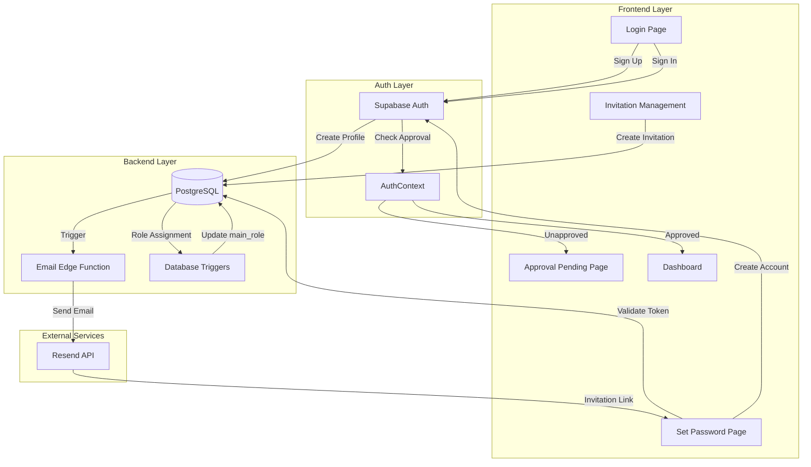
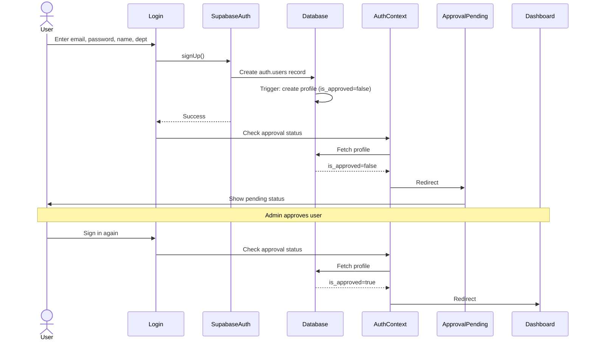
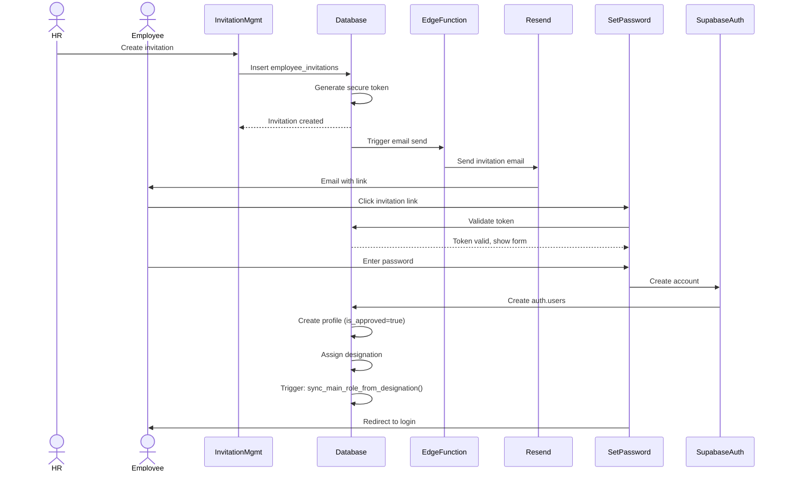
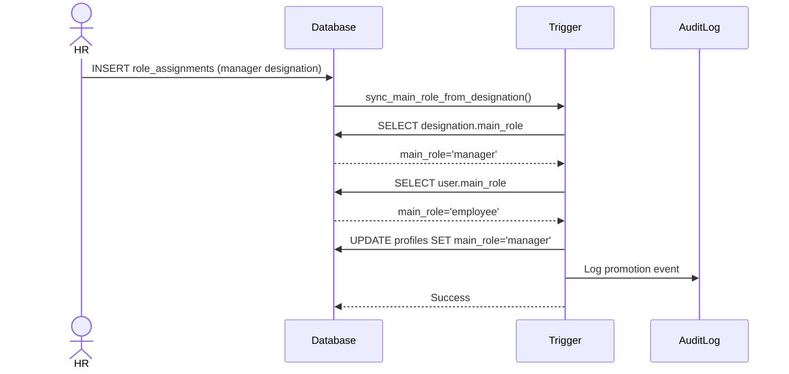

# Design Document: Complete Onboarding System

## Overview

The Complete Onboarding System implements a comprehensive user registration and approval workflow for Lazeez VORP, supporting both self-signup and HR-initiated invitation flows. The system bridges the gap between user registration and full system access by managing approval states, role assignments, and automatic role promotions.

### Key Design Goals

1. **Seamless User Experience**: Provide clear feedback at every stage of the onboarding process
2. **Security-First**: Implement secure token-based invitation system with expiration and validation
3. **Automatic Role Management**: Synchronize main_role with designation assignments via database triggers
4. **Dual Flow Support**: Handle both self-signup (requires approval) and HR invitation (pre-approved) workflows
5. **Integration**: Leverage existing database schema, UI patterns, and authentication infrastructure

### System Context

The onboarding system operates within the existing Lazeez VORP architecture:
- **Frontend**: React 18.3.1 with TypeScript, Framer Motion animations, shadcn/ui components
- **Backend**: Supabase (PostgreSQL with RLS, Edge Functions, Auth)
- **State Management**: TanStack Query for server state, AuthContext for auth state
- **Email Service**: Supabase Edge Function + Resend API for transactional emails
- **Existing Schema**: profiles, custom_roles, role_assignments, employee_invitations tables

## Architecture

### High-Level Architecture



### Flow Diagrams

#### Self-Signup Flow



#### HR Invitation Flow



#### Role Promotion Flow



## Components and Interfaces

### Frontend Components

#### 1. ApprovalPending Page (`src/pages/ApprovalPending.tsx`)

**Purpose**: Display approval status for users awaiting admin approval

**Props**: None (uses AuthContext)

**State**:
- `profile`: User profile from AuthContext
- `isRefreshing`: Boolean for manual refresh action

**Key Features**:
- Display user information (name, email, department)
- Show approval status with visual indicator
- Provide logout option
- Auto-refresh status every 30 seconds
- Display support contact information
- Follow design-system.md patterns (Framer Motion animations, no ALL CAPS)

**UI Structure**:
```tsx
<motion.div className="min-h-screen bg-slate-50">
  <StatusCard>
    <StatusIcon /> {/* Animated pending icon */}
    <UserInfo /> {/* Name, email, department */}
    <StatusMessage /> {/* Clear status explanation */}
    <Timeline /> {/* Expected approval timeline */}
    <Actions> {/* Refresh, Logout buttons */}
  </StatusCard>
  <SupportInfo /> {/* Contact information */}
</motion.div>
```

#### 2. SetPassword Page (`src/pages/SetPassword.tsx`)

**Purpose**: Allow invited users to set their password

**Props**: None (uses URL params)

**State**:
- `token`: Invitation token from URL
- `tokenData`: Validated token information
- `password`: Password input
- `confirmPassword`: Confirm password input
- `isValidating`: Token validation loading state
- `isSubmitting`: Form submission loading state
- `error`: Error message if token invalid/expired

**Key Features**:
- Validate token on mount
- Display employee email and designation
- Password strength indicator (reuse from Login.tsx)
- Form validation with Zod
- Create account and redirect to login
- Handle token expiration gracefully

**UI Structure**:
```tsx
<motion.div className="min-h-screen flex items-center justify-center">
  {isValidating ? (
    <LoadingState />
  ) : error ? (
    <ErrorState message={error} />
  ) : (
    <SetPasswordForm>
      <InvitationInfo /> {/* Email, designation */}
      <PasswordInput /> {/* With strength indicator */}
      <ConfirmPasswordInput />
      <SubmitButton />
    </SetPasswordForm>
  )}
</motion.div>
```

#### 3. InvitationManagement Component (`src/components/hr/InvitationManagement.tsx`)

**Purpose**: HR interface for creating and managing employee invitations

**Props**: None (protected route)

**State**:
- `invitations`: List of all invitations
- `filteredInvitations`: Filtered by status/search
- `statusFilter`: Current filter (all, pending, accepted, expired, revoked)
- `searchQuery`: Search input value
- `isCreating`: Create invitation dialog open state
- `selectedInvitation`: For resend/revoke actions

**Key Features**:
- Create new invitation form (email, department, designation)
- Display invitations table with status badges
- Filter by status (pending, accepted, expired, revoked)
- Search by email or department
- Resend invitation email
- Revoke pending invitation
- Show expiration countdown
- Real-time status updates via TanStack Query

**UI Structure**:
```tsx
<div className="space-y-6">
  <Header>
    <Title>Employee Invitations</Title>
    <CreateButton onClick={openDialog} />
  </Header>
  
  <Filters>
    <StatusTabs /> {/* All, Pending, Accepted, Expired */}
    <SearchInput />
  </Filters>
  
  <InvitationsTable>
    {/* Columns: Email, Department, Designation, Status, Created, Expires, Actions */}
  </InvitationsTable>
  
  <CreateInvitationDialog>
    <Form> {/* Email, Department, Designation */}
  </CreateInvitationDialog>
</div>
```

#### 4. AuthContext Updates (`src/components/contexts/AuthContext.tsx`)

**Changes Required**:
- Add `isApproved` check in redirect logic
- Redirect unapproved users to `/approval-pending` after login
- Redirect approved users to `/dashboard`
- Add `refreshProfile()` method for manual profile refresh

**New Logic**:
```typescript
// In AuthProvider, after fetchUserData:
useEffect(() => {
  if (user && profile) {
    if (!profile.is_approved && location.pathname !== '/approval-pending') {
      navigate('/approval-pending', { replace: true });
    } else if (profile.is_approved && location.pathname === '/approval-pending') {
      navigate('/dashboard', { replace: true });
    }
  }
}, [user, profile, location.pathname]);
```

### Backend Components

#### 1. Email Edge Function (`supabase/functions/send-invitation-email/index.ts`)

**Purpose**: Send invitation emails via Resend API

**Trigger**: Database trigger on employee_invitations INSERT

**Input**:
```typescript
interface InvitationEmailPayload {
  to: string;
  employeeName: string;
  inviterName: string;
  invitationToken: string;
  designation: string;
  expiresAt: string;
}
```

**Process**:
1. Receive payload from database trigger
2. Generate invitation URL with token
3. Render email template with branding
4. Send via Resend API
5. Update invitation status (sent/delivery_failed)
6. Log result

**Email Template Structure**:
- Lazeez VORP branding header
- Personalized greeting
- Invitation details (designation, inviter)
- Prominent CTA button with invitation link
- Expiration notice (7 days)
- Support contact information
- Professional footer

#### 2. Database Trigger: sync_main_role_from_designation()

**Purpose**: Automatically update main_role when designation is assigned

**Trigger**: AFTER INSERT ON role_assignments

**Logic**:
```sql
CREATE OR REPLACE FUNCTION sync_main_role_from_designation()
RETURNS TRIGGER AS $$
DECLARE
  designation_main_role VARCHAR(50);
  user_current_role VARCHAR(50);
BEGIN
  -- Get designation's main_role
  SELECT main_role INTO designation_main_role
  FROM custom_roles
  WHERE id = NEW.role_id;
  
  -- Get user's current main_role
  SELECT main_role INTO user_current_role
  FROM profiles
  WHERE id = NEW.user_id;
  
  -- Promote employee to manager if designation requires it
  IF designation_main_role = 'manager' AND user_current_role = 'employee' THEN
    UPDATE profiles
    SET main_role = 'manager'
    WHERE id = NEW.user_id;
    
    -- Log promotion
    INSERT INTO audit_logs (user_id, action, details)
    VALUES (NEW.user_id, 'role_promotion', 
            jsonb_build_object('from', 'employee', 'to', 'manager'));
  END IF;
  
  -- Demote manager to employee if designation requires it
  IF designation_main_role = 'employee' AND user_current_role = 'manager' THEN
    UPDATE profiles
    SET main_role = 'employee'
    WHERE id = NEW.user_id;
    
    -- Log demotion
    INSERT INTO audit_logs (user_id, action, details)
    VALUES (NEW.user_id, 'role_demotion', 
            jsonb_build_object('from', 'manager', 'to', 'employee'));
  END IF;
  
  -- Never modify admin role
  -- (implicit: no UPDATE if user_current_role = 'admin')
  
  -- Update designation display name
  UPDATE profiles
  SET designation = (SELECT display_name FROM custom_roles WHERE id = NEW.role_id)
  WHERE id = NEW.user_id;
  
  RETURN NEW;
END;
$$ LANGUAGE plpgsql;
```

### Custom Hooks

#### useInvitations Hook (`src/components/hooks/useInvitations.ts`)

**Purpose**: Manage invitation CRUD operations

**Exports**:
```typescript
interface UseInvitationsReturn {
  invitations: Invitation[];
  isLoading: boolean;
  error: Error | null;
  createInvitation: (data: CreateInvitationInput) => Promise<void>;
  resendInvitation: (invitationId: string) => Promise<void>;
  revokeInvitation: (invitationId: string) => Promise<void>;
}

interface CreateInvitationInput {
  email: string;
  departmentId: string;
  designationId: string;
}

interface Invitation {
  id: string;
  email: string;
  department: string;
  designation: string;
  status: 'pending' | 'accepted' | 'expired' | 'revoked';
  invitationToken: string;
  createdAt: string;
  expiresAt: string;
  invitedBy: string;
}
```

**Implementation**:
- Use TanStack Query for caching and real-time updates
- Implement optimistic updates for better UX
- Handle errors with toast notifications
- Auto-refetch on window focus

## Data Models

### Database Schema (Existing)

#### profiles Table
```sql
CREATE TABLE profiles (
  id UUID PRIMARY KEY REFERENCES auth.users(id),
  email TEXT UNIQUE NOT NULL,
  full_name TEXT,
  department_id UUID REFERENCES departments(id),
  designation TEXT, -- Display name of assigned designation
  main_role TEXT CHECK (main_role IN ('admin', 'manager', 'employee')),
  is_approved BOOLEAN DEFAULT false,
  approval_status TEXT CHECK (approval_status IN ('pending', 'approved', 'rejected')),
  admin_approved_by UUID REFERENCES profiles(id),
  admin_approved_at TIMESTAMPTZ,
  hr_approved_by UUID REFERENCES profiles(id),
  hr_approved_at TIMESTAMPTZ,
  created_at TIMESTAMPTZ DEFAULT NOW(),
  updated_at TIMESTAMPTZ DEFAULT NOW()
);
```

#### employee_invitations Table
```sql
CREATE TABLE employee_invitations (
  id UUID PRIMARY KEY DEFAULT gen_random_uuid(),
  email TEXT NOT NULL,
  department_id UUID REFERENCES departments(id),
  role_id UUID REFERENCES custom_roles(id), -- Designation to assign
  invitation_token TEXT UNIQUE NOT NULL,
  status TEXT CHECK (status IN ('pending', 'accepted', 'expired', 'revoked', 'delivery_failed')),
  invited_by UUID REFERENCES profiles(id),
  expires_at TIMESTAMPTZ NOT NULL,
  accepted_at TIMESTAMPTZ,
  created_at TIMESTAMPTZ DEFAULT NOW(),
  updated_at TIMESTAMPTZ DEFAULT NOW()
);

CREATE INDEX idx_invitations_token ON employee_invitations(invitation_token);
CREATE INDEX idx_invitations_email ON employee_invitations(email);
CREATE INDEX idx_invitations_status ON employee_invitations(status);
```

#### custom_roles Table (Designations)
```sql
CREATE TABLE custom_roles (
  id UUID PRIMARY KEY DEFAULT gen_random_uuid(),
  name TEXT UNIQUE NOT NULL, -- Slug (e.g., 'hr_manager')
  display_name TEXT NOT NULL, -- Human-readable (e.g., 'HR Manager')
  description TEXT,
  main_role TEXT CHECK (main_role IN ('admin', 'manager', 'employee')),
  permissions JSONB DEFAULT '{}'::jsonb,
  is_system_role BOOLEAN DEFAULT false,
  created_at TIMESTAMPTZ DEFAULT NOW()
);
```

#### role_assignments Table
```sql
CREATE TABLE role_assignments (
  id UUID PRIMARY KEY DEFAULT gen_random_uuid(),
  user_id UUID REFERENCES profiles(id) ON DELETE CASCADE,
  role_id UUID REFERENCES custom_roles(id) ON DELETE CASCADE,
  assigned_by UUID REFERENCES profiles(id),
  assigned_at TIMESTAMPTZ DEFAULT NOW(),
  UNIQUE(user_id, role_id)
);
```

### TypeScript Interfaces

```typescript
// Frontend type definitions

interface Profile {
  id: string;
  email: string;
  full_name: string | null;
  department_id: string | null;
  department: string | null;
  designation: string | null;
  main_role: 'admin' | 'manager' | 'employee';
  is_approved: boolean;
  approval_status: 'pending' | 'approved' | 'rejected';
  created_at: string;
}

interface Invitation {
  id: string;
  email: string;
  department_id: string;
  department: {
    name: string;
  };
  role_id: string;
  designation: {
    display_name: string;
  };
  invitation_token: string;
  status: 'pending' | 'accepted' | 'expired' | 'revoked' | 'delivery_failed';
  invited_by: string;
  inviter: {
    full_name: string;
  };
  expires_at: string;
  accepted_at: string | null;
  created_at: string;
}

interface TokenValidationResult {
  valid: boolean;
  email: string;
  designation: string;
  error?: string;
}

interface CreateInvitationInput {
  email: string;
  departmentId: string;
  roleId: string; // Designation ID
}
```


## Correctness Properties

*A property is a characteristic or behavior that should hold true across all valid executions of a system—essentially, a formal statement about what the system should do. Properties serve as the bridge between human-readable specifications and machine-verifiable correctness guarantees.*

### Property Reflection

After analyzing all acceptance criteria, I identified the following redundancies:
- Properties 1.2, 1.6, 8.1, and 8.2 all test redirect logic based on approval status - can be combined into comprehensive redirect properties
- Properties 3.7, 9.4, and 9.5 all test invitation management actions - 3.7 covers the others
- Properties 4.1 and 11.4 both test token validation - 4.1 covers this
- Properties 6.2, 6.3, and 6.4 can be combined into a single comprehensive role promotion property
- Properties 7.6 and 6.4 are duplicates - 6.4 covers admin protection
- Properties 5.5 and 5.6 test email failure handling - can be combined
- Properties 11.5 and 4.5 both test invitation acceptance - can be combined

### Property 1: Self-signup creates unapproved employee profile

*For any* valid signup data (email, password, full name, department), when a user completes self-signup, the system should create a profile with main_role='employee' and is_approved=false.

**Validates: Requirements 1.1**

### Property 2: Approval status determines redirect destination

*For any* user login attempt, if the user is unapproved, they should be redirected to /approval-pending; if approved, they should be redirected to /dashboard.

**Validates: Requirements 1.2, 1.6, 8.1, 8.2**

### Property 3: Admin approval updates approval status

*For any* unapproved user, when an admin approves them, the is_approved field should be updated to true.

**Validates: Requirements 1.4**

### Property 4: Role promotion synchronizes with designation main_role

*For any* user with main_role='employee' or 'manager', when assigned a designation, their main_role should be updated to match the designation's main_role, except admin users whose main_role should never change.

**Validates: Requirements 1.5, 6.1, 6.2, 6.3, 6.4**

### Property 5: Approval status changes are reflected on page refresh

*For any* user viewing the approval pending page, when their approval status changes in the database, refreshing the page should display the updated status.

**Validates: Requirements 2.5**

### Property 6: Invitation creation generates unique secure token

*For any* valid invitation data (email, department, designation), when HR creates an invitation, the system should generate a unique invitation_token of at least 32 characters and store it hashed in the database.

**Validates: Requirements 3.2, 11.1, 11.2, 11.3**

### Property 7: Invitation creation triggers email send

*For any* created invitation, the system should send an email containing the employee name, inviter name, invitation link with token, and expiration information (7 days).

**Validates: Requirements 3.3, 5.1, 5.3**

### Property 8: Invitation link format is correct

*For any* generated invitation link, it should include the invitation token and route to /set-password/:token.

**Validates: Requirements 3.4**

### Property 9: Invitation tokens expire after 7 days

*For any* invitation token, if more than 7 days have passed since creation, the token should be considered expired and validation should fail.

**Validates: Requirements 3.5**

### Property 10: Invitation management displays all invitation statuses

*For any* set of invitations with different statuses (pending, accepted, expired, revoked), the invitation management interface should display all of them.

**Validates: Requirements 3.6**

### Property 11: Pending invitations can be resent or revoked

*For any* invitation with status='pending', the invitation management interface should provide resend and revoke actions that successfully update the invitation status or trigger email resend.

**Validates: Requirements 3.7**

### Property 12: Token validation checks expiration and validity

*For any* invitation token, when accessed via the set password page, the system should validate the token exists, is not expired, and has not been used, returning appropriate error messages for each failure case.

**Validates: Requirements 4.1, 4.2**

### Property 13: Password strength validation provides feedback

*For any* password input, the system should validate strength requirements (minimum 8 characters, uppercase, lowercase, number) and provide real-time feedback.

**Validates: Requirements 4.4**

### Property 14: Invitation acceptance creates pre-approved account

*For any* valid invitation token and password, when an employee completes password setup, the system should create an account, mark the invitation as accepted, create a profile with is_approved=true, assign the specified designation, and prevent token reuse.

**Validates: Requirements 4.5, 4.6, 4.7, 11.5**

### Property 15: Password setup completion redirects to login

*For any* successful password setup, the user should be redirected to the login page with a success message.

**Validates: Requirements 4.8**

### Property 16: Email delivery failures are handled gracefully

*For any* invitation email that fails to send, the system should mark the invitation status as delivery_failed, log the error, and allow HR to retry sending.

**Validates: Requirements 5.4, 5.5, 5.6**

### Property 17: Role promotions are logged in audit trail

*For any* role promotion or demotion (employee ↔ manager), the system should create an audit log entry with the user ID, action, and role change details.

**Validates: Requirements 6.6**

### Property 18: Invitation route is protected by permissions

*For any* user attempting to access /invitations, access should be granted only if the user has main_role='admin' or a designation with hr_management permission.

**Validates: Requirements 8.6**

### Property 19: Invalid token access redirects to login

*For any* attempt to access /set-password with an invalid or missing token, the user should be redirected to login with an error message.

**Validates: Requirements 8.7**

### Property 20: Invitation filtering works correctly

*For any* status filter (pending, accepted, expired, revoked) applied to the invitation list, only invitations matching that status should be displayed.

**Validates: Requirements 9.2**

### Property 21: Invitation search matches email and department

*For any* search query, the invitation list should display only invitations where the email or department name contains the search term (case-insensitive).

**Validates: Requirements 9.3**

### Property 22: Expiration countdown displays correct time remaining

*For any* pending invitation, the displayed expiration countdown should accurately reflect the time remaining until the 7-day expiration.

**Validates: Requirements 9.6**

### Property 23: Database errors are logged and user-friendly messages displayed

*For any* database operation failure during onboarding, the system should log the error details and display a user-friendly error message to the user.

**Validates: Requirements 10.7**

### Property 24: Rate limiting prevents brute force attacks

*For any* series of rapid requests to /set-password endpoint, after a threshold is exceeded, subsequent requests should be blocked temporarily.

**Validates: Requirements 11.6**

### Property 25: Token validation attempts are audited

*For any* invitation token validation attempt (successful or failed), the system should create an audit log entry with the token, timestamp, and result.

**Validates: Requirements 11.7**

### Property 26: Status change notifications are created

*For any* critical status change (approval, designation assignment, role promotion, invitation sent, invitation accepted), the system should create appropriate notifications for affected users and HR staff.

**Validates: Requirements 12.1, 12.2, 12.3, 12.4, 12.5**

### Property 27: Critical events trigger email notifications

*For any* critical status change (approval, invitation, password setup completion), the system should send email notifications in addition to in-app notifications.

**Validates: Requirements 12.6**

## Error Handling

### Frontend Error Handling

#### Form Validation Errors
- **Email validation**: Display "Please enter a valid email address" for invalid format
- **Password strength**: Display specific requirements when password is weak
- **Required fields**: Highlight missing fields with red border and error message
- **Duplicate email**: Display "An account with this email already exists"

#### Token Validation Errors
- **Expired token**: Display "This invitation has expired. Please contact HR for a new invitation."
- **Invalid token**: Display "Invalid invitation link. Please check your email or contact HR."
- **Used token**: Display "This invitation has already been used. Please contact HR if you need assistance."

#### Network Errors
- **Connection failure**: Display "Unable to connect. Please check your internet connection."
- **Timeout**: Display "Request timed out. Please try again."
- **Server error**: Display "An error occurred. Please try again or contact support."

#### Email Delivery Errors
- **Delivery failed**: Display "Email delivery failed. Please verify the email address and try again."
- **Provide retry action**: Show "Resend Email" button for failed invitations

### Backend Error Handling

#### Database Errors
- **Connection failure**: Log error, return 500 with generic message
- **Constraint violation**: Log error, return 400 with specific message
- **Transaction failure**: Rollback transaction, log error, return 500

#### Email Service Errors
- **API failure**: Log error, mark invitation as delivery_failed, allow retry
- **Invalid recipient**: Log error, return 400 with message to verify email
- **Rate limit exceeded**: Queue email for retry, notify HR of delay

#### Authentication Errors
- **Invalid credentials**: Return "Invalid email or password"
- **Account locked**: Return "Account locked. Please contact support."
- **Session expired**: Redirect to login with message

#### Authorization Errors
- **Insufficient permissions**: Return 403 with "You don't have permission to access this resource"
- **Unapproved account**: Redirect to /approval-pending
- **Invalid token**: Return 401 with "Invalid or expired token"

### Error Recovery Strategies

#### Automatic Retry
- Email delivery failures: Retry up to 3 times with exponential backoff
- Network timeouts: Retry once after 2 seconds
- Database deadlocks: Retry transaction up to 3 times

#### User-Initiated Retry
- Failed email delivery: Provide "Resend Email" button
- Failed form submission: Preserve form data, allow resubmission
- Token validation failure: Provide link to request new invitation

#### Graceful Degradation
- Email service unavailable: Queue invitations, process when service recovers
- Database read failure: Show cached data with warning banner
- Notification service failure: Log error, continue with core operation

## Testing Strategy

### Dual Testing Approach

The onboarding system requires both unit tests and property-based tests for comprehensive coverage:

**Unit Tests**: Focus on specific examples, edge cases, and UI rendering
- Specific error messages for known scenarios
- UI component rendering with specific props
- Route configuration and protection
- Admin account setup verification
- Integration between components

**Property-Based Tests**: Verify universal properties across all inputs
- Signup flow with random valid data
- Token generation and validation with random tokens
- Role promotion with various designation combinations
- Invitation creation with random employee data
- Email content validation with random invitation data

### Property-Based Testing Configuration

**Library Selection**: 
- **fast-check** for TypeScript/JavaScript property-based testing
- Integrates well with Jest/Vitest test runners
- Supports complex data generation (emails, UUIDs, dates)

**Test Configuration**:
- Minimum 100 iterations per property test
- Seed-based reproducibility for failed tests
- Shrinking to find minimal failing examples

**Property Test Structure**:
```typescript
import fc from 'fast-check';

describe('Feature: complete-onboarding-system, Property 1: Self-signup creates unapproved employee profile', () => {
  it('should create unapproved employee profile for any valid signup data', () => {
    fc.assert(
      fc.asyncProperty(
        fc.emailAddress(),
        fc.string({ minLength: 8 }),
        fc.string({ minLength: 2 }),
        fc.uuid(),
        async (email, password, fullName, departmentId) => {
          // Test implementation
        }
      ),
      { numRuns: 100 }
    );
  });
});
```

### Unit Test Coverage

#### Component Tests
- **ApprovalPending.tsx**: Render with different approval statuses, logout action, refresh action
- **SetPassword.tsx**: Token validation states, password strength indicator, form submission
- **InvitationManagement.tsx**: Table rendering, filtering, search, create dialog, resend/revoke actions
- **AuthContext.tsx**: Redirect logic, approval status checks, profile refresh

#### Integration Tests
- **Self-signup flow**: Complete signup → check profile → check redirect
- **HR invitation flow**: Create invitation → validate email sent → complete password setup → check account
- **Role promotion flow**: Assign designation → check main_role update → check audit log
- **Approval flow**: Approve user → check notification → check redirect on next login

#### Edge Case Tests
- Expired invitation token
- Already-used invitation token
- Invalid invitation token format
- Duplicate email signup attempt
- Admin account role protection
- Concurrent invitation creation
- Email delivery failure and retry
- Token validation rate limiting

### Test Data Generators

```typescript
// Generators for property-based tests

const validEmailArbitrary = fc.emailAddress();

const validPasswordArbitrary = fc.string({ minLength: 8 })
  .filter(pwd => /[A-Z]/.test(pwd) && /[a-z]/.test(pwd) && /[0-9]/.test(pwd));

const departmentArbitrary = fc.record({
  id: fc.uuid(),
  name: fc.string({ minLength: 2, maxLength: 50 })
});

const designationArbitrary = fc.record({
  id: fc.uuid(),
  name: fc.string({ minLength: 2, maxLength: 50 }),
  display_name: fc.string({ minLength: 2, maxLength: 50 }),
  main_role: fc.constantFrom('admin', 'manager', 'employee')
});

const invitationTokenArbitrary = fc.hexaString({ minLength: 32, maxLength: 64 });

const profileArbitrary = fc.record({
  id: fc.uuid(),
  email: validEmailArbitrary,
  full_name: fc.string({ minLength: 2, maxLength: 100 }),
  department_id: fc.uuid(),
  main_role: fc.constantFrom('admin', 'manager', 'employee'),
  is_approved: fc.boolean()
});
```

### Testing Checklist

Before deployment, verify:
- [ ] All 27 correctness properties have corresponding property-based tests
- [ ] All property tests run with minimum 100 iterations
- [ ] All unit tests pass for UI components
- [ ] Integration tests cover complete user flows
- [ ] Edge case tests cover error scenarios
- [ ] Email templates render correctly in test environment
- [ ] Database triggers execute correctly in test database
- [ ] Rate limiting works as expected
- [ ] Audit logging captures all required events
- [ ] Error messages match requirements specifications
- [ ] Redirect logic works for all approval states
- [ ] Token expiration is enforced correctly
- [ ] Admin account is protected from role changes

