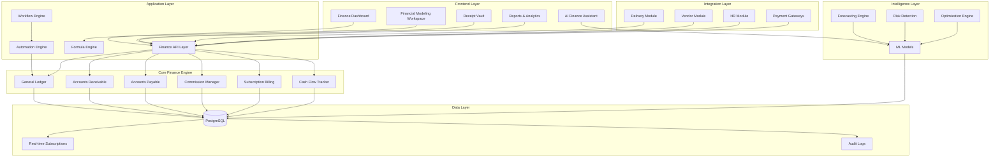
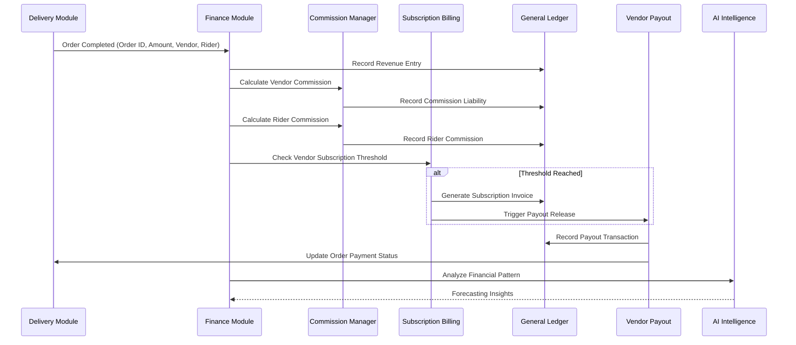

# Design Document: Finance Module

## Overview

The Finance Module is a comprehensive enterprise-grade financial command center for Lazeez VORP ERP system. It integrates revenue management, vendor commission tracking, subscription billing, expense management, cash flow analysis, and AI-powered financial intelligence into a unified platform. The module provides real-time financial visibility, automated workflows, and advanced analytics to support strategic financial decision-making across vendor operations, delivery management, and organizational resource planning.

## Architecture

### System Architecture Overview



### Main Workflow Sequence



## Components and Interfaces

### 1. Core Accounting Engine

**Purpose**: Foundation for all financial transactions using double-entry bookkeeping

**Interface**:
```typescript
interface GeneralLedger {
  createJournalEntry(entry: JournalEntry): Promise<JournalEntryResult>
  postTransaction(transaction: Transaction): Promise<TransactionResult>
  getAccountBalance(accountId: string, date?: Date): Promise<Balance>
  getTrialBalance(startDate: Date, endDate: Date): Promise<TrialBalance>
  reconcileAccount(accountId: string, statement: BankStatement): Promise<ReconciliationResult>
}

interface JournalEntry {
  id: string
  date: Date
  description: string
  reference: string
  entries: LedgerEntry[]
  createdBy: string
  status: 'draft' | 'posted' | 'void'
}

interface LedgerEntry {
  accountId: string
  debit: number
  credit: number
  currency: string
  description: string
}

interface ChartOfAccounts {
  id: string
  code: string
  name: string
  type: 'asset' | 'liability' | 'equity' | 'revenue' | 'expense'
  subType: string
  currency: string
  parentAccountId?: string
  isActive: boolean
}
```

**Responsibilities**:
- Maintain chart of accounts structure
- Process double-entry journal entries
- Calculate account balances in real-time
- Support multi-currency transactions
- Ensure accounting equation balance (Assets = Liabilities + Equity)
- Provide audit trail for all transactions

### 2. Revenue Management System

**Purpose**: Track and manage all revenue streams including subscriptions, commissions, and transaction fees

**Interface**:
```typescript
interface RevenueManager {
  recordRevenue(source: RevenueSource): Promise<RevenueRecord>
  calculateCommission(orderId: string, vendorId: string): Promise<Commission>
  processSubscriptionRevenue(vendorId: string): Promise<SubscriptionRevenue>
  getRevenueByPeriod(startDate: Date, endDate: Date): Promise<RevenueReport>
  getRevenueByVendor(vendorId: string, period: Period): Promise<VendorRevenue>
  recognizeRevenue(revenueId: string): Promise<RevenueRecognition>
}

interface RevenueSource {
  type: 'subscription' | 'commission' | 'transaction_fee' | 'service_charge'
  orderId?: string
  vendorId: string
  amount: number
  currency: string
  date: Date
  metadata: Record<string, any>
}

interface Commission {
  vendorCommission: number
  riderCommission: number
  platformRevenue: number
  commissionRate: number
  calculationMethod: 'flat' | 'tiered' | 'percentage'
}
```

**Responsibilities**:
- Record revenue from multiple sources
- Calculate vendor and rider commissions
- Track subscription revenue per vendor
- Apply revenue recognition rules
- Generate revenue reports by period, vendor, category


### 3. Vendor Commission System

**Purpose**: Calculate and track vendor commissions based on configurable models

**Interface**:
```typescript
interface CommissionEngine {
  calculateVendorCommission(order: Order): Promise<CommissionResult>
  calculateRiderCommission(delivery: Delivery): Promise<CommissionResult>
  applyCommissionTier(vendorId: string, amount: number): Promise<TierResult>
  getCommissionHistory(vendorId: string, period: Period): Promise<CommissionHistory[]>
  updateCommissionRules(vendorId: string, rules: CommissionRules): Promise<void>
}

interface CommissionRules {
  vendorId: string
  model: 'flat' | 'percentage' | 'tiered' | 'category_based'
  flatRate?: number
  percentageRate?: number
  tiers?: CommissionTier[]
  categoryRates?: Record<string, number>
  effectiveDate: Date
}

interface CommissionTier {
  minAmount: number
  maxAmount: number
  rate: number
}

interface CommissionResult {
  orderId: string
  vendorId: string
  orderAmount: number
  commissionAmount: number
  commissionRate: number
  netPayable: number
  calculatedAt: Date
}
```

**Responsibilities**:
- Support multiple commission models (flat, percentage, tiered, category-based)
- Calculate commissions in real-time on order completion
- Track commission history per vendor
- Apply vendor-specific commission rules
- Handle commission adjustments and corrections

### 4. Subscription Billing Management

**Purpose**: Manage vendor subscription plans, billing cycles, and threshold-based billing

**Interface**:
```typescript
interface SubscriptionManager {
  createSubscription(vendorId: string, plan: SubscriptionPlan): Promise<Subscription>
  checkThreshold(vendorId: string): Promise<ThresholdStatus>
  generateInvoice(subscriptionId: string): Promise<Invoice>
  processPayment(invoiceId: string, payment: Payment): Promise<PaymentResult>
  prorateBilling(subscriptionId: string, changeDate: Date): Promise<ProratedAmount>
  cancelSubscription(subscriptionId: string, reason: string): Promise<void>
}

interface SubscriptionPlan {
  id: string
  name: string
  billingCycle: 'monthly' | 'quarterly' | 'annual'
  basePrice: number
  currency: string
  features: string[]
  customThreshold?: number
  autoRenew: boolean
}

interface Subscription {
  id: string
  vendorId: string
  planId: string
  status: 'active' | 'suspended' | 'cancelled' | 'pending'
  startDate: Date
  endDate?: Date
  currentPeriodStart: Date
  currentPeriodEnd: Date
  thresholdReached: boolean
  orderCount: number
}

interface ThresholdStatus {
  vendorId: string
  currentOrderCount: number
  thresholdLimit: number
  thresholdReached: boolean
  nextBillingDate: Date
}
```

**Responsibilities**:
- Create and manage subscription plans
- Track vendor subscription status
- Monitor custom thresholds per vendor
- Generate invoices automatically on threshold or cycle
- Handle proration for mid-cycle changes
- Process subscription payments

### 5. Accounts Receivable (AR)

**Purpose**: Manage customer invoices, payment tracking, and credit management

**Interface**:
```typescript
interface AccountsReceivable {
  createInvoice(invoice: InvoiceData): Promise<Invoice>
  recordPayment(invoiceId: string, payment: Payment): Promise<PaymentRecord>
  generateCreditNote(invoiceId: string, reason: string, amount: number): Promise<CreditNote>
  getAgingReport(asOfDate: Date): Promise<AgingReport>
  sendPaymentReminder(invoiceId: string): Promise<void>
  writeOffBadDebt(invoiceId: string, reason: string): Promise<void>
}

interface Invoice {
  id: string
  invoiceNumber: string
  vendorId: string
  issueDate: Date
  dueDate: Date
  lineItems: InvoiceLineItem[]
  subtotal: number
  taxAmount: number
  totalAmount: number
  amountPaid: number
  amountDue: number
  status: 'draft' | 'sent' | 'paid' | 'overdue' | 'void'
  currency: string
}

interface InvoiceLineItem {
  description: string
  quantity: number
  unitPrice: number
  taxRate: number
  amount: number
}

interface AgingReport {
  current: number
  days30: number
  days60: number
  days90: number
  over90: number
  total: number
}
```

**Responsibilities**:
- Generate invoices for subscriptions and services
- Track payment status and aging
- Send automated payment reminders
- Handle partial payments and credit notes
- Generate aging reports for collections
- Support multiple payment methods

### 6. Accounts Payable (AP)

**Purpose**: Manage vendor bills, expense approvals, and payment scheduling

**Interface**:
```typescript
interface AccountsPayable {
  createBill(bill: BillData): Promise<Bill>
  approveExpense(expenseId: string, approverId: string): Promise<ApprovalResult>
  schedulePayment(billId: string, paymentDate: Date): Promise<ScheduledPayment>
  processVendorPayout(vendorId: string, orderId: string): Promise<PayoutResult>
  getBillsByVendor(vendorId: string): Promise<Bill[]>
  getPaymentSchedule(startDate: Date, endDate: Date): Promise<ScheduledPayment[]>
}

interface Bill {
  id: string
  billNumber: string
  vendorId: string
  billDate: Date
  dueDate: Date
  lineItems: BillLineItem[]
  subtotal: number
  taxAmount: number
  totalAmount: number
  amountPaid: number
  status: 'pending' | 'approved' | 'paid' | 'rejected'
  approvalChain: Approval[]
}

interface PayoutResult {
  vendorId: string
  orderId: string
  payoutAmount: number
  upfrontAmount: number
  remainingAmount: number
  commissionDeducted: number
  netPayout: number
  paymentMethod: string
  transactionId: string
  status: 'pending' | 'processing' | 'completed' | 'failed'
}
```

**Responsibilities**:
- Create and track vendor bills
- Manage approval workflows for expenses
- Schedule vendor payouts based on order completion
- Handle upfront payment calculations
- Process commission deductions
- Track payment history per vendor


### 7. Expense Management

**Purpose**: Handle expense submission, approval workflows, and reimbursement processing

**Interface**:
```typescript
interface ExpenseManager {
  submitExpense(expense: ExpenseSubmission): Promise<Expense>
  approveExpense(expenseId: string, approverId: string, notes?: string): Promise<void>
  rejectExpense(expenseId: string, approverId: string, reason: string): Promise<void>
  processReimbursement(expenseId: string): Promise<ReimbursementResult>
  getExpensesByEmployee(employeeId: string, period: Period): Promise<Expense[]>
  getExpenseReport(departmentId: string, period: Period): Promise<ExpenseReport>
}

interface ExpenseSubmission {
  employeeId: string
  category: string
  amount: number
  currency: string
  date: Date
  description: string
  receiptUrl?: string
  projectId?: string
  vendorId?: string
}

interface Expense {
  id: string
  employeeId: string
  category: string
  amount: number
  status: 'submitted' | 'pending_approval' | 'approved' | 'rejected' | 'reimbursed'
  submittedAt: Date
  approvedAt?: Date
  reimbursedAt?: Date
  approvalChain: Approval[]
  receiptVaultId?: string
}
```

**Responsibilities**:
- Accept expense submissions from employees
- Route expenses through approval workflows
- Validate expense policies and limits
- Process reimbursements
- Link expenses to receipt vault
- Generate expense reports by employee, department, category

### 8. Financial Modeling Workspace

**Purpose**: Provide Excel-like interface for financial modeling, forecasting, and scenario analysis

**Interface**:
```typescript
interface ModelingWorkspace {
  createWorkbook(name: string, template?: string): Promise<Workbook>
  createSheet(workbookId: string, name: string): Promise<Sheet>
  updateCell(sheetId: string, cell: CellReference, value: CellValue): Promise<void>
  evaluateFormula(formula: string, context: FormulaContext): Promise<any>
  runScenario(workbookId: string, scenario: Scenario): Promise<ScenarioResult>
  exportWorkbook(workbookId: string, format: 'xlsx' | 'pdf' | 'csv'): Promise<Blob>
}

interface Workbook {
  id: string
  name: string
  sheets: Sheet[]
  createdBy: string
  createdAt: Date
  lastModified: Date
  sharedWith: string[]
}

interface Sheet {
  id: string
  name: string
  cells: Map<string, Cell>
  rowCount: number
  columnCount: number
  frozenRows: number
  frozenColumns: number
}

interface Cell {
  value: string | number | boolean | Date | null
  formula?: string
  format?: CellFormat
  style?: CellStyle
}

interface FormulaEngine {
  evaluate(formula: string, context: FormulaContext): any
  supportedFunctions: string[]
  registerFunction(name: string, implementation: Function): void
}
```

**Responsibilities**:
- Provide spreadsheet-like interface for financial modeling
- Support formula evaluation (SUM, AVERAGE, NPV, IRR, etc.)
- Enable scenario analysis and what-if modeling
- Support data import from finance system
- Export models to Excel, PDF, CSV
- Enable collaboration and sharing

### 9. Budgeting & Forecasting

**Purpose**: Create and manage budgets, track spending, and forecast financial performance

**Interface**:
```typescript
interface BudgetManager {
  createBudget(budget: BudgetData): Promise<Budget>
  allocateBudget(budgetId: string, allocations: BudgetAllocation[]): Promise<void>
  trackSpending(budgetId: string): Promise<SpendingReport>
  forecastSpending(budgetId: string, method: 'linear' | 'seasonal' | 'ml'): Promise<Forecast>
  alertOnOverspend(budgetId: string, threshold: number): Promise<void>
  rolloverBudget(budgetId: string, nextPeriod: Period): Promise<Budget>
}

interface Budget {
  id: string
  name: string
  fiscalYear: number
  period: 'monthly' | 'quarterly' | 'annual'
  totalAmount: number
  allocations: BudgetAllocation[]
  status: 'draft' | 'approved' | 'active' | 'closed'
  approvedBy?: string
  approvedAt?: Date
}

interface BudgetAllocation {
  departmentId: string
  category: string
  allocatedAmount: number
  spentAmount: number
  remainingAmount: number
  utilizationPercentage: number
}
```

**Responsibilities**:
- Create departmental and category budgets
- Track actual spending against budget
- Alert on budget overruns
- Forecast future spending patterns
- Support budget revisions and rollovers
- Generate variance reports


### 10. Profit & Loss (P&L) System

**Purpose**: Automated P&L generation with drill-down capabilities

**Interface**:
```typescript
interface ProfitLossManager {
  generatePL(period: Period, filters?: PLFilters): Promise<ProfitLossStatement>
  getDepartmentPL(departmentId: string, period: Period): Promise<ProfitLossStatement>
  getVendorPL(vendorId: string, period: Period): Promise<VendorProfitLoss>
  comparePeriods(period1: Period, period2: Period): Promise<PLComparison>
  exportPL(plId: string, format: 'pdf' | 'xlsx'): Promise<Blob>
}

interface ProfitLossStatement {
  period: Period
  revenue: RevenueBreakdown
  costOfGoodsSold: number
  grossProfit: number
  operatingExpenses: ExpenseBreakdown
  operatingIncome: number
  otherIncome: number
  otherExpenses: number
  netIncome: number
  margins: {
    grossMargin: number
    operatingMargin: number
    netMargin: number
  }
}

interface RevenueBreakdown {
  subscriptionRevenue: number
  commissionRevenue: number
  transactionFees: number
  serviceCharges: number
  otherRevenue: number
  totalRevenue: number
}

interface ExpenseBreakdown {
  vendorPayouts: number
  riderCommissions: number
  salaries: number
  marketing: number
  technology: number
  administrative: number
  otherExpenses: number
  totalExpenses: number
}
```

**Responsibilities**:
- Generate automated P&L statements
- Support monthly, quarterly, annual views
- Provide department-level P&L
- Calculate vendor-specific profitability
- Compare periods for trend analysis
- Export formatted P&L reports

### 11. Cash Flow Tracking

**Purpose**: Monitor and forecast cash flows across operating, investing, and financing activities

**Interface**:
```typescript
interface CashFlowManager {
  recordCashFlow(transaction: CashFlowTransaction): Promise<void>
  getCashFlowStatement(period: Period): Promise<CashFlowStatement>
  forecastCashFlow(months: number, method: 'historical' | 'ml'): Promise<CashFlowForecast>
  getCashPosition(date: Date): Promise<CashPosition>
  alertOnLowCash(threshold: number): Promise<void>
  reconcileCashAccounts(date: Date): Promise<ReconciliationResult>
}

interface CashFlowStatement {
  period: Period
  operatingActivities: {
    netIncome: number
    adjustments: number[]
    changeInWorkingCapital: number
    netCashFromOperations: number
  }
  investingActivities: {
    capitalExpenditures: number
    assetPurchases: number
    assetSales: number
    netCashFromInvesting: number
  }
  financingActivities: {
    debtProceeds: number
    debtRepayments: number
    equityProceeds: number
    dividendsPaid: number
    netCashFromFinancing: number
  }
  netCashChange: number
  beginningCash: number
  endingCash: number
}

interface CashFlowForecast {
  forecastPeriods: ForecastPeriod[]
  projectedCashPosition: number[]
  confidenceInterval: { lower: number[], upper: number[] }
  assumptions: string[]
}
```

**Responsibilities**:
- Track cash inflows and outflows
- Categorize by operating, investing, financing
- Generate cash flow statements
- Forecast future cash positions
- Alert on low cash situations
- Support cash flow scenario planning

### 12. Receipt Vault Management

**Purpose**: Centralized storage and categorization of financial receipts with AI-powered extraction

**Interface**:
```typescript
interface ReceiptVault {
  uploadReceipt(file: File, metadata: ReceiptMetadata): Promise<Receipt>
  extractReceiptData(receiptId: string): Promise<ExtractedData>
  categorizeReceipt(receiptId: string, category: ReceiptCategory): Promise<void>
  tagReceipt(receiptId: string, tags: string[]): Promise<void>
  searchReceipts(query: ReceiptQuery): Promise<Receipt[]>
  linkToTransaction(receiptId: string, transactionId: string): Promise<void>
  generateReceiptReport(filters: ReceiptFilters): Promise<ReceiptReport>
}

interface ReceiptMetadata {
  uploadedBy: string
  category: 'riders' | 'vendors' | 'general'
  subcategory?: string
  date: Date
  amount?: number
  vendorId?: string
  riderId?: string
  orderId?: string
}

interface Receipt {
  id: string
  fileUrl: string
  fileName: string
  fileType: string
  uploadedAt: Date
  category: 'riders' | 'vendors' | 'general'
  tags: string[]
  extractedData?: ExtractedData
  linkedTransactionId?: string
  status: 'pending' | 'processed' | 'verified'
}

interface ExtractedData {
  merchantName?: string
  date?: Date
  totalAmount?: number
  currency?: string
  lineItems?: Array<{
    description: string
    quantity: number
    unitPrice: number
    amount: number
  }>
  taxAmount?: number
  paymentMethod?: string
  confidence: number
}

interface AssetTags {
  assetType: 'tangible' | 'intangible'
  assetClass: 'fixed' | 'current'
  accountingCategory: 'asset' | 'liability' | 'equity' | 'income' | 'expense'
  depreciable: boolean
  usefulLife?: number
}
```

**Responsibilities**:
- Store receipts with categorization (Riders, Vendors, General)
- Extract data using OCR and AI (Tesseract.js + AI analysis)
- Tag receipts with asset classifications
- Link receipts to transactions and expenses
- Enable search and filtering
- Generate receipt-based reports

### 13. Rider Commission Management

**Purpose**: Calculate rider commissions based on distance, delivery charges, and tier-based models

**Interface**:
```typescript
interface RiderCommissionManager {
  calculateRiderCommission(delivery: DeliveryData): Promise<RiderCommission>
  applyDistanceTier(distance: number): Promise<TierRate>
  recordDeliveryReceipt(receipt: DeliveryReceipt): Promise<void>
  getRiderEarnings(riderId: string, period: Period): Promise<RiderEarnings>
  processRiderPayout(riderId: string, period: Period): Promise<PayoutResult>
  getDeliveryPricing(distance: number, orderValue: number): Promise<DeliveryPricing>
}

interface DeliveryData {
  orderId: string
  riderId: string
  vendorId: string
  pickupLocation: Location
  deliveryLocation: Location
  distance: number
  optimizedRoute: RouteData
  orderValue: number
  deliveryCharge: number
  completedAt: Date
}

interface RiderCommission {
  orderId: string
  riderId: string
  distance: number
  deliveryCharge: number
  commissionRate: number
  commissionAmount: number
  tierApplied: string
  calculatedAt: Date
}

interface DeliveryPricing {
  baseCharge: number
  distanceCharge: number
  tierRate: number
  totalCharge: number
  estimatedCommission: number
}
```

**Responsibilities**:
- Calculate rider commissions per delivery
- Apply distance-based tier pricing
- Track optimized routes and distances
- Record delivery receipts with full details
- Generate rider earnings reports
- Process rider payouts


### 14. AI Finance Intelligence

**Purpose**: Provide AI-powered forecasting, risk detection, and financial optimization

**Interface**:
```typescript
interface AIFinanceIntelligence {
  forecastRevenue(months: number, confidence: number): Promise<RevenueForecast>
  detectAnomalies(accountId: string, period: Period): Promise<Anomaly[]>
  optimizeCommissionRates(vendorId: string): Promise<OptimizationResult>
  predictCashFlow(months: number): Promise<CashFlowPrediction>
  analyzeVendorProfitability(vendorId: string): Promise<ProfitabilityAnalysis>
  recommendBudgetAdjustments(budgetId: string): Promise<BudgetRecommendation[]>
  detectFraudRisk(transactionId: string): Promise<FraudRiskScore>
}

interface RevenueForecast {
  forecastPeriods: Array<{
    period: string
    predictedRevenue: number
    lowerBound: number
    upperBound: number
    confidence: number
  }>
  trendAnalysis: {
    direction: 'increasing' | 'decreasing' | 'stable'
    growthRate: number
    seasonality: boolean
  }
  factors: string[]
  recommendations: string[]
}

interface Anomaly {
  transactionId: string
  accountId: string
  detectedAt: Date
  anomalyType: 'spike' | 'drop' | 'pattern_break' | 'outlier'
  severity: 'low' | 'medium' | 'high' | 'critical'
  description: string
  expectedValue: number
  actualValue: number
  deviation: number
  suggestedAction: string
}

interface OptimizationResult {
  currentRate: number
  recommendedRate: number
  projectedImpact: {
    revenueChange: number
    profitChange: number
    volumeChange: number
  }
  reasoning: string[]
  confidence: number
}
```

**Responsibilities**:
- Forecast revenue using ML models
- Detect financial anomalies and fraud
- Optimize commission rates for profitability
- Predict cash flow trends
- Analyze vendor profitability patterns
- Recommend budget adjustments
- Provide conversational finance insights

### 15. Multi-Currency System

**Purpose**: Handle multi-currency transactions, conversions, and reporting

**Interface**:
```typescript
interface MultiCurrencyManager {
  convertCurrency(amount: number, from: string, to: string, date?: Date): Promise<number>
  getExchangeRate(from: string, to: string, date?: Date): Promise<ExchangeRate>
  recordFXTransaction(transaction: FXTransaction): Promise<void>
  getFXGainLoss(period: Period): Promise<FXGainLoss>
  getMultiCurrencyReport(period: Period, baseCurrency: string): Promise<MultiCurrencyReport>
  updateExchangeRates(): Promise<void>
}

interface ExchangeRate {
  fromCurrency: string
  toCurrency: string
  rate: number
  date: Date
  source: string
}

interface FXTransaction {
  transactionId: string
  fromCurrency: string
  toCurrency: string
  fromAmount: number
  toAmount: number
  exchangeRate: number
  date: Date
  fxGainLoss: number
}

interface MultiCurrencyReport {
  baseCurrency: string
  period: Period
  revenueByurrency: Record<string, number>
  expensesByCurrency: Record<string, number>
  totalRevenue: number
  totalExpenses: number
  fxGainLoss: number
  netIncome: number
}
```

**Responsibilities**:
- Convert between currencies using real-time rates
- Track foreign exchange transactions
- Calculate FX gains and losses
- Generate multi-currency financial reports
- Update exchange rates automatically
- Support multiple base currencies

### 16. Financial Dashboard

**Purpose**: Executive dashboard with real-time KPIs and financial metrics

**Interface**:
```typescript
interface FinanceDashboard {
  getExecutiveSummary(period: Period): Promise<ExecutiveSummary>
  getKPIs(period: Period): Promise<FinancialKPIs>
  getRevenueChart(period: Period, groupBy: 'day' | 'week' | 'month'): Promise<ChartData>
  getCashFlowChart(months: number): Promise<ChartData>
  getVendorPerformance(limit: number): Promise<VendorPerformance[]>
  getAlerts(): Promise<FinanceAlert[]>
}

interface ExecutiveSummary {
  period: Period
  totalRevenue: number
  totalExpenses: number
  netIncome: number
  cashPosition: number
  accountsReceivable: number
  accountsPayable: number
  revenueGrowth: number
  profitMargin: number
  burnRate: number
  runway: number
}

interface FinancialKPIs {
  mrr: number
  arr: number
  customerLifetimeValue: number
  customerAcquisitionCost: number
  churnRate: number
  revenuePerVendor: number
  operatingCashFlow: number
  quickRatio: number
  currentRatio: number
  debtToEquity: number
}
```

**Responsibilities**:
- Display real-time financial metrics
- Show revenue, expense, cash flow trends
- Highlight top performing vendors
- Alert on critical financial issues
- Provide drill-down capabilities
- Support role-based dashboard views


### 17. Compliance & Tax System

**Purpose**: Manage tax calculations, compliance reporting, and audit trails

**Interface**:
```typescript
interface ComplianceTaxManager {
  calculateTax(transaction: Transaction, taxRules: TaxRules): Promise<TaxCalculation>
  generateTaxReport(period: Period, taxType: 'VAT' | 'GST' | 'income'): Promise<TaxReport>
  fileComplianceReport(reportType: string, period: Period): Promise<FilingResult>
  getAuditTrail(entityId: string, entityType: string): Promise<AuditEntry[]>
  validateCompliance(transaction: Transaction): Promise<ComplianceResult>
  generateAuditPackage(period: Period): Promise<AuditPackage>
}

interface TaxCalculation {
  transactionId: string
  taxableAmount: number
  taxRate: number
  taxAmount: number
  taxType: string
  jurisdiction: string
  calculatedAt: Date
}

interface TaxReport {
  period: Period
  taxType: string
  totalSales: number
  taxableAmount: number
  taxCollected: number
  taxPaid: number
  netTaxLiability: number
  filingDeadline: Date
  status: 'draft' | 'filed' | 'paid'
}
```

**Responsibilities**:
- Calculate VAT/GST on transactions
- Generate tax reports for filing
- Maintain comprehensive audit trails
- Validate compliance with regulations
- Support multiple tax jurisdictions
- Generate audit packages for external auditors

## Data Models

### Core Financial Entities

```typescript
// Account Structure
interface Account {
  id: string
  code: string
  name: string
  type: 'asset' | 'liability' | 'equity' | 'revenue' | 'expense'
  subType: string
  currency: string
  balance: number
  parentAccountId?: string
  isActive: boolean
  createdAt: Date
  updatedAt: Date
}

// Transaction
interface Transaction {
  id: string
  transactionNumber: string
  date: Date
  type: 'revenue' | 'expense' | 'transfer' | 'adjustment'
  description: string
  amount: number
  currency: string
  status: 'pending' | 'posted' | 'void'
  sourceModule: 'delivery' | 'vendor' | 'hr' | 'manual'
  sourceId: string
  journalEntryId: string
  createdBy: string
  createdAt: Date
}

// Vendor Financial Profile
interface VendorFinancialProfile {
  vendorId: string
  commissionRules: CommissionRules
  subscriptionId?: string
  subscriptionStatus: 'active' | 'suspended' | 'cancelled'
  currentThreshold: number
  thresholdLimit: number
  totalRevenue: number
  totalCommissionPaid: number
  totalPayouts: number
  outstandingBalance: number
  paymentTerms: string
  preferredPaymentMethod: string
  bankDetails?: BankDetails
  taxId?: string
  lastPayoutDate?: Date
  nextBillingDate?: Date
}

// Order Financial Data
interface OrderFinancialData {
  orderId: string
  vendorId: string
  riderId?: string
  orderAmount: number
  deliveryCharge: number
  taxAmount: number
  totalAmount: number
  vendorCommission: number
  riderCommission: number
  platformRevenue: number
  paymentStatus: 'pending' | 'partial' | 'completed'
  upfrontPaid: number
  remainingAmount: number
  payoutReleased: boolean
  payoutDate?: Date
  currency: string
  createdAt: Date
}

// Delivery Financial Data
interface DeliveryFinancialData {
  deliveryId: string
  orderId: string
  riderId: string
  distance: number
  optimizedRoute: string
  deliveryCharge: number
  riderCommission: number
  commissionRate: number
  tierApplied: string
  receiptId?: string
  payoutStatus: 'pending' | 'processed' | 'paid'
  payoutDate?: Date
  createdAt: Date
}

// Receipt Entity
interface ReceiptEntity {
  id: string
  fileUrl: string
  fileName: string
  fileType: string
  fileSize: number
  uploadedBy: string
  uploadedAt: Date
  category: 'riders' | 'vendors' | 'general'
  subcategory?: string
  tags: string[]
  assetTags?: AssetTags
  extractedData?: ExtractedData
  linkedEntityType?: 'transaction' | 'expense' | 'delivery' | 'order'
  linkedEntityId?: string
  verifiedBy?: string
  verifiedAt?: Date
  status: 'pending' | 'processed' | 'verified' | 'rejected'
  notes?: string
}

// Budget Entity
interface BudgetEntity {
  id: string
  name: string
  description: string
  fiscalYear: number
  period: 'monthly' | 'quarterly' | 'annual'
  startDate: Date
  endDate: Date
  totalAmount: number
  allocatedAmount: number
  spentAmount: number
  remainingAmount: number
  status: 'draft' | 'approved' | 'active' | 'closed'
  departmentId?: string
  categoryId?: string
  ownerId: string
  approvedBy?: string
  approvedAt?: Date
  alerts: BudgetAlert[]
  createdAt: Date
  updatedAt: Date
}

interface BudgetAlert {
  threshold: number
  triggered: boolean
  triggeredAt?: Date
  notifiedUsers: string[]
}

// Financial Forecast
interface FinancialForecast {
  id: string
  type: 'revenue' | 'expense' | 'cash_flow' | 'profit'
  period: Period
  forecastMethod: 'linear' | 'seasonal' | 'ml' | 'manual'
  baselineData: number[]
  forecastedValues: number[]
  confidenceIntervals: Array<{ lower: number; upper: number }>
  accuracy?: number
  assumptions: string[]
  createdBy: string
  createdAt: Date
  lastUpdated: Date
}
```

### Database Schema Design

```sql
-- Chart of Accounts
CREATE TABLE finance_accounts (
  id UUID PRIMARY KEY DEFAULT gen_random_uuid(),
  code VARCHAR(20) UNIQUE NOT NULL,
  name VARCHAR(255) NOT NULL,
  type VARCHAR(20) NOT NULL CHECK (type IN ('asset', 'liability', 'equity', 'revenue', 'expense')),
  sub_type VARCHAR(50),
  currency VARCHAR(3) DEFAULT 'USD',
  balance DECIMAL(15, 2) DEFAULT 0,
  parent_account_id UUID REFERENCES finance_accounts(id),
  is_active BOOLEAN DEFAULT true,
  created_at TIMESTAMPTZ DEFAULT NOW(),
  updated_at TIMESTAMPTZ DEFAULT NOW()
);

-- Journal Entries
CREATE TABLE finance_journal_entries (
  id UUID PRIMARY KEY DEFAULT gen_random_uuid(),
  entry_number VARCHAR(50) UNIQUE NOT NULL,
  entry_date DATE NOT NULL,
  description TEXT,
  reference VARCHAR(100),
  status VARCHAR(20) DEFAULT 'draft' CHECK (status IN ('draft', 'posted', 'void')),
  created_by UUID REFERENCES auth.users(id),
  posted_by UUID REFERENCES auth.users(id),
  posted_at TIMESTAMPTZ,
  created_at TIMESTAMPTZ DEFAULT NOW(),
  updated_at TIMESTAMPTZ DEFAULT NOW()
);

-- Ledger Entries
CREATE TABLE finance_ledger_entries (
  id UUID PRIMARY KEY DEFAULT gen_random_uuid(),
  journal_entry_id UUID REFERENCES finance_journal_entries(id) ON DELETE CASCADE,
  account_id UUID REFERENCES finance_accounts(id),
  debit DECIMAL(15, 2) DEFAULT 0,
  credit DECIMAL(15, 2) DEFAULT 0,
  currency VARCHAR(3) DEFAULT 'USD',
  description TEXT,
  created_at TIMESTAMPTZ DEFAULT NOW()
);

-- Transactions
CREATE TABLE finance_transactions (
  id UUID PRIMARY KEY DEFAULT gen_random_uuid(),
  transaction_number VARCHAR(50) UNIQUE NOT NULL,
  transaction_date DATE NOT NULL,
  type VARCHAR(20) NOT NULL CHECK (type IN ('revenue', 'expense', 'transfer', 'adjustment')),
  description TEXT,
  amount DECIMAL(15, 2) NOT NULL,
  currency VARCHAR(3) DEFAULT 'USD',
  status VARCHAR(20) DEFAULT 'pending' CHECK (status IN ('pending', 'posted', 'void')),
  source_module VARCHAR(50),
  source_id UUID,
  journal_entry_id UUID REFERENCES finance_journal_entries(id),
  created_by UUID REFERENCES auth.users(id),
  created_at TIMESTAMPTZ DEFAULT NOW(),
  updated_at TIMESTAMPTZ DEFAULT NOW()
);

-- Vendor Financial Profiles
CREATE TABLE finance_vendor_profiles (
  id UUID PRIMARY KEY DEFAULT gen_random_uuid(),
  vendor_id UUID REFERENCES vendors(id) ON DELETE CASCADE,
  commission_model VARCHAR(20) DEFAULT 'percentage' CHECK (commission_model IN ('flat', 'percentage', 'tiered', 'category_based')),
  commission_rate DECIMAL(5, 2),
  commission_rules JSONB,
  subscription_id UUID,
  subscription_status VARCHAR(20) DEFAULT 'active',
  current_threshold INTEGER DEFAULT 0,
  threshold_limit INTEGER,
  total_revenue DECIMAL(15, 2) DEFAULT 0,
  total_commission_paid DECIMAL(15, 2) DEFAULT 0,
  total_payouts DECIMAL(15, 2) DEFAULT 0,
  outstanding_balance DECIMAL(15, 2) DEFAULT 0,
  payment_terms VARCHAR(50),
  preferred_payment_method VARCHAR(50),
  bank_details JSONB,
  tax_id VARCHAR(50),
  last_payout_date TIMESTAMPTZ,
  next_billing_date DATE,
  created_at TIMESTAMPTZ DEFAULT NOW(),
  updated_at TIMESTAMPTZ DEFAULT NOW()
);

-- Order Financial Data
CREATE TABLE finance_order_data (
  id UUID PRIMARY KEY DEFAULT gen_random_uuid(),
  order_id UUID UNIQUE NOT NULL,
  vendor_id UUID REFERENCES vendors(id),
  rider_id UUID,
  order_amount DECIMAL(15, 2) NOT NULL,
  delivery_charge DECIMAL(15, 2) DEFAULT 0,
  tax_amount DECIMAL(15, 2) DEFAULT 0,
  total_amount DECIMAL(15, 2) NOT NULL,
  vendor_commission DECIMAL(15, 2) DEFAULT 0,
  rider_commission DECIMAL(15, 2) DEFAULT 0,
  platform_revenue DECIMAL(15, 2) DEFAULT 0,
  payment_status VARCHAR(20) DEFAULT 'pending' CHECK (payment_status IN ('pending', 'partial', 'completed')),
  upfront_paid DECIMAL(15, 2) DEFAULT 0,
  remaining_amount DECIMAL(15, 2) DEFAULT 0,
  payout_released BOOLEAN DEFAULT false,
  payout_date TIMESTAMPTZ,
  currency VARCHAR(3) DEFAULT 'USD',
  created_at TIMESTAMPTZ DEFAULT NOW(),
  updated_at TIMESTAMPTZ DEFAULT NOW()
);

-- Delivery Financial Data
CREATE TABLE finance_delivery_data (
  id UUID PRIMARY KEY DEFAULT gen_random_uuid(),
  delivery_id UUID UNIQUE NOT NULL,
  order_id UUID REFERENCES finance_order_data(order_id),
  rider_id UUID NOT NULL,
  distance DECIMAL(10, 2) NOT NULL,
  optimized_route TEXT,
  delivery_charge DECIMAL(15, 2) NOT NULL,
  rider_commission DECIMAL(15, 2) NOT NULL,
  commission_rate DECIMAL(5, 2) NOT NULL,
  tier_applied VARCHAR(50),
  receipt_id UUID,
  payout_status VARCHAR(20) DEFAULT 'pending' CHECK (payout_status IN ('pending', 'processed', 'paid')),
  payout_date TIMESTAMPTZ,
  created_at TIMESTAMPTZ DEFAULT NOW()
);

-- Invoices
CREATE TABLE finance_invoices (
  id UUID PRIMARY KEY DEFAULT gen_random_uuid(),
  invoice_number VARCHAR(50) UNIQUE NOT NULL,
  vendor_id UUID REFERENCES vendors(id),
  issue_date DATE NOT NULL,
  due_date DATE NOT NULL,
  subtotal DECIMAL(15, 2) NOT NULL,
  tax_amount DECIMAL(15, 2) DEFAULT 0,
  total_amount DECIMAL(15, 2) NOT NULL,
  amount_paid DECIMAL(15, 2) DEFAULT 0,
  amount_due DECIMAL(15, 2) NOT NULL,
  status VARCHAR(20) DEFAULT 'draft' CHECK (status IN ('draft', 'sent', 'paid', 'overdue', 'void')),
  currency VARCHAR(3) DEFAULT 'USD',
  notes TEXT,
  created_by UUID REFERENCES auth.users(id),
  created_at TIMESTAMPTZ DEFAULT NOW(),
  updated_at TIMESTAMPTZ DEFAULT NOW()
);

-- Invoice Line Items
CREATE TABLE finance_invoice_line_items (
  id UUID PRIMARY KEY DEFAULT gen_random_uuid(),
  invoice_id UUID REFERENCES finance_invoices(id) ON DELETE CASCADE,
  description TEXT NOT NULL,
  quantity DECIMAL(10, 2) NOT NULL,
  unit_price DECIMAL(15, 2) NOT NULL,
  tax_rate DECIMAL(5, 2) DEFAULT 0,
  amount DECIMAL(15, 2) NOT NULL,
  created_at TIMESTAMPTZ DEFAULT NOW()
);

-- Expenses
CREATE TABLE finance_expenses (
  id UUID PRIMARY KEY DEFAULT gen_random_uuid(),
  expense_number VARCHAR(50) UNIQUE NOT NULL,
  employee_id UUID REFERENCES auth.users(id),
  category VARCHAR(100) NOT NULL,
  amount DECIMAL(15, 2) NOT NULL,
  currency VARCHAR(3) DEFAULT 'USD',
  expense_date DATE NOT NULL,
  description TEXT,
  receipt_url TEXT,
  receipt_vault_id UUID,
  project_id UUID,
  vendor_id UUID,
  status VARCHAR(20) DEFAULT 'submitted' CHECK (status IN ('submitted', 'pending_approval', 'approved', 'rejected', 'reimbursed')),
  submitted_at TIMESTAMPTZ DEFAULT NOW(),
  approved_at TIMESTAMPTZ,
  approved_by UUID REFERENCES auth.users(id),
  reimbursed_at TIMESTAMPTZ,
  rejection_reason TEXT,
  created_at TIMESTAMPTZ DEFAULT NOW(),
  updated_at TIMESTAMPTZ DEFAULT NOW()
);

-- Receipt Vault
CREATE TABLE finance_receipt_vault (
  id UUID PRIMARY KEY DEFAULT gen_random_uuid(),
  file_url TEXT NOT NULL,
  file_name VARCHAR(255) NOT NULL,
  file_type VARCHAR(50) NOT NULL,
  file_size INTEGER NOT NULL,
  uploaded_by UUID REFERENCES auth.users(id),
  uploaded_at TIMESTAMPTZ DEFAULT NOW(),
  category VARCHAR(20) NOT NULL CHECK (category IN ('riders', 'vendors', 'general')),
  subcategory VARCHAR(100),
  tags TEXT[],
  asset_tags JSONB,
  extracted_data JSONB,
  linked_entity_type VARCHAR(50),
  linked_entity_id UUID,
  verified_by UUID REFERENCES auth.users(id),
  verified_at TIMESTAMPTZ,
  status VARCHAR(20) DEFAULT 'pending' CHECK (status IN ('pending', 'processed', 'verified', 'rejected')),
  notes TEXT,
  created_at TIMESTAMPTZ DEFAULT NOW(),
  updated_at TIMESTAMPTZ DEFAULT NOW()
);

-- Budgets
CREATE TABLE finance_budgets (
  id UUID PRIMARY KEY DEFAULT gen_random_uuid(),
  name VARCHAR(255) NOT NULL,
  description TEXT,
  fiscal_year INTEGER NOT NULL,
  period VARCHAR(20) NOT NULL CHECK (period IN ('monthly', 'quarterly', 'annual')),
  start_date DATE NOT NULL,
  end_date DATE NOT NULL,
  total_amount DECIMAL(15, 2) NOT NULL,
  allocated_amount DECIMAL(15, 2) DEFAULT 0,
  spent_amount DECIMAL(15, 2) DEFAULT 0,
  remaining_amount DECIMAL(15, 2) NOT NULL,
  status VARCHAR(20) DEFAULT 'draft' CHECK (status IN ('draft', 'approved', 'active', 'closed')),
  department_id UUID,
  category_id UUID,
  owner_id UUID REFERENCES auth.users(id),
  approved_by UUID REFERENCES auth.users(id),
  approved_at TIMESTAMPTZ,
  alerts JSONB,
  created_at TIMESTAMPTZ DEFAULT NOW(),
  updated_at TIMESTAMPTZ DEFAULT NOW()
);

-- Exchange Rates
CREATE TABLE finance_exchange_rates (
  id UUID PRIMARY KEY DEFAULT gen_random_uuid(),
  from_currency VARCHAR(3) NOT NULL,
  to_currency VARCHAR(3) NOT NULL,
  rate DECIMAL(15, 6) NOT NULL,
  rate_date DATE NOT NULL,
  source VARCHAR(50),
  created_at TIMESTAMPTZ DEFAULT NOW(),
  UNIQUE(from_currency, to_currency, rate_date)
);

-- Financial Forecasts
CREATE TABLE finance_forecasts (
  id UUID PRIMARY KEY DEFAULT gen_random_uuid(),
  type VARCHAR(20) NOT NULL CHECK (type IN ('revenue', 'expense', 'cash_flow', 'profit')),
  period_start DATE NOT NULL,
  period_end DATE NOT NULL,
  forecast_method VARCHAR(20) NOT NULL CHECK (forecast_method IN ('linear', 'seasonal', 'ml', 'manual')),
  baseline_data JSONB NOT NULL,
  forecasted_values JSONB NOT NULL,
  confidence_intervals JSONB,
  accuracy DECIMAL(5, 2),
  assumptions TEXT[],
  created_by UUID REFERENCES auth.users(id),
  created_at TIMESTAMPTZ DEFAULT NOW(),
  updated_at TIMESTAMPTZ DEFAULT NOW()
);

-- Audit Trail
CREATE TABLE finance_audit_log (
  id UUID PRIMARY KEY DEFAULT gen_random_uuid(),
  entity_type VARCHAR(50) NOT NULL,
  entity_id UUID NOT NULL,
  action VARCHAR(50) NOT NULL,
  old_values JSONB,
  new_values JSONB,
  changed_by UUID REFERENCES auth.users(id),
  changed_at TIMESTAMPTZ DEFAULT NOW(),
  ip_address INET,
  user_agent TEXT
);

-- Indexes for performance
CREATE INDEX idx_ledger_entries_account ON finance_ledger_entries(account_id);
CREATE INDEX idx_ledger_entries_journal ON finance_ledger_entries(journal_entry_id);
CREATE INDEX idx_transactions_date ON finance_transactions(transaction_date);
CREATE INDEX idx_transactions_source ON finance_transactions(source_module, source_id);
CREATE INDEX idx_order_data_vendor ON finance_order_data(vendor_id);
CREATE INDEX idx_order_data_date ON finance_order_data(created_at);
CREATE INDEX idx_delivery_data_rider ON finance_delivery_data(rider_id);
CREATE INDEX idx_invoices_vendor ON finance_invoices(vendor_id);
CREATE INDEX idx_invoices_status ON finance_invoices(status);
CREATE INDEX idx_expenses_employee ON finance_expenses(employee_id);
CREATE INDEX idx_expenses_status ON finance_expenses(status);
CREATE INDEX idx_receipt_vault_category ON finance_receipt_vault(category);
CREATE INDEX idx_receipt_vault_linked ON finance_receipt_vault(linked_entity_type, linked_entity_id);
CREATE INDEX idx_audit_log_entity ON finance_audit_log(entity_type, entity_id);
```

## Algorithmic Pseudocode

### Main Revenue Processing Algorithm

```typescript
ALGORITHM processOrderRevenue(order: Order): Promise<RevenueResult>
INPUT: order of type Order
OUTPUT: result of type RevenueResult

PRECONDITIONS:
  - order is validated and completed
  - order.vendorId exists in system
  - order.totalAmount > 0

POSTCONDITIONS:
  - Revenue recorded in general ledger
  - Vendor commission calculated and recorded
  - Rider commission calculated (if delivery order)
  - Subscription threshold updated
  - Payout triggered if conditions met
  - All transactions are atomic (rollback on failure)

BEGIN
  // Step 1: Start database transaction
  transaction ← beginTransaction()
  
  TRY
    // Step 2: Record revenue in general ledger
    journalEntry ← createJournalEntry({
      date: order.completedAt,
      description: `Revenue from Order ${order.id}`,
      entries: [
        { account: 'Cash', debit: order.totalAmount },
        { account: 'Revenue', credit: order.totalAmount }
      ]
    })
    
    // Step 3: Calculate vendor commission
    vendorProfile ← getVendorFinancialProfile(order.vendorId)
    vendorCommission ← calculateCommission(order, vendorProfile.commissionRules)
    
    // Step 4: Record vendor commission liability
    commissionEntry ← createJournalEntry({
      date: order.completedAt,
      description: `Vendor Commission for Order ${order.id}`,
      entries: [
        { account: 'Commission Expense', debit: vendorCommission.amount },
        { account: 'Accounts Payable - Vendors', credit: vendorCommission.amount }
      ]
    })
    
    // Step 5: Calculate rider commission if delivery order
    IF order.deliveryId IS NOT NULL THEN
      delivery ← getDeliveryData(order.deliveryId)
      riderCommission ← calculateRiderCommission(delivery)
      
      riderCommissionEntry ← createJournalEntry({
        date: order.completedAt,
        description: `Rider Commission for Delivery ${order.deliveryId}`,
        entries: [
          { account: 'Commission Expense', debit: riderCommission.amount },
          { account: 'Accounts Payable - Riders', credit: riderCommission.amount }
        ]
      })
    END IF
    
    // Step 6: Update vendor subscription threshold
    vendorProfile.currentThreshold ← vendorProfile.currentThreshold + 1
    updateVendorProfile(vendorProfile)
    
    // Step 7: Check if threshold reached for billing
    IF vendorProfile.currentThreshold >= vendorProfile.thresholdLimit THEN
      invoice ← generateSubscriptionInvoice(order.vendorId)
      vendorProfile.currentThreshold ← 0
      vendorProfile.nextBillingDate ← calculateNextBillingDate()
      updateVendorProfile(vendorProfile)
    END IF
    
    // Step 8: Process payout if conditions met
    payoutResult ← processVendorPayout(order)
    
    // Step 9: Record order financial data
    orderFinancialData ← {
      orderId: order.id,
      vendorId: order.vendorId,
      riderId: order.riderId,
      orderAmount: order.amount,
      deliveryCharge: order.deliveryCharge,
      totalAmount: order.totalAmount,
      vendorCommission: vendorCommission.amount,
      riderCommission: riderCommission?.amount || 0,
      platformRevenue: order.totalAmount - vendorCommission.amount - (riderCommission?.amount || 0),
      paymentStatus: 'completed',
      payoutReleased: payoutResult.released
    }
    saveOrderFinancialData(orderFinancialData)
    
    // Step 10: Commit transaction
    commitTransaction(transaction)
    
    RETURN {
      success: true,
      journalEntryId: journalEntry.id,
      vendorCommission: vendorCommission.amount,
      riderCommission: riderCommission?.amount || 0,
      payoutReleased: payoutResult.released
    }
    
  CATCH error
    // Rollback on any failure
    rollbackTransaction(transaction)
    logError(error)
    RETURN {
      success: false,
      error: error.message
    }
  END TRY
END
```

**Loop Invariants**: N/A (no loops in main flow)

**Time Complexity**: O(1) - constant time operations with database queries


### Commission Calculation Algorithm

```typescript
ALGORITHM calculateCommission(order: Order, rules: CommissionRules): Commission
INPUT: order of type Order, rules of type CommissionRules
OUTPUT: commission of type Commission

PRECONDITIONS:
  - order.amount > 0
  - rules.model is valid ('flat', 'percentage', 'tiered', 'category_based')
  - For tiered model: rules.tiers is sorted by minAmount ascending

POSTCONDITIONS:
  - Returns valid commission amount >= 0
  - Commission amount <= order.amount
  - Calculation matches specified model

BEGIN
  MATCH rules.model WITH
    CASE 'flat':
      commissionAmount ← rules.flatRate
      commissionRate ← (rules.flatRate / order.amount) * 100
      
    CASE 'percentage':
      commissionAmount ← order.amount * (rules.percentageRate / 100)
      commissionRate ← rules.percentageRate
      
    CASE 'tiered':
      // Find applicable tier
      applicableTier ← NULL
      FOR EACH tier IN rules.tiers DO
        IF order.amount >= tier.minAmount AND order.amount <= tier.maxAmount THEN
          applicableTier ← tier
          BREAK
        END IF
      END FOR
      
      IF applicableTier IS NULL THEN
        // Use highest tier if amount exceeds all tiers
        applicableTier ← rules.tiers[rules.tiers.length - 1]
      END IF
      
      commissionAmount ← order.amount * (applicableTier.rate / 100)
      commissionRate ← applicableTier.rate
      tierApplied ← applicableTier.name
      
    CASE 'category_based':
      categoryRate ← rules.categoryRates[order.category] || rules.defaultRate
      commissionAmount ← order.amount * (categoryRate / 100)
      commissionRate ← categoryRate
  END MATCH
  
  // Calculate net payable to vendor
  netPayable ← order.amount - commissionAmount
  
  RETURN {
    orderId: order.id,
    vendorId: order.vendorId,
    orderAmount: order.amount,
    commissionAmount: commissionAmount,
    commissionRate: commissionRate,
    netPayable: netPayable,
    tierApplied: tierApplied,
    calculatedAt: NOW()
  }
END
```

**Loop Invariants**: 
- For tiered model loop: All previously checked tiers did not match the order amount
- applicableTier remains NULL until matching tier is found

**Time Complexity**: 
- Flat/Percentage: O(1)
- Tiered: O(n) where n is number of tiers
- Category-based: O(1) with hash map lookup

### Rider Commission Calculation Algorithm

```typescript
ALGORITHM calculateRiderCommission(delivery: DeliveryData): RiderCommission
INPUT: delivery of type DeliveryData
OUTPUT: commission of type RiderCommission

PRECONDITIONS:
  - delivery.distance > 0
  - delivery.deliveryCharge > 0
  - Distance tiers are configured in system

POSTCONDITIONS:
  - Returns valid commission amount >= 0
  - Commission amount <= delivery.deliveryCharge
  - Tier correctly applied based on distance

BEGIN
  // Step 1: Get distance-based tier configuration
  distanceTiers ← getDistanceTiers()
  
  // Step 2: Find applicable tier based on distance
  applicableTier ← NULL
  FOR EACH tier IN distanceTiers DO
    IF delivery.distance >= tier.minDistance AND delivery.distance <= tier.maxDistance THEN
      applicableTier ← tier
      BREAK
    END IF
  END FOR
  
  // Step 3: Use default tier if no match
  IF applicableTier IS NULL THEN
    applicableTier ← getDefaultTier()
  END IF
  
  // Step 4: Calculate commission
  commissionRate ← applicableTier.commissionRate
  commissionAmount ← delivery.deliveryCharge * (commissionRate / 100)
  
  // Step 5: Record delivery receipt
  receipt ← {
    deliveryId: delivery.deliveryId,
    orderId: delivery.orderId,
    riderId: delivery.riderId,
    distance: delivery.distance,
    route: delivery.optimizedRoute,
    deliveryCharge: delivery.deliveryCharge,
    commissionAmount: commissionAmount,
    tierApplied: applicableTier.name
  }
  
  RETURN {
    orderId: delivery.orderId,
    riderId: delivery.riderId,
    distance: delivery.distance,
    deliveryCharge: delivery.deliveryCharge,
    commissionRate: commissionRate,
    commissionAmount: commissionAmount,
    tierApplied: applicableTier.name,
    calculatedAt: NOW()
  }
END
```

**Loop Invariants**: All previously checked tiers did not match the delivery distance

**Time Complexity**: O(n) where n is number of distance tiers

### Vendor Payout Processing Algorithm

```typescript
ALGORITHM processVendorPayout(order: Order): Promise<PayoutResult>
INPUT: order of type Order
OUTPUT: result of type PayoutResult

PRECONDITIONS:
  - order.status = 'completed'
  - order.vendorId exists
  - Vendor financial profile exists
  - Commission has been calculated

POSTCONDITIONS:
  - Payout amount correctly calculated with upfront deduction
  - Commission deducted from payout
  - Payout recorded in accounts payable
  - Vendor balance updated
  - Transaction is atomic

BEGIN
  // Step 1: Get vendor financial profile
  vendorProfile ← getVendorFinancialProfile(order.vendorId)
  
  // Step 2: Get order financial data
  orderFinancial ← getOrderFinancialData(order.id)
  
  // Step 3: Calculate payout amount
  upfrontPercentage ← vendorProfile.upfrontPercentage || 0
  upfrontAmount ← order.amount * (upfrontPercentage / 100)
  remainingAmount ← order.amount - upfrontAmount
  commissionAmount ← orderFinancial.vendorCommission
  netPayout ← remainingAmount - commissionAmount
  
  // Step 4: Check if payout should be released
  shouldRelease ← checkPayoutConditions(order, vendorProfile)
  
  IF shouldRelease THEN
    // Step 5: Create payout transaction
    payout ← {
      vendorId: order.vendorId,
      orderId: order.id,
      payoutAmount: remainingAmount,
      upfrontAmount: upfrontAmount,
      commissionDeducted: commissionAmount,
      netPayout: netPayout,
      paymentMethod: vendorProfile.preferredPaymentMethod,
      status: 'processing'
    }
    
    // Step 6: Record in accounts payable
    journalEntry ← createJournalEntry({
      date: NOW(),
      description: `Vendor Payout for Order ${order.id}`,
      entries: [
        { account: 'Accounts Payable - Vendors', debit: netPayout },
        { account: 'Cash', credit: netPayout }
      ]
    })
    
    // Step 7: Update vendor profile
    vendorProfile.totalPayouts ← vendorProfile.totalPayouts + netPayout
    vendorProfile.outstandingBalance ← vendorProfile.outstandingBalance - netPayout
    vendorProfile.lastPayoutDate ← NOW()
    updateVendorProfile(vendorProfile)
    
    // Step 8: Update order financial data
    orderFinancial.payoutReleased ← true
    orderFinancial.payoutDate ← NOW()
    orderFinancial.paymentStatus ← 'completed'
    updateOrderFinancialData(orderFinancial)
    
    RETURN {
      success: true,
      released: true,
      payoutAmount: netPayout,
      transactionId: journalEntry.id
    }
  ELSE
    RETURN {
      success: true,
      released: false,
      reason: 'Payout conditions not met'
    }
  END IF
END
```

**Loop Invariants**: N/A

**Time Complexity**: O(1) - constant time operations


### Receipt Data Extraction Algorithm

```typescript
ALGORITHM extractReceiptData(receiptId: string): Promise<ExtractedData>
INPUT: receiptId of type string
OUTPUT: extractedData of type ExtractedData

PRECONDITIONS:
  - Receipt file exists and is accessible
  - File is in supported format (PDF, JPG, PNG)
  - OCR service (Tesseract.js) is available

POSTCONDITIONS:
  - Returns extracted data with confidence score
  - Receipt status updated to 'processed'
  - Extracted data stored in database

BEGIN
  // Step 1: Get receipt file
  receipt ← getReceiptFromVault(receiptId)
  
  // Step 2: Download file for processing
  fileBuffer ← downloadFile(receipt.fileUrl)
  
  // Step 3: Perform OCR extraction
  ocrText ← performOCR(fileBuffer)
  
  // Step 4: Parse extracted text using AI
  parsedData ← parseReceiptText(ocrText)
  
  // Step 5: Extract structured data
  extractedData ← {
    merchantName: extractMerchantName(parsedData),
    date: extractDate(parsedData),
    totalAmount: extractTotalAmount(parsedData),
    currency: extractCurrency(parsedData) || 'USD',
    lineItems: extractLineItems(parsedData),
    taxAmount: extractTaxAmount(parsedData),
    paymentMethod: extractPaymentMethod(parsedData),
    confidence: calculateConfidence(parsedData)
  }
  
  // Step 6: Validate extracted data
  isValid ← validateExtractedData(extractedData)
  
  IF isValid THEN
    // Step 7: Update receipt with extracted data
    receipt.extractedData ← extractedData
    receipt.status ← 'processed'
    updateReceipt(receipt)
    
    RETURN extractedData
  ELSE
    // Mark for manual review
    receipt.status ← 'pending'
    receipt.notes ← 'Low confidence extraction - requires manual review'
    updateReceipt(receipt)
    
    RETURN extractedData
  END IF
END
```

**Loop Invariants**: N/A

**Time Complexity**: O(n) where n is the size of the receipt image/document

### AI Revenue Forecasting Algorithm

```typescript
ALGORITHM forecastRevenue(months: number, confidence: number): Promise<RevenueForecast>
INPUT: months (number of months to forecast), confidence (confidence level 0-1)
OUTPUT: forecast of type RevenueForecast

PRECONDITIONS:
  - months > 0 and months <= 24
  - confidence >= 0 and confidence <= 1
  - Historical revenue data available (minimum 6 months)

POSTCONDITIONS:
  - Returns forecast for specified number of months
  - Includes confidence intervals
  - Identifies trend and seasonality
  - Provides actionable recommendations

BEGIN
  // Step 1: Gather historical data
  historicalData ← getHistoricalRevenue(months * 2) // Get 2x data for training
  
  // Step 2: Detect seasonality
  seasonality ← detectSeasonality(historicalData)
  
  // Step 3: Calculate trend
  trend ← calculateTrend(historicalData)
  
  // Step 4: Prepare features for ML model
  features ← prepareFeatures(historicalData, seasonality, trend)
  
  // Step 5: Load or train ML model
  model ← getOrTrainModel(features)
  
  // Step 6: Generate forecasts
  forecastPeriods ← []
  FOR i FROM 1 TO months DO
    // Predict next period
    prediction ← model.predict(features)
    
    // Calculate confidence interval
    interval ← calculateConfidenceInterval(prediction, confidence)
    
    forecastPeriods.push({
      period: formatPeriod(i),
      predictedRevenue: prediction.value,
      lowerBound: interval.lower,
      upperBound: interval.upper,
      confidence: prediction.confidence
    })
    
    // Update features for next iteration
    features ← updateFeatures(features, prediction)
  END FOR
  
  // Step 7: Analyze trend
  trendAnalysis ← {
    direction: determineTrendDirection(forecastPeriods),
    growthRate: calculateGrowthRate(forecastPeriods),
    seasonality: seasonality.detected
  }
  
  // Step 8: Generate recommendations
  recommendations ← generateRecommendations(forecastPeriods, trendAnalysis)
  
  RETURN {
    forecastPeriods: forecastPeriods,
    trendAnalysis: trendAnalysis,
    factors: identifyKeyFactors(historicalData),
    recommendations: recommendations
  }
END
```

**Loop Invariants**: 
- For forecast loop: All previous periods have been predicted
- features remain valid for next prediction

**Time Complexity**: O(m * n) where m is months to forecast, n is feature complexity


## Key Functions with Formal Specifications

### Function: createJournalEntry()

```typescript
function createJournalEntry(entry: JournalEntryData): Promise<JournalEntry>
```

**Preconditions:**
- `entry.entries` array is non-empty
- Sum of debits equals sum of credits (accounting equation balance)
- All referenced account IDs exist in chart of accounts
- `entry.date` is valid date
- User has permission to create journal entries

**Postconditions:**
- Journal entry created with unique entry number
- All ledger entries created and linked to journal entry
- Account balances updated atomically
- Audit log entry created
- Returns complete journal entry object with generated ID
- Transaction is atomic (all or nothing)

**Loop Invariants:** N/A

### Function: calculateVendorCommission()

```typescript
function calculateVendorCommission(order: Order, rules: CommissionRules): Promise<Commission>
```

**Preconditions:**
- `order.amount` is positive number
- `rules.model` is one of: 'flat', 'percentage', 'tiered', 'category_based'
- For tiered model: `rules.tiers` is non-empty and sorted by minAmount
- For category_based: `rules.categoryRates` contains order.category or defaultRate exists

**Postconditions:**
- Returns commission object with amount >= 0
- Commission amount <= order.amount
- `commission.netPayable` = order.amount - commission.amount
- Calculation matches specified commission model
- No side effects on input parameters

**Loop Invariants:** 
- For tiered model: All checked tiers maintain sorted order invariant

### Function: processSubscriptionBilling()

```typescript
function processSubscriptionBilling(vendorId: string): Promise<Invoice>
```

**Preconditions:**
- Vendor exists and has active subscription
- Vendor threshold has been reached or billing cycle completed
- Subscription plan is active
- Vendor has valid billing information

**Postconditions:**
- Invoice generated with unique invoice number
- Invoice amount matches subscription plan pricing
- Vendor threshold reset to 0
- Next billing date calculated and updated
- Invoice status set to 'sent'
- Notification sent to vendor
- Journal entry created for accounts receivable

**Loop Invariants:** N/A

### Function: reconcileCashAccounts()

```typescript
function reconcileCashAccounts(date: Date): Promise<ReconciliationResult>
```

**Preconditions:**
- `date` is valid date not in future
- Cash accounts exist in chart of accounts
- Bank statement data available for date

**Postconditions:**
- Returns reconciliation result with matched/unmatched transactions
- Identifies discrepancies between book balance and bank balance
- No modifications to ledger (read-only operation)
- Generates reconciliation report
- Flags suspicious transactions for review

**Loop Invariants:**
- For transaction matching loop: All previously processed transactions remain matched/unmatched status


### Function: forecastCashFlow()

```typescript
function forecastCashFlow(months: number, method: 'historical' | 'ml'): Promise<CashFlowForecast>
```

**Preconditions:**
- `months` > 0 and <= 24
- Historical cash flow data available (minimum 6 months for ML method)
- `method` is either 'historical' or 'ml'

**Postconditions:**
- Returns forecast for specified number of months
- Each forecast period includes projected cash position
- Confidence intervals provided for ML method
- Assumptions documented
- No modifications to historical data

**Loop Invariants:**
- For forecast generation loop: All previous periods maintain chronological order
- Cash position calculations remain consistent with previous period ending balance

### Function: detectFinancialAnomalies()

```typescript
function detectFinancialAnomalies(accountId: string, period: Period): Promise<Anomaly[]>
```

**Preconditions:**
- Account exists in chart of accounts
- Period has valid start and end dates
- Historical transaction data available for comparison
- Anomaly detection model is trained

**Postconditions:**
- Returns array of detected anomalies (may be empty)
- Each anomaly includes severity level and suggested action
- Anomalies sorted by severity (critical first)
- No modifications to transaction data
- Detection confidence score included

**Loop Invariants:**
- For transaction analysis loop: All processed transactions maintain temporal order
- Anomaly detection threshold remains constant throughout analysis

## Example Usage

### Example 1: Processing Order Revenue

```typescript
// Complete order revenue processing workflow
import { FinanceModule } from '@/components/finance'

async function handleOrderCompletion(order: Order) {
  try {
    // Process revenue from completed order
    const result = await FinanceModule.processOrderRevenue(order)
    
    if (result.success) {
      console.log(`Revenue recorded: ${result.journalEntryId}`)
      console.log(`Vendor commission: ${result.vendorCommission}`)
      console.log(`Rider commission: ${result.riderCommission}`)
      
      if (result.payoutReleased) {
        // Notify vendor of payout
        await notifyVendor(order.vendorId, {
          type: 'payout_released',
          orderId: order.id,
          amount: result.payoutAmount
        })
      }
    }
  } catch (error) {
    console.error('Revenue processing failed:', error)
    // Rollback handled automatically
  }
}
```

### Example 2: Generating Financial Reports

```typescript
// Generate comprehensive financial reports
import { ReportingEngine } from '@/components/finance/reporting'

async function generateMonthlyReports() {
  const period = {
    startDate: new Date('2024-01-01'),
    endDate: new Date('2024-01-31')
  }
  
  // Generate P&L statement
  const pl = await ReportingEngine.generatePL(period)
  console.log(`Net Income: ${pl.netIncome}`)
  console.log(`Gross Margin: ${pl.margins.grossMargin}%`)
  
  // Generate cash flow statement
  const cashFlow = await ReportingEngine.getCashFlowStatement(period)
  console.log(`Operating Cash Flow: ${cashFlow.operatingActivities.netCashFromOperations}`)
  
  // Export to PDF
  const pdfBlob = await ReportingEngine.exportPL(pl.id, 'pdf')
  downloadFile(pdfBlob, 'monthly-pl-report.pdf')
}
```


### Example 3: Financial Modeling Workspace

```typescript
// Create and work with financial models
import { ModelingWorkspace } from '@/components/finance/modeling'

async function createRevenueModel() {
  // Create new workbook
  const workbook = await ModelingWorkspace.createWorkbook('Revenue Forecast 2024')
  
  // Create sheet
  const sheet = await ModelingWorkspace.createSheet(workbook.id, 'Monthly Forecast')
  
  // Set up headers
  await ModelingWorkspace.updateCell(sheet.id, 'A1', 'Month')
  await ModelingWorkspace.updateCell(sheet.id, 'B1', 'Revenue')
  await ModelingWorkspace.updateCell(sheet.id, 'C1', 'Growth %')
  
  // Add formulas
  await ModelingWorkspace.updateCell(sheet.id, 'C2', '=(B2-B1)/B1*100')
  
  // Import actual data
  const actualRevenue = await getHistoricalRevenue(12)
  for (let i = 0; i < actualRevenue.length; i++) {
    await ModelingWorkspace.updateCell(sheet.id, `A${i+2}`, actualRevenue[i].month)
    await ModelingWorkspace.updateCell(sheet.id, `B${i+2}`, actualRevenue[i].amount)
  }
  
  // Run scenario analysis
  const scenario = {
    name: 'Optimistic Growth',
    assumptions: { growthRate: 0.15 }
  }
  const result = await ModelingWorkspace.runScenario(workbook.id, scenario)
  
  // Export to Excel
  const excelBlob = await ModelingWorkspace.exportWorkbook(workbook.id, 'xlsx')
  downloadFile(excelBlob, 'revenue-forecast.xlsx')
}
```

### Example 4: AI-Powered Financial Intelligence

```typescript
// Use AI for financial insights and forecasting
import { AIFinanceIntelligence } from '@/components/finance/ai'

async function getFinancialInsights() {
  // Forecast revenue for next 6 months
  const forecast = await AIFinanceIntelligence.forecastRevenue(6, 0.95)
  
  console.log('Revenue Forecast:')
  forecast.forecastPeriods.forEach(period => {
    console.log(`${period.period}: $${period.predictedRevenue} (${period.confidence}% confidence)`)
  })
  
  console.log(`Trend: ${forecast.trendAnalysis.direction}`)
  console.log(`Growth Rate: ${forecast.trendAnalysis.growthRate}%`)
  
  // Detect anomalies
  const anomalies = await AIFinanceIntelligence.detectAnomalies('revenue-account-id', {
    startDate: new Date('2024-01-01'),
    endDate: new Date('2024-03-31')
  })
  
  if (anomalies.length > 0) {
    console.log('Anomalies detected:')
    anomalies.forEach(anomaly => {
      console.log(`- ${anomaly.description} (${anomaly.severity})`)
      console.log(`  Suggested action: ${anomaly.suggestedAction}`)
    })
  }
  
  // Optimize commission rates
  const optimization = await AIFinanceIntelligence.optimizeCommissionRates('vendor-123')
  console.log(`Current rate: ${optimization.currentRate}%`)
  console.log(`Recommended rate: ${optimization.recommendedRate}%`)
  console.log(`Projected profit change: $${optimization.projectedImpact.profitChange}`)
}
```

### Example 5: Receipt Vault with AI Extraction

```typescript
// Upload and process receipts with AI extraction
import { ReceiptVault } from '@/components/finance/receipts'

async function processReceipt(file: File, category: 'riders' | 'vendors' | 'general') {
  // Upload receipt
  const receipt = await ReceiptVault.uploadReceipt(file, {
    uploadedBy: currentUser.id,
    category: category,
    date: new Date(),
    vendorId: 'vendor-123'
  })
  
  console.log(`Receipt uploaded: ${receipt.id}`)
  
  // Extract data using AI
  const extractedData = await ReceiptVault.extractReceiptData(receipt.id)
  
  console.log('Extracted Data:')
  console.log(`Merchant: ${extractedData.merchantName}`)
  console.log(`Date: ${extractedData.date}`)
  console.log(`Amount: ${extractedData.totalAmount} ${extractedData.currency}`)
  console.log(`Confidence: ${extractedData.confidence}%`)
  
  if (extractedData.lineItems) {
    console.log('Line Items:')
    extractedData.lineItems.forEach(item => {
      console.log(`- ${item.description}: ${item.amount}`)
    })
  }
  
  // Categorize and tag
  await ReceiptVault.categorizeReceipt(receipt.id, category)
  await ReceiptVault.tagReceipt(receipt.id, ['office-supplies', 'fixed-asset'])
  
  // Link to expense
  if (category === 'general') {
    const expense = await createExpenseFromReceipt(extractedData)
    await ReceiptVault.linkToTransaction(receipt.id, expense.id)
  }
}
```

### Example 6: Multi-Currency Operations

```typescript
// Handle multi-currency transactions
import { MultiCurrencyManager } from '@/components/finance/currency'

async function processInternationalOrder(order: Order) {
  // Convert order amount to base currency
  const convertedAmount = await MultiCurrencyManager.convertCurrency(
    order.amount,
    order.currency,
    'USD',
    order.date
  )
  
  console.log(`${order.amount} ${order.currency} = ${convertedAmount} USD`)
  
  // Record FX transaction
  const exchangeRate = await MultiCurrencyManager.getExchangeRate(
    order.currency,
    'USD',
    order.date
  )
  
  await MultiCurrencyManager.recordFXTransaction({
    transactionId: order.id,
    fromCurrency: order.currency,
    toCurrency: 'USD',
    fromAmount: order.amount,
    toAmount: convertedAmount,
    exchangeRate: exchangeRate.rate,
    date: order.date,
    fxGainLoss: 0 // Calculated based on historical rate
  })
  
  // Generate multi-currency report
  const report = await MultiCurrencyManager.getMultiCurrencyReport(
    { startDate: new Date('2024-01-01'), endDate: new Date('2024-12-31') },
    'USD'
  )
  
  console.log('Multi-Currency Report:')
  console.log(`Total Revenue (USD): ${report.totalRevenue}`)
  console.log(`FX Gain/Loss: ${report.fxGainLoss}`)
}
```

## Correctness Properties

### Universal Quantification Statements

```typescript
// Property 1: Accounting Equation Balance
∀ journalEntry ∈ JournalEntries:
  sum(journalEntry.entries.map(e => e.debit)) === sum(journalEntry.entries.map(e => e.credit))

// Property 2: Commission Bounds
∀ commission ∈ Commissions:
  commission.amount >= 0 AND
  commission.amount <= commission.orderAmount AND
  commission.netPayable === commission.orderAmount - commission.amount

// Property 3: Payout Integrity
∀ payout ∈ Payouts:
  payout.netPayout === payout.payoutAmount - payout.upfrontAmount - payout.commissionDeducted AND
  payout.netPayout >= 0

// Property 4: Invoice Balance
∀ invoice ∈ Invoices:
  invoice.amountDue === invoice.totalAmount - invoice.amountPaid AND
  invoice.amountDue >= 0

// Property 5: Budget Constraints
∀ budget ∈ Budgets:
  budget.remainingAmount === budget.totalAmount - budget.spentAmount AND
  budget.spentAmount <= budget.totalAmount

// Property 6: Cash Flow Conservation
∀ period ∈ Periods:
  period.endingCash === period.beginningCash + period.netCashChange

// Property 7: Revenue Recognition
∀ revenue ∈ Revenues:
  revenue.recognizedAmount <= revenue.totalAmount AND
  revenue.recognizedAmount >= 0

// Property 8: Multi-Currency Consistency
∀ transaction ∈ MultiCurrencyTransactions:
  transaction.toAmount === transaction.fromAmount * transaction.exchangeRate

// Property 9: Subscription Threshold
∀ vendor ∈ Vendors:
  vendor.currentThreshold >= 0 AND
  vendor.currentThreshold <= vendor.thresholdLimit

// Property 10: Forecast Confidence
∀ forecast ∈ Forecasts:
  forecast.lowerBound <= forecast.predictedValue <= forecast.upperBound AND
  forecast.confidence >= 0 AND forecast.confidence <= 1
```


## Error Handling

### Error Scenario 1: Journal Entry Imbalance

**Condition**: Sum of debits does not equal sum of credits when creating journal entry

**Response**: 
- Reject journal entry creation
- Return validation error with detailed breakdown
- Log attempted imbalance for audit
- Do not modify any account balances

**Recovery**:
- Display error message to user with debit/credit totals
- Highlight imbalanced entries in UI
- Suggest corrections to balance the entry
- Allow user to edit and resubmit

### Error Scenario 2: Commission Calculation Failure

**Condition**: Commission rules are invalid or missing for vendor

**Response**:
- Halt order revenue processing
- Rollback any partial transactions
- Log error with order and vendor details
- Notify finance team of configuration issue

**Recovery**:
- Display error to user with vendor information
- Provide link to vendor commission settings
- Allow manual commission entry as override
- Queue order for reprocessing after rules fixed

### Error Scenario 3: Payout Processing Failure

**Condition**: Payment gateway error or insufficient funds

**Response**:
- Mark payout as 'failed' status
- Do not update vendor balance
- Rollback journal entries
- Create alert for finance team
- Log detailed error information

**Recovery**:
- Retry payout automatically after delay
- Notify vendor of delay
- Provide manual retry option for finance team
- Allow alternative payment method selection

### Error Scenario 4: Receipt Extraction Low Confidence

**Condition**: OCR/AI extraction confidence below threshold (< 70%)

**Response**:
- Mark receipt as 'pending' status
- Store extracted data with low confidence flag
- Create task for manual review
- Do not auto-link to transactions

**Recovery**:
- Display extracted data to user for verification
- Allow manual correction of extracted fields
- Provide side-by-side view of receipt and data
- Update confidence score after manual verification

### Error Scenario 5: Budget Overspend

**Condition**: Expense submission would exceed budget limit

**Response**:
- Block expense submission
- Display budget status to user
- Notify budget owner and approvers
- Log overspend attempt

**Recovery**:
- Show remaining budget amount
- Suggest splitting expense across periods
- Provide budget increase request workflow
- Allow override with special approval

### Error Scenario 6: Currency Conversion Failure

**Condition**: Exchange rate not available for transaction date

**Response**:
- Halt transaction processing
- Log missing exchange rate details
- Alert finance team
- Do not use fallback rates

**Recovery**:
- Fetch latest available rate with date disclaimer
- Allow manual rate entry by authorized user
- Queue transaction for reprocessing
- Update exchange rate database

### Error Scenario 7: Forecast Generation Failure

**Condition**: Insufficient historical data or ML model error

**Response**:
- Return error with specific reason
- Do not return partial forecast
- Log error details for debugging
- Suggest data requirements

**Recovery**:
- Display minimum data requirements to user
- Offer alternative forecasting methods
- Provide manual forecasting option
- Schedule retry when data available

### Error Scenario 8: Subscription Billing Failure

**Condition**: Vendor payment method invalid or expired

**Response**:
- Mark invoice as 'failed'
- Do not reset subscription threshold
- Suspend vendor subscription
- Send urgent notification to vendor

**Recovery**:
- Provide payment method update link
- Allow grace period for payment
- Retry billing after method updated
- Restore subscription upon successful payment

## Testing Strategy

### Unit Testing Approach

**Scope**: Test individual functions and components in isolation

**Key Test Cases**:

1. **Commission Calculation Tests**
   - Test flat rate commission
   - Test percentage-based commission
   - Test tiered commission with boundary values
   - Test category-based commission
   - Test edge cases (zero amount, negative values)
   - Verify commission bounds property

2. **Journal Entry Tests**
   - Test debit/credit balance validation
   - Test account existence validation
   - Test atomic transaction rollback
   - Test audit log creation
   - Verify accounting equation property

3. **Payout Calculation Tests**
   - Test upfront percentage deduction
   - Test commission deduction
   - Test net payout calculation
   - Test boundary conditions
   - Verify payout integrity property

4. **Budget Tracking Tests**
   - Test budget allocation
   - Test spending tracking
   - Test overspend detection
   - Test alert triggering
   - Verify budget constraints property

5. **Currency Conversion Tests**
   - Test conversion accuracy
   - Test rate caching
   - Test historical rate lookup
   - Test multi-currency consistency
   - Verify conversion property

**Coverage Goals**: Minimum 85% code coverage for core financial logic

**Tools**: Vitest, React Testing Library, MSW for API mocking


### Property-Based Testing Approach

**Property Test Library**: fast-check (JavaScript/TypeScript property-based testing)

**Key Properties to Test**:

1. **Accounting Equation Property**
```typescript
import fc from 'fast-check'

test('journal entries always balance', () => {
  fc.assert(
    fc.property(
      fc.array(fc.record({
        debit: fc.float({ min: 0, max: 10000 }),
        credit: fc.float({ min: 0, max: 10000 })
      }), { minLength: 2 }),
      (entries) => {
        const totalDebits = entries.reduce((sum, e) => sum + e.debit, 0)
        const totalCredits = entries.reduce((sum, e) => sum + e.credit, 0)
        return Math.abs(totalDebits - totalCredits) < 0.01 // floating point tolerance
      }
    )
  )
})
```

2. **Commission Bounds Property**
```typescript
test('commission never exceeds order amount', () => {
  fc.assert(
    fc.property(
      fc.float({ min: 1, max: 10000 }),
      fc.float({ min: 0, max: 100 }),
      (orderAmount, commissionRate) => {
        const commission = calculateCommission({ amount: orderAmount }, { 
          model: 'percentage', 
          percentageRate: commissionRate 
        })
        return commission.amount >= 0 && commission.amount <= orderAmount
      }
    )
  )
})
```

3. **Budget Conservation Property**
```typescript
test('budget remaining equals total minus spent', () => {
  fc.assert(
    fc.property(
      fc.float({ min: 1000, max: 100000 }),
      fc.array(fc.float({ min: 0, max: 1000 })),
      (totalBudget, expenses) => {
        const spent = expenses.reduce((sum, e) => sum + e, 0)
        const remaining = totalBudget - spent
        return remaining >= 0 && Math.abs((totalBudget - spent) - remaining) < 0.01
      }
    )
  )
})
```

4. **Currency Conversion Reversibility**
```typescript
test('currency conversion is reversible', () => {
  fc.assert(
    fc.property(
      fc.float({ min: 1, max: 10000 }),
      fc.float({ min: 0.1, max: 10 }),
      (amount, rate) => {
        const converted = amount * rate
        const reversed = converted / rate
        return Math.abs(reversed - amount) < 0.01
      }
    )
  )
})
```

5. **Forecast Confidence Bounds**
```typescript
test('forecast values within confidence intervals', () => {
  fc.assert(
    fc.property(
      fc.float({ min: 1000, max: 100000 }),
      fc.float({ min: 0.8, max: 1.0 }),
      async (baseValue, confidence) => {
        const forecast = await forecastRevenue(6, confidence)
        return forecast.forecastPeriods.every(period => 
          period.predictedRevenue >= period.lowerBound &&
          period.predictedRevenue <= period.upperBound
        )
      }
    )
  )
})
```

### Integration Testing Approach

**Scope**: Test interactions between finance module and other system components

**Key Integration Tests**:

1. **Delivery Module Integration**
   - Test order completion triggers revenue processing
   - Test rider commission calculation from delivery data
   - Test payout release updates order status
   - Verify end-to-end order-to-payout workflow

2. **Vendor Module Integration**
   - Test vendor commission rules synchronization
   - Test subscription status updates
   - Test vendor financial profile updates
   - Verify vendor payout notifications

3. **HR Module Integration**
   - Test expense reimbursement to payroll
   - Test department budget allocation
   - Test employee expense submissions
   - Verify approval workflow integration

4. **Payment Gateway Integration**
   - Test payout processing with mock gateway
   - Test payment failure handling
   - Test webhook processing
   - Verify transaction reconciliation

5. **Database Transaction Tests**
   - Test atomic operations across tables
   - Test rollback on partial failures
   - Test concurrent transaction handling
   - Verify data consistency

**Tools**: Vitest, Supabase local development, Playwright for E2E

## Performance Considerations

### Database Query Optimization

**Indexing Strategy**:
- Index all foreign keys for join performance
- Composite indexes on frequently queried combinations (vendor_id + date)
- Partial indexes on status fields for active records
- GiST indexes for date range queries

**Query Patterns**:
- Use materialized views for complex aggregations (P&L, cash flow)
- Implement query result caching with Redis
- Use database functions for complex calculations
- Batch insert operations for bulk data

**Expected Performance**:
- Journal entry creation: < 100ms
- Commission calculation: < 50ms
- Report generation: < 2s for monthly reports
- Dashboard KPIs: < 500ms with caching

### Real-Time Updates

**Supabase Real-Time Subscriptions**:
- Subscribe to critical tables (transactions, invoices, payouts)
- Implement optimistic UI updates
- Use debouncing for high-frequency updates
- Limit subscription scope to user's relevant data

**WebSocket Management**:
- Reconnection logic with exponential backoff
- Message queuing during disconnection
- Heartbeat monitoring
- Graceful degradation to polling

### Large Dataset Handling

**Pagination Strategy**:
- Cursor-based pagination for transaction lists
- Virtual scrolling for large tables
- Lazy loading for historical data
- Progressive data loading

**Data Archival**:
- Archive transactions older than 7 years
- Maintain summary data for archived periods
- Implement data retention policies
- Provide archive access for compliance

### Caching Strategy

**Multi-Level Caching**:
- Browser cache for static data (chart of accounts)
- TanStack Query cache for API responses
- Redis cache for computed values (KPIs, reports)
- Database query cache for frequent queries

**Cache Invalidation**:
- Invalidate on data mutations
- Time-based expiration for forecasts
- Event-based invalidation for related data
- Manual cache clearing for admins


## Security Considerations

### Authentication & Authorization

**Role-Based Access Control (RBAC)**:
- Finance Admin: Full access to all finance features
- Finance Manager: Read/write access, limited to department
- Accountant: Transaction entry, report viewing
- Manager: Budget viewing, expense approval
- Employee: Expense submission, personal data viewing
- Vendor: Limited portal access (invoices, payouts)

**Row-Level Security (RLS)**:
```sql
-- Example RLS policy for transactions
CREATE POLICY "Users can view transactions based on role"
ON finance_transactions
FOR SELECT
USING (
  auth.uid() IN (
    SELECT user_id FROM user_roles 
    WHERE role IN ('finance_admin', 'finance_manager')
  )
  OR
  (
    auth.uid() = created_by
    AND source_module = 'expense'
  )
);

-- Example RLS policy for vendor financial data
CREATE POLICY "Vendors can view own financial data"
ON finance_vendor_profiles
FOR SELECT
USING (
  vendor_id IN (
    SELECT id FROM vendors WHERE user_id = auth.uid()
  )
  OR
  auth.uid() IN (
    SELECT user_id FROM user_roles 
    WHERE role IN ('finance_admin', 'finance_manager')
  )
);
```

**API Security**:
- JWT token authentication for all API calls
- Rate limiting on financial endpoints (100 req/min)
- Request signing for sensitive operations
- IP whitelisting for admin operations

### Data Encryption

**At Rest**:
- Database encryption using Supabase encryption
- Encrypted storage for receipt files
- Encrypted backup storage
- Key rotation every 90 days

**In Transit**:
- TLS 1.3 for all API communications
- Certificate pinning for mobile apps
- Encrypted WebSocket connections
- Secure file upload with pre-signed URLs

**Sensitive Data**:
- Bank account details encrypted with separate key
- Tax IDs hashed and encrypted
- Payment tokens never stored, use gateway tokens
- PII data encrypted at field level

### Audit Trail

**Comprehensive Logging**:
- All financial transactions logged
- User actions tracked with timestamps
- IP addresses and user agents recorded
- Before/after values for all updates
- Failed authentication attempts logged

**Audit Log Retention**:
- 7 years for financial transactions (compliance)
- 1 year for user actions
- Permanent retention for critical events
- Immutable audit logs (append-only)

**Audit Log Access**:
- Finance admins can view all logs
- Auditors granted temporary read-only access
- Automated alerts for suspicious patterns
- Export capability for external audits

### Fraud Prevention

**Transaction Monitoring**:
- Real-time anomaly detection
- Threshold alerts for large transactions
- Velocity checks for rapid transactions
- Pattern analysis for suspicious behavior

**Approval Workflows**:
- Multi-level approval for large payouts (> $10,000)
- Dual authorization for bank transfers
- Maker-checker pattern for critical operations
- Time-delayed execution for high-risk transactions

**Access Controls**:
- Separation of duties enforcement
- No single user can complete full transaction cycle
- Regular access reviews and revocations
- Privileged access monitoring

### Compliance

**Regulatory Requirements**:
- SOX compliance for financial reporting
- GDPR compliance for personal financial data
- PCI DSS for payment card data (if applicable)
- Local tax authority requirements

**Data Privacy**:
- Right to access financial data
- Right to data portability
- Right to erasure (with retention exceptions)
- Consent management for data processing

## Dependencies

### External Services

**Payment Gateways**:
- Stripe for vendor payouts
- PayPal for alternative payments
- Bank transfer APIs for direct deposits
- Webhook handlers for payment status

**Currency Exchange**:
- Exchange rate API (e.g., Open Exchange Rates)
- Fallback to multiple providers
- Historical rate database
- Rate update scheduler

**AI/ML Services**:
- OpenAI API for receipt extraction
- Custom ML models for forecasting
- Tesseract.js for OCR
- TensorFlow.js for client-side predictions

**Cloud Storage**:
- Supabase Storage for receipts
- CDN for static assets
- Backup storage (S3-compatible)
- Archive storage for old records

### Internal Dependencies

**Delivery Module**:
- Order completion events
- Delivery distance data
- Rider assignment information
- Order status updates

**Vendor Module**:
- Vendor profile data
- Commission rules configuration
- Subscription plan details
- Contact information

**HR Module**:
- Employee data for expenses
- Department structure for budgets
- Payroll integration
- Approval hierarchies

**Notification System**:
- Email notifications for invoices
- SMS alerts for critical events
- In-app notifications for updates
- Webhook notifications for integrations

### Technology Stack Dependencies

**Frontend**:
- React 18.3.1
- TypeScript 5.8.3
- TanStack Query 5.83.0
- Framer Motion 12.34.3
- Recharts 2.15.4 (for charts)
- React Hook Form 7.61.1 + Zod 3.25.76
- jspdf 3.0.4 (PDF generation)
- xlsx 0.18.5 (Excel export)
- tesseract.js 4.0.2 (OCR)

**Backend**:
- Supabase (PostgreSQL, Edge Functions, Real-time, Storage)
- PostgreSQL 15+ with extensions (pg_cron for scheduling)
- Redis for caching (optional)

**Build Tools**:
- Vite 5.4.19
- PostCSS 8.5.6
- Tailwind CSS 3.4.17

**Testing**:
- Vitest for unit tests
- fast-check for property-based tests
- Playwright for E2E tests
- MSW for API mocking

## Implementation Phases

### Phase 1: Core Accounting Foundation (Weeks 1-3)
- Chart of accounts setup
- Journal entry system
- General ledger
- Basic transaction recording
- Audit logging

### Phase 2: Revenue & Commission Management (Weeks 4-6)
- Revenue recording from orders
- Vendor commission calculation
- Rider commission calculation
- Commission rules engine
- Payout processing

### Phase 3: Subscription & Billing (Weeks 7-8)
- Subscription plan management
- Threshold tracking
- Invoice generation
- Payment processing
- Billing automation

### Phase 4: Accounts Receivable & Payable (Weeks 9-10)
- Invoice management
- Payment tracking
- Vendor bill processing
- Expense management
- Approval workflows

### Phase 5: Receipt Vault & AI Extraction (Weeks 11-12)
- Receipt upload and storage
- OCR integration
- AI data extraction
- Categorization and tagging
- Transaction linking

### Phase 6: Financial Reporting (Weeks 13-14)
- P&L statement generation
- Cash flow statement
- Balance sheet
- Report export (PDF, Excel)
- Dashboard KPIs

### Phase 7: Budgeting & Forecasting (Weeks 15-16)
- Budget creation and allocation
- Spending tracking
- Budget alerts
- Basic forecasting
- Variance analysis

### Phase 8: Financial Modeling Workspace (Weeks 17-18)
- Spreadsheet UI component
- Formula engine
- Scenario analysis
- Data import/export
- Collaboration features

### Phase 9: AI Finance Intelligence (Weeks 19-20)
- Revenue forecasting ML model
- Anomaly detection
- Commission optimization
- Cash flow prediction
- AI assistant

### Phase 10: Multi-Currency & Advanced Features (Weeks 21-22)
- Currency conversion
- Exchange rate management
- Multi-currency reporting
- FX gain/loss tracking
- Compliance features

### Phase 11: Integration & Testing (Weeks 23-24)
- Delivery module integration
- Vendor module integration
- HR module integration
- End-to-end testing
- Performance optimization

### Phase 12: Polish & Launch (Weeks 25-26)
- UI/UX refinements
- Documentation
- User training materials
- Security audit
- Production deployment

## Success Metrics

**Operational Metrics**:
- Transaction processing time < 100ms
- Report generation time < 2s
- System uptime > 99.9%
- Zero accounting errors (balanced entries)

**User Adoption Metrics**:
- 90% of vendors using payout portal
- 80% of expenses submitted digitally
- 70% of receipts processed with AI
- 50% reduction in manual data entry

**Financial Metrics**:
- 30% reduction in accounting close time
- 25% improvement in cash flow visibility
- 20% reduction in payment processing costs
- 15% improvement in budget accuracy

**Accuracy Metrics**:
- 95%+ accuracy in receipt extraction
- 90%+ accuracy in revenue forecasting
- 85%+ accuracy in anomaly detection
- Zero critical financial errors
